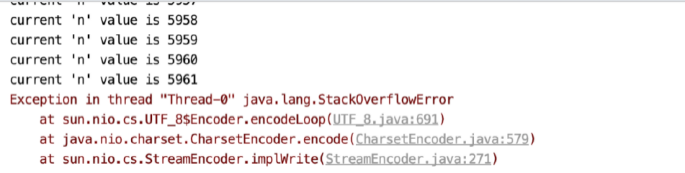
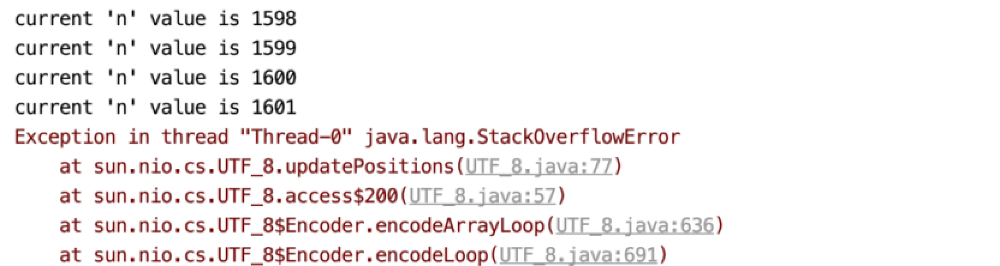
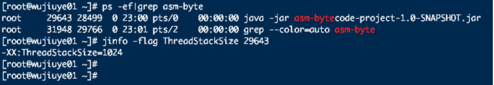
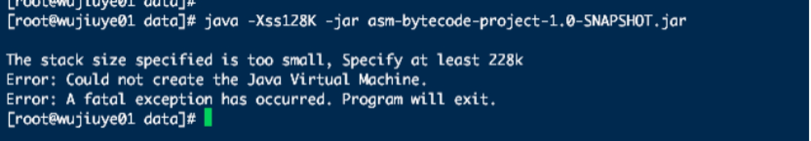

# 为什么会出现StackOverflowError


StackOverflowError这个错误常出现在较深的方法调用以及递归方法中，平时很少会遇到。我们以一道经典的递归算法题为例，求1到n的和。为了查看在发生栈溢出时方法一共递归了多少次，我们在方法中打印当前n的值。如代码清单1-1所示。

<center>代码清单1-1 使用递归算法求1到n的和</center>

```java
public class RecursionAlgorithmMain {   
  public static int sigma(int n) {     
    System.out.println("current 'n' value is " + n);     
    return n + sigma(n + 1);   
  }   
  public static void main(String[] args) throws IOException {     
    new Thread(() -> sigma(1))
      .start();     
    System.in.read();   
  }  
} 
```

在默认栈大小情况下，程序抛出栈溢出错误并终止线程时方法递归调用了5961次，如图1.1所示。

<center>图1.1 使用默认栈大小时的栈溢出</center>

 

在默认栈大小的情况下，多次运行代码清单1-1的代码，得出的结果是相差不大的。并且我们会发现，在发生StackOverflowError时，进程并没有结束，这是因为一个线程的StackOverflowError并不影响整个进程。

现在我们将配置JVM的启动参数-Xss，以调整虚拟机栈的大小为256k。如果你是使用IDEA运行本例代码，可直接在VM options配置加上-Xss256K。如果你是使用java命令运行，可在java命令后面加上-Xss256k，启动命令如下。

```shell
java -Xss256k -jar RecursionAlgorithmMain.jar 
```

在调整栈的大小后，再次运行代码清单1-1的代码，sigma方法只递归调用了1601次，如图1.2所示。

<center>图1.2 栈大小为256K时的栈溢出</center>

 

这与调整栈大小之前似乎存在着某种关系，用调整栈大小之前程序发生栈溢出时方法的调用次数除以栈大小调整后的，结果约为4。这是不是说明栈的大小默认为1024K呢。当然，以这个测试结果来说明其实并不严谨。

我们可以通过打印虚拟机参数查看默认的栈大小。使用jinfo[^1]命令行工具可查看某个Java进程当前虚拟机栈的大小，这是jdk提供的工具，不需要额外下载安装。使用jinfo查看Java进程的线程栈大小如下：

```shell
wjy$ jinfo -flag ThreadStackSize 29643 
```

* 其中29643为进程ID。

在不修改任何配置的情况下，在64位Linux系统上执行jinfo命令，查询出来的默认栈大小为1M，如图1.3所示。

<center>图1.3 jinfo查看默认线程栈大小</center>

 

栈大小除了可以使用jinfo命令行工具查看之外，我们还可以通过NAT[^2]工具查看，并且使用NAT工具还可以查看方法区的大小。

以使用Java命令启动Java进程为例，在Java命令后面加上开启NAT的配置参数NativeMemoryTracking，如下：

```shell
java -XX:NativeMemoryTracking=summary -jar xxx.jar  
```

进程启动后，可通过jcmd[^3]命令行工具查看该进程的内存占用信息，如图1.4所示。

<center>图1.4 NAT打印内存占用信息</center>

 

 从图1.4中，我们能看到当前进程Java堆的大小、用于存储类元数据信息使用的内存大小、线程栈总共占用的内存大小等。从线程栈信息来看，被查看的进程当前线程数为63，使用内存为63696K，也就是每个线程栈占用1M内存。

 NAT工具也用于排查内存泄露问题，当项目中依赖了一些使用直接内存的第三方jar包时，可能会因为使用不当而造成内存泄露。如堆内存没有用满，但top[^4]命令查看内存使用率却接近百分百，这种情况就很有可能是程序使用堆外直接内存造成的。

 -Xss参数在多线程项目中常用于JVM调优。假设项目中开启1024个线程，那么使用默认栈大小的情况下，虚拟机栈将会占用1G的内存，而如果将栈大小调整为256K，虚拟机将只花费256M内存用于1024个栈的分配。

最后，我们也可以在HotSpot源码中找到关于栈大小的设置[^5]。以Linux操作系统且处理器架构为AMD 64位为例，HotSpot虚拟机配置的默认栈大小为1M，编译线程的栈大小默认为4M，如代码清单1-2所示。

<center> 代码清单1-2 获取默认栈大小的方法</center>

```c++
// return default stack size for thr_type  
 size_t os::Linux::default_stack_size(os::ThreadType thr_type) {  
      // default stack size (compiler thread needs larger stack)  
     #ifdef AMD64  
           size_t s = (thr_type == os::compiler_thread ? 4 * M : 1 * M);  
     #else  
           size_t s = (thr_type == os::compiler_thread ? 2 * M : 512 * K);  
     #endif // AMD64  
      return s;  
}  
```

栈也有最小值，该最小值因操作系统及处理器架构而议。如果在64位的Linxu系统下，我们使用java命令启动一个jar包并将-Xss参数配置为128K，进程将会异常终止，并提示创建Java虚拟机失败，要求栈最小值为228K。如图1.5所示。

<center>图1.5 设置栈大小为128k进程启动失败</center>

 

 虚拟机栈的最小值是在虚拟机启动时、解析完全局参数之后调用os::init_2方法设置。栈的最小取值不仅受当前处理器架构是32位还是64位的影响，也受系统页大小影响。例如，在64位Linxu操作系统下，HotSopt所允许设置栈大小的最小值为228K，如代码清单1-3所示。 

<center>代码清单1-3 设置栈的最小值</center>

```c++
// os::init_2(void)
 os::Linux::min_stack_allowed = MAX2(os::Linux::min_stack_allowed,  
            (size_t)(StackYellowPages+StackRedPages+StackShadowPages) * Linux::page_size()   + (2*BytesPerWord COMPILER2_PRESENT(+1)) * Linux::vm_default_page_size());  
```

[^1]:  jinfo是JDK提供的命令行工具，可以用来查看正在运行的 java 应用程序的扩展参数。
[^2]: Native Memory Tracking是一个Java Hotspot VM新特性，用于跟踪热点VM的内部内存使用情况。
[^3]: jcmd是JDK提供的命令行工具，使用jcmd可访问NMT数据。
[^4]: Linux操作系统提供的top命令可用于查看系统当前每个进程对内存的占用率以及CPU的使用率等信息。
[^5]: 源码在hotspot/src/os_cpu/linux_x86/vm/os_linux_x86.cpp文件中，方法名为default_stack_size。

---

<font color= #666666>发布于：2021 年 06 月 23 日</font><br><font color= #666666>作者: 吴就业</font><br><font color= #666666>链接: https://wujiuye.gitbook.io/jvmbytecode/chapter01/01 </font><br><font color= #666666>来源: GitBook开源电子书《深入浅出JVM字节码》（《Java虚拟机字节码从入门到实战》的第二版），未经作者许可，禁止转载!</font><br>


