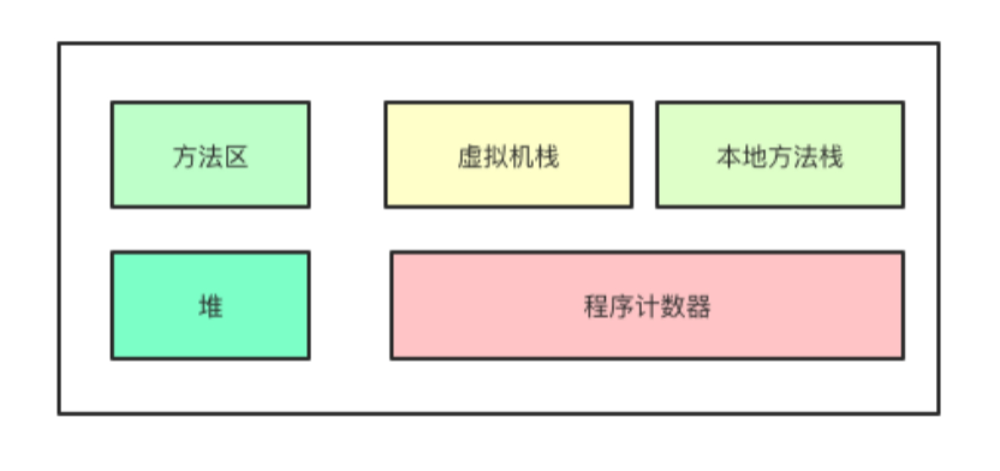

# JVM运行时内存结构

Java虚拟机运行时数据区域分为方法区、堆、虚拟机栈、本地方法栈和程序计数器[^1]，如图1.6所示。

图1.6 JVM运行时内存结构

 

 Java堆（Java Heap）是线程共享的，用于存放对象实例。然而，并非所有的对象都会存放在堆中。比如开启内存逃逸分析后，JIT即时编译器会将多次被执行的字节码编译为机器码，同时也会分析方法体内的对象创建，如果方法体内创建的对象没有逃离出方法体之外，即不会被别的地方引用，没有别的线程使用，那么就不需要将对象分配到堆中，而是直接分配到虚拟机栈上。

方法区（Method Area）也是线程共享的，用于存放虚拟机加载的类信息、常量、静态变量等数据。在JDK1.8之前，HotSpot虚拟机使用永久代实现方法区，而1.8及之后使用元数据区实现方法区。运行时常量池是方法区的一部分，用于存放类被加载后的常量池表。

Java虚拟机栈（Java Virtual Machine Satck）是线程私有的，它的生命周期与线程的生命周期相同。根据《Java虚拟机规范》的规定，native方法应该在本地方法栈中执行，但在HotSpot虚拟机中，本地方法栈已与虚拟机栈合二为一。

---

[^1]: 周志明. 深入理解Java虚拟机：JVM高级特性与最佳实践（第3版） 第二章，运行时数据区域。

发布于：2021 年 06 月 23 日 作者: 吴就业 链接: https://wujiuye.gitbook.io/jvmbytecode 来源: GitBook开源电子书《深入浅出JVM字节码》（《Java虚拟机字节码从入门到实战》的第二版），未经作者许可，禁止转载! 

