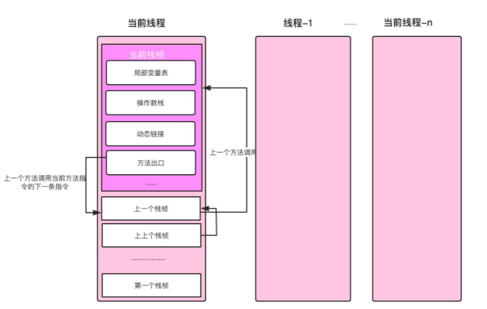

# 线程、栈与栈桢

在Java中，Java线程与操作系统一对一绑定，Java虚拟机栈也与操作系统线程栈映射，操作系统线程在Java线程创建时创建。前面介绍使用-Xss参数可配置虚拟机栈的大小，实际上就是指定操作系统线程栈的大小。

 我们以Java命令启动一个Java程序其实就是启动一个JVM进程，JVM启动后会加载类的字节码执行，而操作系统是以线程为调度单位的，Java线程又与操作系统线程一对一绑定，所以我们编写的Java代码最终都会在线程上执行。

 程序中的main方法是Java程序的入口，JVM会为main方法的执行分配一个线程，叫main线程。虽然我们看不到main方法被放在Java线程中执行，但我们可以打印main方法所在线程名，如代码清单1-4所示。

<center>代码清单1-4 打印main方法所在线程名</center>

```java
public static void main(String[] args) throws IOException {  
    // 输出：main  
    System.out.println(Thread.currentThread().getName());  
}
```

在Java中创建Thread对象并调用start方法时，JVM会为其创建一个Java线程，并创建一个操作系统线程，将操作系统线程绑定到Java线程上。HotSpot虚拟机线程start流程如下：

```c++
// 第一步：jvm.cpp文件中，JVM_StartThread方法  
native_thread = new JavaThread(&thread_entry, sz);  
// 第二步： thread.cpp文件中，JavaThread的构建方法  
os::create_thread(this, thr_type, stack_sz);  
// 第三步：os_linux.cpp文化中，os::create_thread方法  
OSThread* osthread = new OSThread(NULL, NULL);  
thread->set_osthread(osthread);  
```

虽然Java是一门面向对象的语言，但程序运行依然是基于方法的调用，每个方法对应一个栈桢，方法的调用对应栈桢的入栈和出栈。Java类中的每个方法经过编译处理后最终变为字节码指令存储在Code属性中，所以调用方法时需指定调用哪个类的方法，而调用类的静态方法与非静态方法区别只在于调用方法时是否需要传递this引用，这与过程调用并无差异。栈与栈桢的关系如图1.7所示。 

<center>图1.7 线程、栈与栈桢的关系</center>

 

 在调用Thread对象的start方法时，该线程对应的虚拟机栈的第一个栈桢是run方法。run方法中每调用一个方法就对应一个栈桢的入栈，一个方法只有执行结束才会出栈。方法执行结束包括方法抛出异常结束、return命令返回。

栈的大小是固定的，默认栈大小是1M，可通过-Xss参数配置。因此，从run方法开始，如果调用链路过深，如递归方法，在栈没有足够的空间容纳下一个栈桢的入栈时，就会出现StackOverflowError错误，同时当前栈被销毁，当前线程结束。HotSpot虚拟机的实现源码[^1]如代码清单1-6所示。

<center>代码清单1-6 HotSpot方法调用源码</center>

```c++
void JavaCalls::call(JavaValue* result, methodHandle method, JavaCallArguments* args, TRAPS) {  
  os::os_exception_wrapper(call_helper, result, &method, args, THREAD);  
}  

void JavaCalls::call_helper(JavaValue* result, methodHandle* m, JavaCallArguments* args, TRAPS) {  
  methodHandle method = *m;  
  JavaThread* thread = (JavaThread*)THREAD;  
  .......  
   // 判断当前线程的调用栈是否有足够的内存  
  if (!os::stack_shadow_pages_available(THREAD, method)) {  
     // 内存不足，抛出stack_overflow异常  
    Exceptions::throw_stack_overflow_exception(THREAD, __FILE__, __LINE__, method);  
    return;  
  } else {  
    // 占用足够的内存  
    os::bang_stack_shadow_pages();  
  }  
  ......  
}   
```

---

[^1]: 源码在hotspot/src/share/vm/runtime/javaCalls.cpp文件中

<font color= #666666>发布于：2021 年 06 月 23 日</font><br><font color= #666666>作者: [吴就业](https://www.wujiuye.com/)</font><br><font color= #666666>GitHub链接:https://github.com/wujiuye/JVMByteCodeGitBook</font><br><font color= #666666>链接:https://www.wujiuye.com/ebook/JVMByteCodeGitBook/chapter/chapter01_03.md</font><br><font color= #666666>来源: Github Pages 开源电子书《深入浅出JVM字节码》（《Java虚拟机字节码从入门到实战》的第二版），未经作者许可，禁止转载!</font><br>