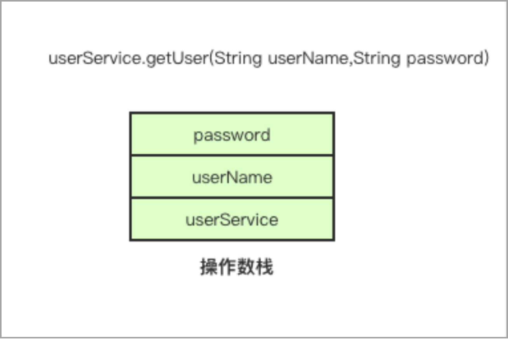

# 局部变量表与操作数栈

在了解线程、栈与栈桢的关系后，我们还要重点关注栈桢中的局部变量表与操作数栈，这两个数据结构是字节码指令执行所依赖的。

## 局部变量表

局部变量表存储方法中声明的变量、方法参数，如果是非静态方法还会存放this引用。局部变量表的大小是固定的，在编译时就已经确定。这也是我们在操作字节码时需要注意的一点，我们需要计算方法的局部变量表需要多大，如果设置过大就会造成内存资源的浪费。 

局部变量表的结构是一个数组，数组的单位是Slot（变量槽），Slot的大小是多少个字节由虚拟机决定。在32位的HotSpot虚拟机中，一个Slot槽的大小等于4个字节，而在64位的HotSpot虚拟机中，一个Slot槽的大小等于8个字节。但64位的HotSpot虚拟机可以配置是否开启指针压缩，如果开启指针压缩，那么一个Slot槽的大小也等于4个字节。局部变量表的结构如图1.8所示。

图1.8 局部变量表结构

 

在此提出几个问题：在方法中new一个对象是否会将对象的引用存入局部变量表？try-catch块，catch括号中的异常是否存在局部变量表？使用build构造者模式时，链式调用方法会不会每次调用都将返回的对象先存储到局部变量表？这些问题将在第三章解答。

## 操作数栈

操作数栈与局部变量表有相似的地方，其大小也是固定的，栈的大小在编译期确定，单位也是Slot。但不同的是，操作数栈的大小并不仅与局部变量的个数有关。操作数栈的结构如图1.9所示。

图1.9 操作数栈结构

 

操作数栈用于存储执行字节码指令所需要的参数。比如获取对象自身的字段，需要先将this引用压入栈顶，再执行getfield字节码指令；比如执行new指令后，栈顶会存放该new指令返回的对象的引用。

局部变量表与操作数栈大小的设置，也会影响到栈桢的大小，从而影响栈所能容纳的栈桢的最大数量。以前面栈溢出的例子说明，默认1M大小的栈大概能调用六千次的递归求和方法，而如果递归方法中再写得复杂些，也会导致调用次数的下降。因此，在使用ASM框架操作字节码时，我们需要合理设置这个结构的大小。

---

发布于：2021 年 06 月 23 日 作者: [吴就业](https://www.wujiuye.com/) 链接: https://github.com/wujiuye/JVMByteCodeGitBook 来源: Github Pages 开源电子书《深入浅出JVM字节码》（《Java虚拟机字节码从入门到实战》的第二版），未经作者许可，禁止转载! 

