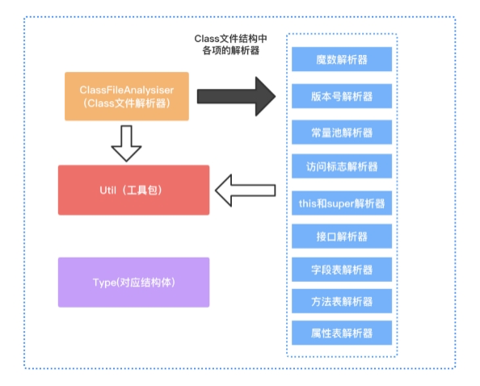
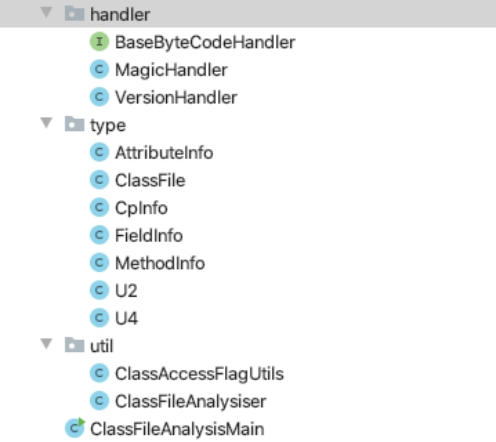

# 动手实现class文件结构解析器


可用于分析class文件结构的工具有很多，笔者将其分为两类：一类是基于十六进制的分析工具，如010editer、UE；另一类是可视化的class文件结构分析工具，如开源的classpy[^1]。为能让读者更好的理解class文件结构，本书将介绍如何使用Java语言编写一个解析class文件的工具类项目，通过该项目实现class文件的解析，并从编写该项目的过程中慢慢掌握class文件结构。

首先，根据 class文件结构以及class文件的解析流程设计该项目的技术架构图，如下图所示。



接着，根据架构图搭建项目的框架，框架搭建如下图所示。



我们先定义对应class文件结构中各项结构的类型（type包），如常量池（CpInfo.class）、字段表（FieldInfo.class）、方法表（MethodInfo.class）、属性表（AttributeInfo.class）、U2（class文件结构的基本单位，占两个字节）、U4（class文件结构的基本单位，占四个字节）；再定义各项的解析器（handler包），如魔数解析器、版本号解析器等；最后通过工具类ClassFileAnalysiser使用责任链模式协调各个解析器的工作完成class文件的解析。

在框架搭建好后，我们再开始编码完成各个解析器。

根据 class文件结构创建ClassFile类，ClassFile类代码如下。

```java
public class ClassFile {  
    private U4 magic; // 魔数  
    private U2 minor_version; // 副版本号  
    private U2 magor_version; // 主版本号  
    private U2 constant_pool_count; // 常量池计数器  
    private CpInfo[] constant_pool; // 常量池  
    private U2 access_flags; // 访问标志  
    private U2 this_class; // 类索引  
    private U2 super_class; // 父类索引  
    private U2 interfaces_count; // 接口总数  
    private U2[] interfaces; // 接口数组  
    private U2 fields_count; // 字段总数  
    private FieldInfo[] fields; // 字段表  
    private U2 methods_count; // 方法总数  
    private MethodInfo[] methods; // 方法表  
    private U2 attributes_count; // 属性总数  
    private AttributeInfo[] attributes; // 属性表
}  
```

ClassFile类中的每个字段是按照class文件结构中各项的顺序声明的，其中CpInfo、FieldInfo、MethodInfo、AttributeInfo这几个类目前并未添加任何字段，只是一个空的类，代码如下。

```java
public class CpInfo {  
}  
public class FieldInfo {  
}  
public class MethodInfo {  
}  
public class AttributeInfo {  
}  
```

U2和U4是class文件结构的基本单位，长度分别为两个字节和四个字节，我们需要为这两种基本单位创建对应的Java类。这两个类都只需要一个字段，类型为Byte数组，长度在构造方法中控制，要求构造方法必须传入数组每个元素的值。

U2：

```java
public class U2 {  
  
    private byte[] value;  
  
    public U2(byte b1, byte b2) {  
        value = new byte[]{b1, b2};  
    }  
  
    public Integer toInt() {  
        return (value[0] & 0xff) << 8 | (value[1] & 0xff);  
    }  
  
    public String toHexString() {  
        char[] hexChar = new char[]{'0', '1', '2', '3', '4', '5', '6', '7', '8', '9', 'A', 'B', 'C', 'D', 'E', 'F'};  
        StringBuilder hexStr = new StringBuilder();  
        for (int i = 1; i >= 0; i--) {  
            int v = value[i] & 0xff;  
            while (v > 0) {  
                int c = v % 16;  
                v = v >>> 4;  
                hexStr.insert(0, hexChar[c]);  
            }  
            if (((hexStr.length() & 0x01) == 1)) {  
                hexStr.insert(0, '0');  
            }  
        }  
        return "0x" + (hexStr.length() == 0 ? "00" : hexStr.toString());  
    }  
  
}  
```

U4：

```java
public class U4 {  
  
    private byte[] value;  
  
    public U4(byte b1, byte b2, byte b3, byte b4) {  
        value = new byte[]{b1, b2, b3, b4};  
    }  
  
    public int toInt() {  
        int a = (value[0] & 0xff) << 24;  
        a |= (value[1] & 0xff) << 16;  
        a |= (value[2] & 0xff) << 8;  
        return a | (value[3] & 0xff);  
    }  
  
    public String toHexString() {  
        char[] hexChar = new char[]{'0', '1', '2', '3', '4', '5', '6', '7', '8', '9', 'A', 'B', 'C', 'D', 'E', 'F'};  
        StringBuilder hexStr = new StringBuilder();  
        for (int i = 3; i >= 0; i--) {  
            int v = value[i] & 0xff;  
            while (v > 0) {  
                int c = v % 16;  
                v = v >>> 4;  
                hexStr.insert(0, hexChar[c]);  
            }  
            if (((hexStr.length() & 0x01) == 1)) {  
                hexStr.insert(0, '0');  
            }  
        }  
        return "0x" + hexStr.toString();  
    }   
}
```

提示：为便于验证解析结果是否正确以及解析结果的可读性，我们还给这两个类添加了一个byte[]转int的方法（toInt），以及byte[]转16进制字符串的方法（toHexString）。

接着我们需要创建一个接口BaseByteCodeHandler，抽象出class文件结构各项的解析器行为。每个解析器应该只负责完成class文件结构中某一项的解析工作，如常量池解析器就只负责解析常量池。

BaseByteCodeHandler接口：

```java
public interface BaseByteCodeHandler {  
    /** 
     * 解释器的排序值 
     * @return 
     */  
    int order();  
  
    /** 
     * 读取 
     * @param codeBuf 
     * @param classFile 
     */  
    void read(ByteBuffer codeBuf, ClassFile classFile) throws Exception;  
}  
```

BaseByteCodeHandler接口定义了一个read方法，该方法要求传入class文件的字节缓存[^2]和ClassFile对象。每个继承BaseByteCodeHandler的解析器都可以在read方法中从字节缓存读取相应的字节数据写入ClassFile对象。

由于解析是按顺序解析的，因此BaseByteCodeHandler接口还定义了一个返回排序值的方法，该值用于实现解析器的排序。比如，版本号解析器应该排在魔数解析器的后面，因此，版本号解析器order方法的返回值应该比魔数解析器order方法的返回值大。

有了解析器之后，我们还需要实现一个管理和调度解析器工作的总指挥：ClassFileAnalysiser ，代码如下。

```java
public class ClassFileAnalysiser {  
  
    private final static List<BaseByteCodeHandler> handlers = new ArrayList<>();  
  
    static {  
        // 添加各项的解析器  
        handlers.add(new MagicHandler());  
        handlers.add(new VersionHandler());  
         ......
        // 解析器排序，要按顺序调用  
        handlers.sort((Comparator.comparingInt(BaseByteCodeHandler::order)));  
    }  
  
  // 将传入的从class文件读取的字节缓存，解析生成一个ClassFile 对象
public static ClassFile analysis(ByteBuffer codeBuf) throws Exception {  
  // 重置ByteBuffer的读指针，从头开始
       codeBuf.position(0);   
        ClassFile classFile = new ClassFile();  
        // 遍历解析器，调用每个解析器的解析方法   
        for (BaseByteCodeHandler handler : handlers) {  
            handler.read(codeBuf, classFile);  
        }  
        return classFile;  
    }  
  
}  
```

ClassFileAnalysiser 的静态代码块负责实例化各个解释器并排好序。

ClassFileAnalysiser 暴露analysis方法给外部调用，由analysis方法根据解析器的排序顺序去调用各个解析器的read方法完成class文件结构各项的解析工作，由各项解析器将解析结果赋值给ClassFile对象的对应字段。

analysis方法的入参是class文件内容的字节缓存，从class文件中读取而来。在该项目中使用ByteBuffer而不直接使用byte[]缓存加载的class文件，是因为使用ByteBuffer能更好的控制顺序读取。

假设我们已经实现了所有解析器，那么我们只需要实现将class文件加载到内存中，再调用ClassFileAnalysiser的analysis方法就能实现将一个class文件解析为一个ClassFile对象，例如。

```java
public class ClassFileAnalysisMain {  
  
    public static ByteBuffer readFile(String classFilePath) throws Exception {  
        File file = new File(classFilePath);  
        if (!file.exists()) {  
            throw new Exception("file not exists!");  
        }  
        byte[] byteCodeBuf = new byte[4096];  
        int lenght;  
        try (InputStream in = new FileInputStream(file)) {  
            lenght = in.read(byteCodeBuf);  
        }  
        if (lenght < 1) {  
            throw new Exception("not read byte code.");  
        }  
        // 将字节数组包装为ByteBuffer
        return ByteBuffer.wrap(byteCodeBuf, 0, lenght).asReadOnlyBuffer();  
    }  
  
    public static void main(String[] args) throws Exception {  
        // 读取class文件
        ByteBuffer codeBuf = readFile("xxx.class");  
        // 解析class文件
        ClassFile classFile = ClassFileAnalysiser.analysis(codeBuf);  
        // 打印魔数解析器解析出来的Magic
        System.out.println(classFile.getMagic().toHexString());  
    }  
  
} 
```

当然，这只是整体的框架搭建，class文件结构各项的解释器还没有实现。接下来，我们就按照解析class文件结构的顺序实现各项解析器。

---

[^1]: classpy是一个开源的class文件结构分析工具：https://github.com/zxh0/classpy
[^2]: class文件字节缓存是指从class文件读入内存的字节缓存，这是一个数组，大小即为class文件的大小。

<font color= #666666>发布于：2021 年 07 月 10 日</font><br><font color= #666666>作者: [吴就业](https://www.wujiuye.com/)</font><br><font color= #666666>链接: https://github.com/wujiuye/JVMByteCodeGitBook</font><br><font color= #666666>来源: Github Pages 开源电子书《深入浅出JVM字节码》（《Java虚拟机字节码从入门到实战》的第二版），未经作者许可，禁止转载!</font><br>


