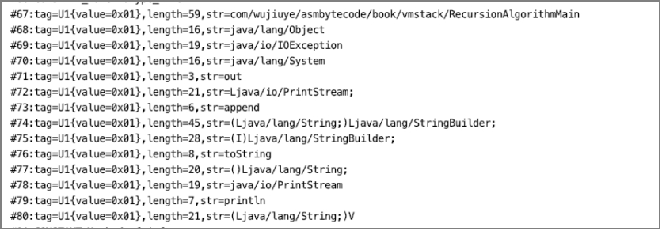

# 解析常量池


Java虚拟机执行字节码指令依赖常量池表中的常量信息，如使用new指令创建对象需要指定创建对象的类型描述符，那么new指令的操作数便是该类型描述符在常量池中的索引，虚拟机将根据常量信息到方法区寻找对应的class元数据。

```
new  #2 
```

*  #2为常量在常量池中的索引。

根据《Java虚拟机规范》规定，常量池表中所有常量项的结构都包含一个tag项，tag值用于标志一个常量是哪种常量结构。常量结构的通用格式为：

```c
cp_info{  
    u1 tag;  
    u1 info[];   
}  
```

其中U1类型占一个字节，Info[]字节数组存储的内容和长度由tag值决定。在解析常量时，我们只有先根据tag值确定常量的结构，才能根据常量结构计算一个常量所占用的字节数。

<center>tag值对应的常量结构表</center>

| ***常量类型***                   | ***tag值*** | ***描述***                               |
| -------------------------------- | ----------- | ---------------------------------------- |
| CONSTANT_Class_info              | 7           | 类或接口的符号引用                       |
| CONSTANT_Fieldref_info           | 9           | 字段的符号引用                           |
| CONSTANT_Methodref_info          | 10          | 类中方法的符号引用                       |
| CONSTANT_InterfaceMethodref_info | 11          | 接口中方法的符号引用                     |
| CONSTANT_String_info             | 8           | 字符串类型字面量                         |
| CONSTANT_Integer_info            | 3           | 整型字面量                               |
| CONSTANT_Float_info              | 4           | 浮点型字面量                             |
| CONSTANT_Long_info               | 5           | 长整形字面类                             |
| CONSTANT_Double_info             | 6           | 双精度浮点型字面量                       |
| CONSTANT_NameAndType_info        | 12          | 字段与字段类型或方法与方法类型的符号引用 |
| CONSTANT_Utf8_info               | 1           | UTF-8编码字符串                          |
| CONSTANT_MethodHandle_info       | 15          | 表示方法句柄                             |
| CONSTANT_MethodType_info         | 16          | 表示方法类型                             |
| CONSTANT_InvokeDynamic_info      | 18          | 表示一个动态方法调用点                   |

要从class文件中解析出常量池中的所有常量，除了要了解每个tag值对应的常量结构之外，我们还需要了解每个常量结构都用于存储哪些信息，并根据《Java虚拟机规范》中描述的每个常量结构创建对应的Java类型。

## 常量池常量结构解析

与实现class文件结构各项的解析器一样，我们也要为每个常量结构实现各自的常量解析器。

 首先定义常量解析器接口：ConstantInfoHandler。

```java
public interface ConstantInfoHandler {   
		void read(ByteBuffer codeBuf) throws Exception;  
}  
```

ConstantInfoHandler 接口只定义了一个解析方法，方法要求传入class文件字节缓存，该class文件字节缓存与class文件结构各项解析器使用的是同一个缓存对象，都是从同一个class文件读取到内存中的ByteBuffer对象。

 接着根据常量结构的通用格式将常量结构抽象出一个父类CpInfo。

```java
public abstract class CpInfo implements ConstantInfoHandler {  
    private U1 tag;  
    public CpInfo(U1 tag) {  
        this.tag = tag;  
    }  
    @Override  
    public String toString() {  
        return "tag=" + tag.toHexString();  
    }  
}  
```

CpInfo 抽象类约定构造方法必须传入tag值，且约定子类必须实现ConstantInfoHandler常量结构解析器接口，并实现常量解析方法。

### CONSTANT_Utf8_info常量

CONSTANT_Utf8_info常量结构用于存储字符串常量，字符串编码使用UTF-8。该常量除一个必须的tag字段和存储字符串的字节数组外，还要有一个字段存储描述这个字符串字节数组的长度[^1]。

CONSTANT_Utf8_info常量结构：

```c
{
  u1  tag;
  u2  length;
  u1[]  bytes; 
}
```

创建CONSTANT_Utf8_Info类并继承CpInfo抽象类，实现ConstantInfoHandler 接口定义的解析方法，代码如下。

```java
public class CONSTANT_Utf8_info extends CpInfo {  
  
    private U2 length;  
    private byte[] bytes;  
  
    public CONSTANT_Utf8_info(U1 tag) {  
        super(tag);  
    }  
  
    @Override  
		public void read(ByteBuffer codeBuf) throws Exception {  
  			// 先读取长度
        length = new U2(codeBuf.get(), codeBuf.get());  
        bytes = new byte[length.toInt()];  
    		// 读取指定长度的字节到bytes 数组
        codeBuf.get(bytes, 0, length.toInt());  
    }  
  
    @Override  
    public String toString() {  
        return super.toString() +  ",length=" + length.toInt() +  ",str=" + new String(bytes, StandardCharsets.UTF_8);  
    }  
}
```

* read方法：从Class文件字节缓存ByteBuffer 对象中读取该类型的常量，需按顺序先读取长度，再根据长度n取后续n个字节存放到该常量的字节数组中。

### CONSTANT_Class_Info常量

CONSTANT_Class_Info常量存储类的符号信息，除tag字段外，只有一个存储指向常量池表中某一常量的索引字段name_index，并且name_index指向的常量必须是一个CONSTANT_Utf8_info常量，该常量存储的是class的类名（内部类名[^2]）。

CONSTANT_Class_Info常量结构：

```c
{
	u1 tag;
	u2 name_index;
}
```

创建CONSTANT_Class_Info类并继承CpInfo抽象类，实现ConstantInfoHandler 接口定义的解析方法，代码如下。

```java
public class CONSTANT_Class_info extends CpInfo {  
    private U2 name_index;  
    public CONSTANT_Class_info(U1 tag) {  
        super(tag);  
    }  
    @Override  
		public void read(ByteBuffer codeBuf) throws Exception {  
  			// 读取两个字节
        this.name_index = new U2(codeBuf.get(), codeBuf.get());  
    }  
}  
```

### CONSTANT_Fieldref_info常量

CONSTANT_Fieldref_info常量存储字段的符号信息，除tag字段外，只有两个U2类型的字段，分别是class_index、name_and_type_index。

CONSTANT_Fieldref_Info常量结构：

```c
{
	u1  tag;
	u2  class_index;
	u2  name_and_type_index; 
}
```

* class_index：指向的常量必须是一个CONSTANT_Class_Info常量，表示当前字段所在类的类名；
* name_and_type_inde：指向的常量必须是一个CONSTANT_NameAndType_info常量，表示当前字段的名字和类型描述符。

创建CONSTANT_Fieldref_info类并继承CpInfo抽象类，实现ConstantInfoHandler 接口定义的解析方法，代码如下。

```java
public class CONSTANT_Fieldref_info extends CpInfo {  
    private U2 class_index;  
    private U2 name_and_type_index;  
  
    public CONSTANT_Fieldref_info(U1 tag) {  
        super(tag);  
    }  
  
    @Override  
    public void read(ByteBuffer codeBuf) throws Exception {  
        class_index = new U2(codeBuf.get(), codeBuf.get());  
        name_and_type_index = new U2(codeBuf.get(), codeBuf.get());  
    }  
}  
```

### CONSTANT_Methodref_info常量

CONSTANT_Methodref_Info常量结构：

```c
{
	u1  tag;
	u2  class_index;
	u2  name_and_type_index; 
}
```

* class_index：指向的常量必须是一个CONSTANT_Class_Info常量，表示当前方法所在类的类名；
* name_and_type_index：指向的常量必须是一个CONSTANT_NameAndType_info常量，表示当前方法的名字和方法描述符。

CONSTANT_Methodref_info在结构上与CONSTANT_Fieldref_info一样，因此可通过继承CONSTANT_Fieldref_info类实现其字段的定义和完成解析工作。创建CONSTANT_Methodref_info类并继承CONSTANT_Fieldref_info，代码如下。

```java
public class CONSTANT_Methodref_info extends CONSTANT_Fieldref_info {  
    public CONSTANT_Methodref_info(U1 tag) {  
        super(tag);  
    }  
}  
```

### CONSTANT_InterfaceMethodref_info常量

CONSTANT_InterfaceMethodref_Info常量结构：

```c
{
	u1  tag;
	u2  class_index;
	u2  name_and_type_index; 
}
```

* class_index：指向的常量必须是一个CONSTANT_Class_Info常量，表示当前接口方法所属接口的类名；
* name_and_type_index：指向的常量必须是一个CONSTANT_NameAndType_info常量，表示当前接口方法的名字和方法描述符。

CONSTANT_InterfaceMethodref_info在结构上也与CONSTANT_Fieldref_info一样，因此可通过继承CONSTANT_Fieldref_info类实现其字段的定义和完成解析工作。创建CONSTANT_InterfaceMethodref_info类并继承CONSTANT_Fieldref_info，代码如下。

```java
public class CONSTANT_InterfaceMethodref_info extends CONSTANT_Fieldref_info{  
    public CONSTANT_InterfaceMethodref_info(U1 tag) {  
        super(tag);  
    }  
} 
```

### CONSTANT_String_info常量

CONSTANT_String_info用于存储Java中String类型的常量，除tag字段外，只有一个U2类型的字段string_index，值为常量池中某个常量的索引，该索引指向的常量必须是一个CONSTANT_Utf8_info常量。

CONSTANT_String_Info常量结构：

```c
{
	u1  tag;
	u2  string_index;
}
```

创建CONSTANT_String_info类并继承CpInfo抽象类，实现ConstantInfoHandler 接口定义的解析方法，代码如下。

```java
public class CONSTANT_String_info extends CpInfo {  
    private U2 string_index;  
    public CONSTANT_String_info(U1 tag) {  
        super(tag);  
    }  
    @Override  
    public void read(ByteBuffer codeBuf) throws Exception {  
        string_index = new U2(codeBuf.get(), codeBuf.get());  
		}  
} 
```

### CONSTANT_Integer_info常量

CONSTANT_Integer_info常量存储一个整型数值，除一个tag字段外，只有一个U4类型的字段bytes，bytes转为10进制数就是这个常量所表示的整型值。

CONSTANT_Integer_Info常量结构：

```c
{
	u1  tag;
	u4  bytes;
}
```

创建CONSTANT_Integer_info类并继承Cpinfo抽象类，实现ConstantInfoHandler 接口定义的解析方法，代码如下。

```java
public class CONSTANT_Integer_info extends CpInfo {  
    private U4 bytes;  
    public CONSTANT_Integer_info(U1 tag) {  
        super(tag);  
    }  
    @Override  
		public void read(ByteBuffer codeBuf) throws Exception {  
  			// 连续读取四个字节
        bytes = new U4(codeBuf.get(),codeBuf.get(),codeBuf.get(),codeBuf.get());  
    }  
}  
```

### CONSTANT_Float_info常量

CONSTANT_Float_info与CONSTANT_Integer_info在存储结构上是一样的，只是bytes所表示的内容不同，CONSTANT_Float_info的bytes存储的是浮点数。

CONSTANT_Float_info类的定义和解析方法的实现也可通过继承CONSTANT_Integer_info实现，代码如下。

```java
public class CONSTANT_Float_info extends CONSTANT_Integer_info {  
    public CONSTANT_Float_info(U1 tag) {  
        super(tag);  
    }  
}  
```

### CONSTANT_Long_info常量

与CONSTANT_Integer_info常量不同的是，CONSTANT_Long_info常量使用8个字节存储一个长整型数值，即使用两个U4类型的字段分别存储一个长整型数的高32位和低32位。

CONSTANT_Long_Info常量结构：

```c
{
	u1  tag;
	u4  hight_bytes;
	u4  low_bytes;
}
```

创建CONSTANT_Long_info类并继承CpInfo抽象类，实现ConstantInfoHandler 接口定义的解析方法，代码如下。

```java
public class CONSTANT_Long_info extends CpInfo {  
    private U4 hight_bytes;  
    private U4 low_bytes;  
    public CONSTANT_Long_info(U1 tag) {  
        super(tag);  
    }  
    @Override  
		public void read(ByteBuffer codeBuf) throws Exception {  
  			// 读取高32位
        hight_bytes = new U4(codeBuf.get(), codeBuf.get(), codeBuf.get(), codeBuf.get());  
    		// 读取低32位
        low_bytes = new U4(codeBuf.get(), codeBuf.get(), codeBuf.get(), codeBuf.get());  
    }  
}  
```

### CONSTANT_Double_info常量

CONSTANT_Double_info常量与CONSTANT_Long_info常量在结构上也是一样的，只是所表示的值类型不同。因此CONSTANT_Double_info类的定义和解析方法的实现也可通过继承CONSTANT_Long_info实现，代码如下。

```java
public class CONSTANT_Double_info extends CONSTANT_Long_info {  
    public CONSTANT_Double_info(U1 tag) {  
        super(tag);  
    }  
}  
```

### CONSTANT_NameAndType_info常量

CONSTANT_NameAndType_info结构用于存储字段的名称和字段的类型描述符，或者是用于存储方法的名称和方法的描述符。关于描述符和签名放在第三章介绍。

CONSTANT_NameAndType_info结构除tag字段外，还有一个U2类型的字段name_index和一个U2类型的字段descriptor_index，分别对应名称指向常量池中某个常量的索引和描述符指向常量池中某个常量的索引，这两个字段指向的常量都必须是CONSTANT_Utf8_info结构的常量。

CONSTANT_NameAndType_Info常量结构：

```c
{
	u1  tag;
	u2  name_index;
	u2  descriptor_index;
}
```

创建CONSTANT_NameAndType_info类并继承CpInfo抽象类，实现ConstantInfoHandler 接口定义的解析方法，代码如下。

```java
public class CONSTANT_NameAndType_info extends CpInfo {  
    private U2 name_index;  
    private U2 descriptor_index;  
    public CONSTANT_NameAndType_info(U1 tag) {  
        super(tag);  
    }  
    @Override  
		public void read(ByteBuffer codeBuf) throws Exception {  
 				// 名称索引
        name_index = new U2(codeBuf.get(), codeBuf.get());  
   			// 描述符索引
        descriptor_index = new U2(codeBuf.get(), codeBuf.get());  
    }  
}  
```

### CONSTANT_MethodHandle_info常量

CONSTANT_MethodHandle_info结构用于存储方法句柄，这是虚拟机为实现动态调用指令（invokedynamic）所增加的常量结构。

CONSTANT_MethodHandle_info结构除必须的tag字段外，有一个U1类型的字段reference_kind，取值范围为1~9，包括1和9，表示方法句柄的类型，还有一个U2类型的字段reference_index，其值为指向常量池中某个常量的索引。

CONSTANT_MethodHandle_Info常量结构：

```c
{
	u1  tag;
	u1  reference_kind;
	u2  reference_index;
}
```

reference_index指向的常量的结构与reference_kind取值的关系如下表所示。

| ***reference_kind取值***  | ***reference_index指向的常量项的类型***                 |
| ------------------------- | ------------------------------------------------------- |
| 1（REF_getField）         | CONSTANT_Fieldref_info                                  |
| 2（REF_getStatic）        | CONSTANT_Fieldref_info                                  |
| 3（REF_putField）         | CONSTANT_Fieldref_info                                  |
| 4（REF_putStatic）        | CONSTANT_Fieldref_info                                  |
| 5（REF_invokeVirtual）    | CONSTANT_Methodref_info                                 |
| 6（REF_invokeStatic）     | CONSTANT_Methodref_infoCONSTANT_InterfaceMethodref_info |
| 7（REF_invokeSpecial）    | CONSTANT_Methodref_infoCONSTANT_InterfaceMethodref_info |
| 8（REF_newInvokeSpecial） | CONSTANT_Methodref_info                                 |
| 9（REF_invokeInterface）  | CONSTANT_InterfaceMethodref_info                        |

创建CONSTANT_MethodHandle_info类并继承CpInfo抽象类，实现ConstantInfoHandler 接口定义的解析方法，代码如下。

```java
public class CONSTANT_MethodHandle_info extends CpInfo {  
    private U1 reference_kind;  
    private U2 reference_index;  
    public CONSTANT_MethodHandle_info(U1 tag) {  
        super(tag);  
    }  
    @Override  
    public void read(ByteBuffer codeBuf) throws Exception {  
        reference_kind = new U1(codeBuf.get());  
        reference_index = new U2(codeBuf.get(), codeBuf.get());  
    }  
}  
```

### CONSTANT_MethodType_info常量

CONSTANT_MethodType_info结构表示方法类型，与CONSTANT_MethodHandle_info结构一样，也是虚拟机为实现动态调用invokedynamic指令所增加的常量结构。

CONSTANT_MethodType_info除tag字段外，只有一个u2类型的描述符指针字段descriptor_index，指向常量池中的某一CONSTANT_Utf8_info结构的常量。

CONSTANT_MethodType_Info常量结构：

```c
{
	u1  tag;
	u2  descriptor_kind;
}
```

创建CONSTANT_MethodType_info类并继承CpInfo抽象类，实现ConstantInfoHandler 接口定义的解析方法，代码如下。

```java
public class CONSTANT_MethodType_info extends CpInfo {  
    private U2 descriptor_index;  
    public CONSTANT_MethodType_info(U1 tag) {  
        super(tag);  
    }    
    @Override  
    public void read(ByteBuffer codeBuf) throws Exception {  
        descriptor_index = new U2(codeBuf.get(), codeBuf.get());  
    }  
}  
```

### CONSTANT_InvokeDynamic_info常量

CONSTANT_InvokeDynamic_info表示invokedynamic指令用到的引导方法bootstrap method以及引导方法所用到的动态调用名称、参数、返回类型。

CONSTANT_InvokeDynamic_info结构除tag字段外，有两个U2类型的字段，分别是bootstrap_method_attr_index和name_and_type_index，前者指向class文件结构属性表中引导方法表的某个引导方法，后者指向常量池中某个CONSTANT_NameAndType_Info结构的常量。

CONSTANT_InvokeDynamic_Info常量结构：

```c
{
	u1  tag;
	u2  bootstrap_method_attr_index;
	u2  name_and_type_index;
}
```

创建CONSTANT_InvokeDynamic_info类并继承CpInfo抽象类，实现ConstantInfoHandler 接口定义的解析方法，代码如下。

```java
public class CONSTANT_InvokeDynamic_info extends CpInfo {  
    private U2 bootstrap_method_attr_index;  
    private U2 name_and_type_index;  
    public CONSTANT_InvokeDynamic_info(U1 tag) {  
        super(tag);  
    }  
    @Override  
    public void read(ByteBuffer codeBuf) throws Exception {  
        bootstrap_method_attr_index = new U2(codeBuf.get(), codeBuf.get());  
        name_and_type_index = new U2(codeBuf.get(), codeBuf.get());  
    }  
} 
```

## 常量池解析

在创建完各常量结构对应的Java类以及实现各常量结构的解析方法后，我们接着完成整个常量池的解析工作。

假设，某个class文件的常量池只有一个常量[^3]，并且该常量的类型为CONSTANT_Class_Info，那么该常量池占用class文件的存储区域如下图所示，前两个字节存储常量池的大小，接着的三个字节存储的是一个CONSTANT_Class_Info常量，一个字节存储tag值，两个字节存储name_index。


现在需要修改我们自己编写的所有常量类的父类CpInfo，在CpInfo类中添加一个静态方法，用于根据tag的值创建不同的常量类型对象，代码如下。

```java
public abstract class CpInfo implements ConstantInfoHandler {  
  
    private U1 tag;  
  
    protected CpInfo(U1 tag) {  
        this.tag = tag;  
    }  
  
    @Override  
    public String toString() {  
        return "tag=" + tag.toString();  
    }  
  
    public static CpInfo newCpInfo(U1 tag) throws Exception {  
        int tagValue = tag.toInt();  
        CpInfo info;  
        switch (tagValue) {  
            case 1:  
                info = new CONSTANT_Utf8_info(tag);  
                break;  
            case 3:  
                info = new CONSTANT_Integer_info(tag);  
                break;  
            case 4:  
                info = new CONSTANT_Float_info(tag);  
                break;  
            case 5:  
                info = new CONSTANT_Long_info(tag);  
                break;  
            case 6:  
                info = new CONSTANT_Double_info(tag);  
                break;  
            case 7:  
                info = new CONSTANT_Class_info(tag);  
                break;  
            case 8:  
                info = new CONSTANT_String_info(tag);  
                break;  
            case 9:  
                info = new CONSTANT_Fieldref_info(tag);  
                break;  
            case 10:  
                info = new CONSTANT_Methodref_info(tag);  
                break;  
            case 11:  
                info = new CONSTANT_InterfaceMethodref_info(tag);  
                break;  
            case 12:  
                info = new CONSTANT_NameAndType_info(tag);  
                break;  
            case 15:  
                info = new CONSTANT_MethodHandle_info(tag);  
                break;  
            case 16:  
                info = new CONSTANT_MethodType_info(tag);  
                break;  
            case 18:  
                info = new CONSTANT_InvokeDynamic_info(tag);  
                break;  
            default:  
                throw new Exception("没有找到该TAG=" + tagValue + "对应的常量类型");  
        }  
        return info;  
		}  
}
```

接着创建常量池解析器ConstantPoolHandler，设置其排序值为版本号解析器的排序值+1，也就是将该解析器排在版本号解析器的后面。ConstantPoolHandler的代码实现如下。

```java
public class ConstantPoolHandler implements BaseByteCodeHandler {  
  
    @Override  
    public int order() {  
        return 2;  
    }  
  
    @Override  
		public void read(ByteBuffer codeBuf, ClassFile classFile) throws Exception {  
  			// 1）
        U2 cpLen = new U2(codeBuf.get(), codeBuf.get());  
        classFile.setConstant_pool_count(cpLen);  
    		// 2）
        int cpInfoLeng = cpLen.toInt() - 1;  
        classFile.setConstant_pool(new CpInfo[cpInfoLeng]);  
    		// 3）
        for (int i = 0; i < cpInfoLeng; i++) {  
            U1 tag = new U1(codeBuf.get());  
            CpInfo cpInfo = CpInfo.newCpInfo(tag);  
            cpInfo.read(codeBuf);  
            System.out.println("#" + (i + 1) + ":" + cpInfo);  
            classFile.getConstant_pool()[i] = cpInfo;  
            // 4）
            if (cpInfo instanceof CONSTANT_Long_info) {
                i++; // jump n+2
            }
        }  
   }  
  
} 
```

* 1）、读取常量池计数器；
* 2）、根据常量池计数器的值减1得到常量池的常量总数，再根据常量总数创建常量池表；
* 3）、按顺序解析常量池的各个常量，在解析常量池的常量时，先从Class文件字节缓存中取一个字节码，就是tag，根据tag调用CpInfo的静态方法newCpInfo创建对应常量类型对象，再调用创建出来的常量类型对象的read方法完成该常量的解析工作；
* 4）、当遇到CONSTANT_Long_info常量或是CONSTANT_Double_info常量时，下一个常量不读取，直到跳到下下个常量。

提示：常量池的常量总数并不是等于constant_pool_count-1个，而应该是(constant_pool_count - 1 - (CONSTANT_Long_info常量个数+CONSTANT_Double_info常量个数))[^4]。

最后，我们还要将编写好的常量池解析器交给ClassFileAnalysiser管理，代码如下。

```java
public class ClassFileAnalysiser {  
  
    private final static List<BaseByteCodeHandler> handlers = new ArrayList<>();  
  
    static {  
       ......  
        handlers.add(new ConstantPoolHandler());  
        ....  
    }  
}  
```

现在我们来编写单元测试验证解析结果是否正确，代码如下。

```java
public class ConstantPoolHandlerTest {  
  
    @Test  
		public void testConstantPoolHandler() throws Exception {  
  			// 读取class文件，生成ByteBuffer 
        ByteBuffer codeBuf = ClassFileAnalysisMain.readFile("RecursionAlgorithmMain.class");  
        // 解析class文件
				ClassFile classFile = ClassFileAnalysiser.analysis(codeBuf);  
				// 获取常量池常量的总数
        int cp_info_count = classFile.getConstant_pool_count().toInt();  
        System.out.println("常量池中常量项总数：" + cp_info_count);  
    		// 遍历常量池中的常量
        CpInfo[] cpInfo = classFile.getConstant_pool();  
        for (CpInfo cp : cpInfo) {  
            System.out.println(cp.toString());  
        }  
    }  
  
}  
```

> 提示：为了观察解析结果，还需要给各CpInfo的子类添加toString方法，打印出直观的信息，toString方法的实现省略。

单元测试结果如下图所示。



从单元测试结果可以看出，常量池解析器以及各常量解析器都正常。

---

[^1]: 字符串实际上是通过字节数组存储的。
[^2]: 内部类名（internal name）指的是使用“/”替换“.”的类名，如java/lang/String。
[^3]: 不可能存在只有一个常量的class文件。
[^4]: https://github.com/wujiuye/bytecode-book/issues/1

<font color= #666666>发布于：2021 年 07 月 24 日</font><br><font color= #666666>作者: 吴就业</font><br><font color= #666666>链接: https://wujiuye.gitbook.io/jvmbytecode</font><br><font color= #666666>来源: GitBook开源电子书《深入浅出JVM字节码》（《Java虚拟机字节码从入门到实战》的第二版），未经作者许可，禁止转载!</font><br>


