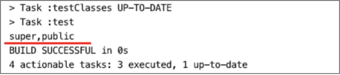

# 解析class文件的访问标志


Class文件结构中的访问标志项access_flags是用U2类型存储的，也就是2个字节。用某个bit位的值是否为1判断该类或接口的访问权限、属性。

<center>访问标志与类或接口的访问权限、属性的映射</center>

| ***标志名***   | ***值*** | ***描述***                            |
| -------------- | -------- | ------------------------------------- |
| ACC_PUBLIC     | 0x0001   | 声明为public                          |
| ACC_FINAL      | 0x0010   | 声明为final，不允许继承               |
| ACC_SUPER      | 0x0020   | Jdk1.0.2之后编译的class文件都会有此值 |
| ACC_INTERFACE  | 0x0200   | 声明该class是接口                     |
| ACC_ABSTRACT   | 0x0400   | 声明为抽象类                          |
| ACC_SYNTHETIC  | 0x1000   | 表示该class文件并非由java代码编译生成 |
| ACC_ANNOTATION | 0x2000   | 标志这是一个注解类型                  |
| ACC_ENUM       | 0x4000   | 标志这是一个枚举类型                  |

如何判断一个类设置了上表中的哪些标志呢？

首先从Class文件字节缓存中读取到access_flags的值，再将access_flags转为int类型，将转换后的值“算术与（&）”上各个标志的值，判断结果是否等于这个标志的值，实现代码如下。

```java
public class ClassAccessFlagUtils {  
  
    private static final Map<Integer, String> classAccessFlagMap = new HashMap<>();  
  
    static {  
         // 公有类型  
         classAccessFlagMap.put(0x0001, "public");  
         // 不允许有子类  
         classAccessFlagMap.put(0x0010, "final");  
         classAccessFlagMap.put(0x0020, "super");  
         // 接口  
         classAccessFlagMap.put(0x0200, "interface");  
         // 抽象类  
         classAccessFlagMap.put(0x0400, "abstract");  
         // 该class非java代码编译后生成  
         classAccessFlagMap.put(0x1000, "synthetic");  
         // 注解类型  
         classAccessFlagMap.put(0x2000, "annotation");  
         // 枚举类型  
         classAccessFlagMap.put(0x4000, "enum");  
    }  
  
    /** 
     * 获取16进制对应的访问标志字符串表示 （仅用于类的访问标志） 
     * 
     * @param flag 访问标志 
     * @return 
     */  
    public static String toClassAccessFlagsString(U2 flag) {  
        final int flagVlaue = flag.toInt();  
        StringBuilder flagBuild = new StringBuilder();  
        classAccessFlagMap.keySet()  
                .forEach(key -> {  
                    if ((flagVlaue & key) == key) {  
                        flagBuild.append(classAccessFlagMap.get(key)).append(",");  
                    }  
                });  
        return flagBuild.length() > 0 && flagBuild.charAt(flagBuild.length() - 1) == ',' ?  
                       flagBuild.substring(0, flagBuild.length() - 1)  : flagBuild.toString();  
    }  
  
}  
```

在class文件中紧挨着常量池存储的就是access_flags，如下图所示。


现在我们来实现class文件访问标志解析器AccessFlagsHandler，并将AccessFlagsHandler解析器交给ClassFileAnalysiser管理。AccessFlagsHandler的排序值设置为3，即放在常量池解析器之后，约定在常量池解析器解析完成之后再到访问标志解析器解析。AccessFlagsHandler的实现代码如下。

```java
public class AccessFlagsHandler implements BaseByteCodeHandler {  
  
    @Override  
    public int order() {  
        return 3;  
    }  
  
    @Override  
    public void read(ByteBuffer codeBuf, ClassFile classFile) throws Exception {  
        classFile.setAccess_flags(new U2(codeBuf.get(), codeBuf.get()));  
    }  
  
}  
```

最后编写单元测试，验证class文件访问标志解析器是否能正常完成解析。在单元测试中，调用ClassAccessFlagUtils 工具类的toClassAccessFlagsString方法将访问标志输出为字符串。

```java
public class AccessFlagsHandlerTest {    
  
    @Test  
    public void testAccessFlagsHandlerHandler() throws Exception {  
        ByteBuffer codeBuf = ClassFileAnalysisMain.readFile("RecursionAlgorithmMain.class");  
        ClassFile classFile = ClassFileAnalysiser.analysis(codeBuf);  
    		// 获取访问标志
        U2 accessFlags = classFile.getAccess_flags();  
    		// 输出为字符串
       System.out.println(ClassAccessFlagUtils.toClassAccessFlagsString(accessFlags));  
    }  
  
}  
```

单元测试结果如下图所示。




---

<font color= #666666>发布于：2021 年 07 月 24 日</font><br><font color= #666666>作者: [吴就业](https://www.wujiuye.com/)</font><br><font color= #666666>链接: https://github.com/wujiuye/JVMByteCodeGitBook</font><br><font color= #666666>来源: Github Pages 开源电子书《深入浅出JVM字节码》（《Java虚拟机字节码从入门到实战》的第二版），未经作者许可，禁止转载!</font><br>


