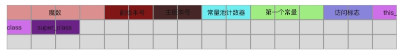
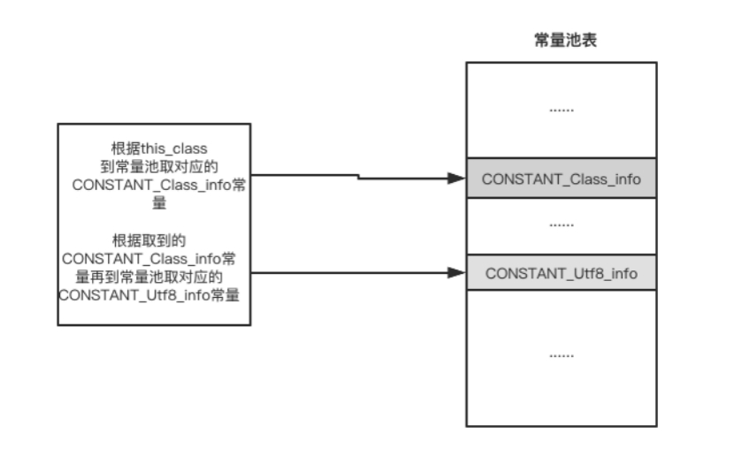
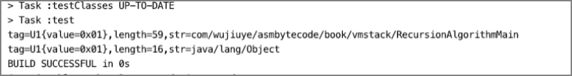

# 解析this与super符号引用


> 提示：这里指的解析this与super符号引用，并非类加载阶段的解析符号引用。

在Class文件结构中，紧挨着访问标志access_flags项的是this_class和super_class这两项，也都是U2类型，如下图所示。



this_class存储的是常量池中某项常量的索引，super_class要么为0，要么也是存储常量池中某项常量的索引[^1]。this_class和super_class指向的常量必须是一个CONSTANT_Class_info结构的常量。

只有Object类的super_class可以为0，接口的super_class指向常量池中描述Object类的CONSTANT_Class_info常量。

this_class与super_class符号解析器实现代码如下。

```java
public class ThisAndSuperClassHandler implements BaseByteCodeHandler {  
  
    @Override  
    public int order() {  
        return 4;  
    }  
  
    @Override  
    public void read(ByteBuffer codeBuf, ClassFile classFile) throws Exception {  
        classFile.setThis_class(new U2(codeBuf.get(), codeBuf.get()));  
        classFile.setSuper_class(new U2(codeBuf.get(), codeBuf.get()));  
    }  
  
}  
```

由于该项目已经完成了常量池的解析，在解析获取到this_class与super_class之后，我们就可以先根据this_class的值到常量池中取得对应的CONSTANT_Class_info常量，再从取得的CONSTANT_Class_info常量中获取该常量的name_index的值，最后根据name_index再回到常量池中取得对应的CONSTANT_Utf8_info常量，这样就能获取到具体的类名了。该过程描述如下图所示。



现在我们编写单元测试验证解析器。为了直观的显示解析结果，我们需要在单元测试用例中，将解析后的this_class与super_class指向的CONSTANT_Class_info常量转为CONSTANT_Utf8_info常量，直接输出字符串类名，代码如下。

```java
public class ThisAndSuperHandlerTest {  
  
    @Test  
    public void testThisAndSuperHandlerHandler() throws Exception {  
        ByteBuffer codeBuf = ClassFileAnalysisMain.readFile("RecursionAlgorithmMain.class");  
        ClassFile classFile = ClassFileAnalysiser.analysis(codeBuf);  
     		// this_class
        U2 this_class = classFile.getThis_class();  
				// 根据this_class 到常量池获取CONSTANT_Class_info常量
				// 由于常量池的索引是从1开始的，所以需要将索引减1取得数组下标
        CONSTANT_Class_info this_class_cpInfo = (CONSTANT_Class_info) classFile.getConstant_pool()[this_class.toInt() - 1]; 
        CONSTANT_Utf8_info this_class_name= (CONSTANT_Utf8_info) 
                             classFile.getConstant_pool()
                             [this_class_cpInfo.getName_index().toInt()-1];  
        System.out.println(this_class_name);  
     		// super_class
        U2 super_class = classFile.getSuper_class();  
        CONSTANT_Class_info super_class_cpInfo = (CONSTANT_Class_info) 
                             classFile.getConstant_pool() [super_class.toInt() - 1];  

        CONSTANT_Utf8_info supor_class_name = (CONSTANT_Utf8_info) 
                            classFile.getConstant_pool()
                            [super_class_cpInfo.getName_index().toInt()-1];  
        System.out.println(supor_class_name);  
    }  
  
} 
```

单元测试结果如下。



从输出的结果可以看出，该class文件的类名为RecursionAlgorithmMain，父类类名为Object。

---

[^1]: 常量池索引都是从1开始的，0就表示不使用。

<font color= #666666>发布于：2021 年 07 月 24 日</font><br><font color= #666666>作者: [吴就业](https://www.wujiuye.com/)</font><br><font color= #666666>链接: https://github.com/wujiuye/JVMByteCodeGitBook</font><br><font color= #666666>来源: Github Pages 开源电子书《深入浅出JVM字节码》（《Java虚拟机字节码从入门到实战》的第二版），未经作者许可，禁止转载!</font><br>


