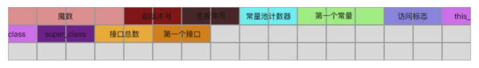
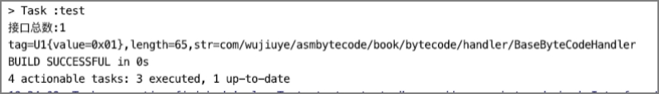

# 解析接口表


在class文件中，继this_class与super_class之后，存储的就是该class实现的接口总数以及该class实现的所有接口。

假设，某个class实现的接口总数为1，则接口表需要占用两个字节，用于存储描述该接口的CONSTANT_Class_info常量在常量池中的索引，如下所示。



接口解析器InterfacesHandler的实现代码如下。

```java
public class InterfacesHandler implements BaseByteCodeHandler {  
  
    @Override  
    public int order() {  
        return 5;  
    }  
  
    @Override  
		public void read(ByteBuffer codeBuf, ClassFile classFile) throws Exception {  
  		 // 1）
       classFile.setInterfaces_count(new U2(codeBuf.get(), codeBuf.get()));
       int interfaces_count = classFile.getInterfaces_count().toInt();  
       U2[] interfaces = new U2[interfaces_count];  
       classFile.setInterfaces(interfaces);  
       // 2）
       for (int i = 0; i < interfaces_count; i++) {  
           interfaces[i] = new U2(codeBuf.get(), codeBuf.get());  
       }  
   }  
  
} 
```

* 1）、先获取接口总数interfaces_count，根据interfaces_count创建接口表interfaces[]；
* 2）、根据接口总数按顺序读取接口，接口表中的每项都是一个常量索引，指向常量池表中的CONSTANT_Class_info结构的常量。

接着我们将解析器注册到ClassFileAnalysiser，然后编写单元测试。

由于接口表中的每一项都是指向常量池表中CONSTANT_Class_info常量的引用，因此，我们可以在单元测试中，根据CONSTANT_Class_info的name_index获取到对应的CONSTANT_Utf8_info常量，拿到接口的类型名称。单元测试代码如下。

```java
public class InterfacesHandlerTest {  
  
    @Test  
    public void testInterfacesHandlerHandler() throws Exception {  
        ByteBuffer codeBuf = ClassFileAnalysisMain.readFile("InterfacesHandler.class");  
        ClassFile classFile = ClassFileAnalysiser.analysis(codeBuf);  
        System.out.println("接口总数:" + classFile.getInterfaces_count().toInt());  
        if (classFile.getInterfaces_count().toInt() == 0) {  
            return;  
        }  
        U2[] interfaces = classFile.getInterfaces();  
				// 遍历接口表
        for (U2 interfacesIndex : interfaces) {  
     	 		// 根据索引从常量池中取得一个CONSTANT_Class_info常量
            CONSTANT_Class_info interfaces_class_info = 
                        (CONSTANT_Class_info) classFile.getConstant_pool()
                                              [interfacesIndex.toInt() - 1]; 
       		// 根据CONSTANT_Class_info的name_index从常量池取得一个
					//  CONSTANT_Utf8_info常量   
           CONSTANT_Utf8_info interfaces_class_name_info = 
                     (CONSTANT_Utf8_info) classFile.getConstant_pool()
                      [interfaces_class_info.getName_index().toInt() - 1];   
            System.out.println(interfaces_class_name_info);  
        }  
    }  
  
}  
```

单元测试结果如下。



从结果可以看出，该class文件实现的接口总数为1，实现的接口为BaseByteCodeHandler。

---

<font color= #666666>发布于：2021 年 07 月 24 日</font><br><font color= #666666>作者: 吴就业</font><br><font color= #666666>链接: https://wujiuye.gitbook.io/jvmbytecode</font><br><font color= #666666>来源: GitBook开源电子书《深入浅出JVM字节码》（《Java虚拟机字节码从入门到实战》的第二版），未经作者许可，禁止转载!</font><br>


