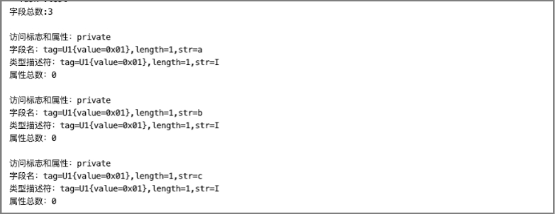

# 解析字段表


在同一个Class文件中，不允许存在两个相同的字段，相同指的是字段名与类型描述符都相同。

字段结构与Class文件结构一样，都有访问标志项，但两者的访问标志项在访问权限和属性上有些区别。

<center>字段中的访问权限和属性标志</center>

| ***标志名***  | ***十六进制值*** | ***说明***                         |
| ------------- | ---------------- | ---------------------------------- |
| ACC_PUBLIC    | 0x 00 01         | 声明为public                       |
| ACC_PRIVATE   | 0x 00 02         | 声明为private                      |
| ACC_PROTECTED | 0x 00 04         | 声明为protected                    |
| ACC_STATIC    | 0x 00 08         | 声明为static                       |
| ACC_FINAL     | 0x 00 10         | 声明为final                        |
| ACC_VOLATILE  | 0x 00 40         | 声明为volatile                     |
| ACC_TRANSIENT | 0x 00 80         | 声明为transient                    |
| ACC_SYNTHTIC  | 0x 10 00         | 标志该字段由编译器产生，不在源码中 |
| ACC_ENUM      | 0x 40 00         | 声明为枚举类型的成员               |

字段的结构如下表所示。

| ***字段名***     | ***类型***     | ***说明***                             |
| ---------------- | -------------- | -------------------------------------- |
| access_flags     | u2             | 访问标志                               |
| name_index       | u2             | 字段名，指向常量池中某个常量的索引     |
| descriptor_index | u2             | 类型描述符，指向常量池中某个常量的索引 |
| attributes_count | u2             | 属性总数                               |
| attributes       | attribute_info | 属性                                   |

其中，access_flags是字段的访问标志，name_index是字段名称常量的索引，descriptor_index是字段的类型描述符常量索引。字段结构与方法结构、Class文件结构都有属性表attributes，属性表的属性个数可以是0个或多个。

属性的通用结构如下表所示。

| ***字段名***         | ***类型*** | ***说明***                         |
| -------------------- | ---------- | ---------------------------------- |
| attribute_name_index | u2         | 属性名称，指向常量池某个常量的索引 |
| attribute_length     | u4         | 属性长度，属性info的字节总数       |
| info                 | u1         | 属性信息，不同的属性不同的解析     |

> 提示：关于属性，我们先了解属性的通用结构，实现属性的初步解析，让字段解析器能够完成字段的解析工作，至于属性info是什么我们暂时先不关心。

首先创建字段结构对应的Java类FieldInfo，代码如下。

 ```java
public class FieldInfo {  
    private U2 access_flags;  
    private U2 name_index;  
    private U2 descriptor_index;  
    private U2 attributes_count;  
    private AttributeInfo[] attributes;
}  
 ```

接着创建属性结构对应的Java类AttributeInfo，代码如下。

```java
public class AttributeInfo {  
    private U2 attribute_name_index;  
    private U4 attribute_length;  
    private byte[] info;  
}  
```

最后创建字段表解析器FieldHandler，实现字段表的解析。字段结构的属性表的解析工作也由字段表解析器完成，解析流程如下：

* 1、先从class文件字节缓存中读取到字段总数，根据字段总数创建字段表；
* 2、循环解析出每个字段；
* 3、解析字段的属性表时，先解析获取到属性总数，再根据属性总数创建属性表；
* 4、使用通用属性结构循环解析出字段的每个属性；
* 5、解析属性时，先解析出attribute_name_index，再解析attribute_length获取属性info的长度，根据长度读取指定长度的字节数据存放到属性的info字段。

字段表解析器的实现代码如下。

```java
public class FieldHandler implements BaseByteCodeHandler {  
  
    @Override  
    public int order() {  
        // 排在接口解析器的后面  
        return 6;  
    }  
  
    @Override  
		public void read(ByteBuffer codeBuf, ClassFile classFile) throws Exception {  
  			// 读取字段总数
        classFile.setFields_count(new U2(codeBuf.get(), codeBuf.get()));  
        int len = classFile.getFields_count().toInt();  
        if (len == 0) {  
            return;  
        }  
        // 创建字段表  
        FieldInfo[] fieldInfos = new FieldInfo[len];  
        classFile.setFields(fieldInfos);  
    		// 循环解析出每个字段
        for (int i = 0; i < fieldInfos.length; i++) {  
            // 解析字段  
            fieldInfos[i] = new FieldInfo();  
           	// 读取字段的访问标志 
						fieldInfos[i].setAccess_flags(new U2(codeBuf.get(), codeBuf.get()));  
						// 读取字段名称
            fieldInfos[i].setName_index(new U2(codeBuf.get(), codeBuf.get()));  
      			// 读取字段类型描述符索引
            fieldInfos[i].setDescriptor_index(new U2(codeBuf.get(), codeBuf.get()));  
      			// 读取属性总数
            fieldInfos[i].setAttributes_count(new U2(codeBuf.get(), codeBuf.get()));  
            // 获取字段的属性总数  
            int attr_len = fieldInfos[i].getAttributes_count().toInt();  
            if (attr_len == 0) {  
                continue;  
            }  
            // 创建字段的属性表  
            fieldInfos[i].setAttributes(new AttributeInfo[attr_len]);  
      			// 循环解析出每个属性，先使用通用属性结构解析每个属性
            for (int j = 0; j < attr_len; j++) {  
                // 解析字段的属性  
                fieldInfos[i].getAttributes()[j]  
                        .setAttribute_name_index(new U2(codeBuf.get(),codeBuf.get()));  
                //  获取属性info的长度  
                U4 attr_info_len = new U4(codeBuf.get(), codeBuf.get(),  codeBuf.get(), codeBuf.get());  
                fieldInfos[i].getAttributes()[j].setAttribute_length(attr_info_len);  
                //  解析info  
                byte[] info = new byte[attr_info_len.toInt()];  
                codeBuf.get(info, 0, attr_info_len.toInt());  
                fieldInfos[i].getAttributes()[j].setInfo(info);  
            }  
        }  
    }  
  
}  
```

为验证解析结果，我们还需要编写将字段的访问标志access_flags转为字符串输出的工具类FieldAccessFlagUtils ，代码如下。

```java
public class FieldAccessFlagUtils {  
    private static final Map<Integer, String> fieldAccessFlagMap = new HashMap<>();  
  
    static {  
        fieldAccessFlagMap.put(0x0001, "public");  
        fieldAccessFlagMap.put(0x0002, "private");  
        fieldAccessFlagMap.put(0x0004, "protected");  
        fieldAccessFlagMap.put(0x0008, "static");  
        fieldAccessFlagMap.put(0x0010, "final");  
        fieldAccessFlagMap.put(0x0040, "volatile");  
        fieldAccessFlagMap.put(0x0080, "transient");  
        fieldAccessFlagMap.put(0x1000, "synthtic");  
        fieldAccessFlagMap.put(0x4000, "enum");  
    }  
  
    /** 
     * 获取16进制对应的访问标志和属性字符串表示 （仅用于类的访问标志） 
     * 
     * @param flag 字段的访问标志 
     * @return 
     */  
    public static String toFieldAccessFlagsString(U2 flag) {  
        final int flagVlaue = flag.toInt();  
        StringBuilder flagBuild = new StringBuilder();  
        fieldAccessFlagMap.keySet()  
                .forEach(key -> {  
                    if ((flagVlaue & key) == key) {  
                        flagBuild.append(fieldAccessFlagMap.get(key)).append(",");  
                    }  
                });  
        return flagBuild.length() > 0 && flagBuild.charAt(flagBuild.length() - 1) == ',' ?  
                     flagBuild.substring(0, flagBuild.length() - 1)  : flagBuild.toString();  
    }  
  
}  
```

字段表解析器编写完成后，我们先将字段解析器注册到ClassFileAnalysiser，再编写单元测试。要求单元测试需要将解析后的所有字段的名称、类型、以及字段的访问标志转为字符串打印出来，以验证结果是否正确。

字段表解析器单元测试代码如下。

```java
public class FieldHandlerTest {  
  
    private static String getName(U2 name_index, ClassFile classFile) {  
        CONSTANT_Utf8_info name_info = (CONSTANT_Utf8_info) 
                     classFile.getConstant_pool()[name_index.toInt() - 1];  
        return name_info.toString();  
    }  
  
    @Test  
    public void testFieldHandlerHandler() throws Exception {  
        ByteBuffer codeBuf = ClassFileAnalysisMain.readFile("Builder.class");  
        ClassFile classFile = ClassFileAnalysiser.analysis(codeBuf);  
        System.out.println("字段总数:" + classFile.getFields_count().toInt());  
        System.out.println();  
        FieldInfo[] fieldInfos = classFile.getFields();  
    		// 遍历字段表
        for (FieldInfo fieldInfo : fieldInfos) {  
            System.out.println("访问标志和属性：" + FieldAccessFlagUtils
                .toFieldAccessFlagsString(fieldInfo.getAccess_flags()));  
            System.out.println("字段名：" 
                + getName(fieldInfo.getName_index(), classFile));  
            System.out.println("字段的类型描述符：" 
                + getName(fieldInfo.getDescriptor_index(), classFile));  
            System.out.println("属性总数：" 
                + fieldInfo.getAttributes_count().toInt());  
            System.out.println();  
        }  
    }  
  
}  
```

单元测试结果如下图所示。



从输出的结果可以看出，该class有三个字段，访问权限都是private的，字段名分别是a、b、c，并且类型描述符都是“I”，即字段的类型都是整型。

---

<font color= #666666>发布于：2021 年 07 月 24 日</font><br><font color= #666666>作者: 吴就业</font><br><font color= #666666>链接: https://wujiuye.gitbook.io/jvmbytecode</font><br><font color= #666666>来源: GitBook开源电子书《深入浅出JVM字节码》（《Java虚拟机字节码从入门到实战》的第二版），未经作者许可，禁止转载!</font><br>


