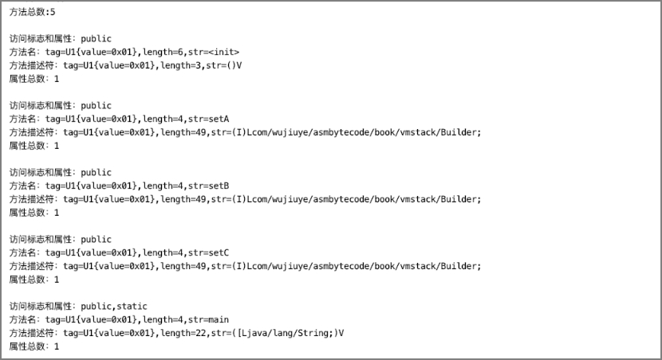

# 解析方法表

class文件的方法表用于存放一个类或者接口的所有方法，方法结构与字段结构一样，都有属性表，方法编译后的字节码指令是存放在方法结构的属性表中的，对应Code属性。但不是所有方法都会有Code属性，如接口中的方法不一定会有Code属性，如抽象方法一定没有Code属性。方法包括静态方法、以及类的初始化方法<clinit>和类的实例初始化方法<init>。

方法表结构如下。

| ***字段名***     | ***类型***     | ***说明***                                 |
| ---------------- | -------------- | ------------------------------------------ |
| access_flags     | u2             | 方法的访问标志和属性                       |
| name_index       | u2             | 方法名，值为指向常量池中某个常量的索引     |
| descriptor_index | u2             | 方法描述符，值为指向常量池中某个常量的索引 |
| attributes_count | u2             | 属性总数                                   |
| attributes       | attribute_info | 属性表                                     |

其中方法名称索引、方法描述符索引与字段结构中的字段名索引和字段类型描述符索引，都是指向常量池中CONSTABT_Utf8_info结构的常量。与字段结构一样，方法结构也拥有属性总数和属性表，只是也会存在一些差异，如方法有Code属性而字段没有。访问标志也与字段的访问标志有些区别，如字段有ACC_VOLATILE标志而方法没有。

<center>方法的访问权限及属性标志</center>

| ***标志名***     | ***十六进制取值*** | ***说明***                     |
| ---------------- | ------------------ | ------------------------------ |
| ACC_PUBLIC       | 0x 00 01           | 声明方法访问权限为public       |
| ACC_PRIVATE      | 0x 00 02           | 声明方法访问权限为private      |
| ACC_PROTECTED    | 0x 00 04           | 声明方法访问权限为protected    |
| ACC_STATIC       | 0x 00 08           | 声明方法为static               |
| ACC_FINAL        | 0x 00 10           | 声明方法为final，不允许覆盖    |
| ACC_SYNCHRONIZED | 0x 00 20           | 同步方法，多线程调用加锁       |
| ACC_BRIDGE       | 0x 00 40           | 声明为bridge方法，由编译器产生 |
| ACC_VARARGS      | 0x 00 80           | 方法有可变长参数               |
| ACC_NATIVE       | 0x 01 00           | native方法                     |
| ACC_ABSTRACT     | 0x 04 00           | 抽象方法                       |
| ACC_STRICT       | 0x 08 00           | 使用FP-strict浮点模式          |
| ACC_SYNTHETIC    | 0x 10 00           | 非源代码编译出来的             |

首先，根据方法结构创建对应的Java类MethodInfo，代码如下。

```java
public class MethodInfo {  
    private U2 access_flags;  
    private U2 name_index;  
    private U2 descriptor_index;  
    private U2 attributes_count;  
    private AttributeInfo[] attributes;  
} 
```

其次是创建方法表解析器，代码如下。

```java
public class MethodHandler implements BaseByteCodeHandler {  
  
    @Override  
    public int order() {  
        // 排在字段解析器的后面  
        return 7;  
    }  
  
    @Override  
    public void read(ByteBuffer codeBuf, ClassFile classFile) 
                        throws Exception {  
       classFile.setMethods_count(new U2(codeBuf.get(), codeBuf.get()));  
        // 获取方法总数  
        int len = classFile.getMethods_count().toInt();  
        if (len == 0) {  
            return;  
        }  
        // 创建方法表  
        MethodInfo[] methodInfos = new MethodInfo[len];  
        classFile.setMethods(methodInfos);  
        for (int i = 0; i < methodInfos.length; i++) {  
            // 解析方法  
            methodInfos[i] = new MethodInfo();  
            methodInfos[i].setAccess_flags(new U2(codeBuf.get(),codeBuf.get()));  
            methodInfos[i].setName_index(new U2(codeBuf.get(), codeBuf.get()));  
            methodInfos[i].setDescriptor_index(new U2(codeBuf.get(), codeBuf.get()));  
            methodInfos[i].setAttributes_count(new U2(codeBuf.get(), codeBuf.get()));  
            // 获取方法的属性总数  
            int attr_len = methodInfos[i].getAttributes_count().toInt();  
            if (attr_len == 0) {  
                continue;  
            }  
            // 创建方法的属性表  
            methodInfos[i].setAttributes(new AttributeInfo[attr_len]);  
            for (int j = 0; j < attr_len; j++) {  
                methodInfos[i].getAttributes()[j] = new AttributeInfo();  
                // 解析方法的属性  
                methodInfos[i].getAttributes()[j]  
                        .setAttribute_name_index(new U2(codeBuf.get(), codeBuf.get()));  
                // 获取属性info的长度  
                U4 attr_info_len = new U4(codeBuf.get(), codeBuf.get(), codeBuf.get(), codeBuf.get());  
                methodInfos[i].getAttributes()[j] .setAttribute_length(attr_info_len);  
                if (attr_info_len.toInt() == 0) {  
                    continue;  
                }  
                // 解析info  
                byte[] info = new byte[attr_info_len.toInt()];  
                codeBuf.get(info, 0, attr_info_len.toInt());  
                methodInfos[i].getAttributes()[j].setInfo(info);  
            }  
        }  
    }  
  
}  
```

> 提示：与字段表的解析流程一样，我们暂时不关心属性表的具体属性的解析，属性表的解析只使用通用属性结构解析。

最后是将方法表解析器注册到ClassFileAnalysiser，这一步省略。

现在我们来编写单元测试，验证方法表解析器解析结果的正确性，方法表解析器的单元测试与字段表解析器的单元测试逻辑差不多，代码如下。

```java
public class MethodHandlerTest {  
  
    private static String getName(U2 name_index, ClassFile classFile) {  
        CONSTANT_Utf8_info name_info = (CONSTANT_Utf8_info) 
                      classFile.getConstant_pool()[name_index.toInt() - 1];  
        return name_info.toString();  
    }  
  
    @Test  
    public void testMethodHandlerHandler() throws Exception {  
        ByteBuffer codeBuf = ClassFileAnalysisMain.readFile("Builder.class");  
        ClassFile classFile = ClassFileAnalysiser.analysis(codeBuf);  
        System.out.println("方法总数:" + classFile.getMethods_count().toInt());  
        System.out.println();  
        MethodInfo[] methodInfos = classFile.getMethods();  
    		// 遍历方法表
        for (MethodInfo methodInfo : methodInfos) {  
            System.out.println("访问标志和属性：" +   FieldAccessFlagUtils
.toFieldAccessFlagsString(methodInfo.getAccess_flags()));  
            System.out.println("方法名：" + getName(methodInfo.getName_index(), classFile));  
            System.out.println("方法描述符：" 
             + getName(methodInfo.getDescriptor_index(), classFile));  
            System.out.println("属性总数：" + methodInfo.getAttributes_count().toInt());  
            System.out.println();  
        }  
    }  
}
```

单元测试结果如下。



从单元测试结果可以看出，该单元测试解析的class文件有5个方法，访问权限都是public，其中有一个方法是静态方法。这五个方法的属性表都只有一个属性，实际都是Code属性。这五个方法的方法名称分别是<init>、setA、setB、setC和main。并且从输出的结果还能看出各个方法的方法描述符。

---

发布于：2021 年 07 月 24 日<br>作者: [吴就业](https://www.wujiuye.com/)<br>GitHub链接:https://github.com/wujiuye/JVMByteCodeGitBook<br>链接: https://www.wujiuye.com/ebook/JVMByteCodeGitBook/chapter/chapter02_09.md<br>来源: Github Pages 开源电子书《深入浅出JVM字节码》（《Java虚拟机字节码从入门到实战》的第二版），未经作者许可，禁止转载!<br>