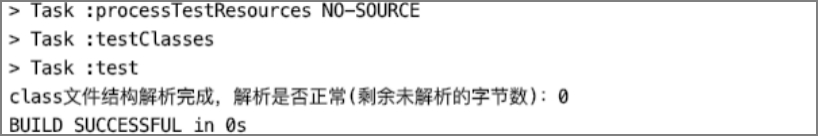

# 解析整个Class文件结构

目前为止，我们已经编写完成class文件结构各项的解析器，并且都已经注册到ClassFileAnalysiser，现在ClassFileAnalysiser类持有的解析器有：

* MagicHandler（魔数解析器）
* VersionHandler（版本号解析器）
* ConstantPoolHandler（常量池解析器）
* AccessFlagsHandler（访问标志解析器）
* ThisAndSuperClassHandler（this_class与super_class解析器）
* InterfacesHandler（接口表解析器）
* FieldHandler（字段表解析球）
* MethodHandler（方法表解析器）
* AttributesHandler（属性表解析器）

ClassFileAnalysiser类的完整代码如下。

```java
public class ClassFileAnalysiser {  
  
    private final static List<BaseByteCodeHandler> handlers = new ArrayList<>();  
  
    static {  
        handlers.add(new MagicHandler());  
        handlers.add(new VersionHandler());  
        handlers.add(new ConstantPoolHandler());  
        handlers.add(new AccessFlagsHandler());  
        handlers.add(new ThisAndSuperClassHandler());  
        handlers.add(new InterfacesHandler());  
        handlers.add(new FieldHandler());  
        handlers.add(new MethodHandler());  
        handlers.add(new AttributesHandler());  
				// 如果解析器是按顺序注册的，那么排序可以忽略
      	handlers.sort((Comparator.comparingInt(BaseByteCodeHandler::order)));
    }  
  
    public static ClassFile analysis(ByteBuffer codeBuf) throws Exception {  
        ClassFile classFile = new ClassFile();  
        codeBuf.position(0);  
        for (BaseByteCodeHandler handler : handlers) {  
            handler.read(codeBuf, classFile);  
        }  
        System.out.println("class文件结构解析完成，解析是否正常(剩余未解析的字节数)：" + codeBuf.remaining());  
        return classFile;  
    }  
  
}  
```

最后我们还需要对ClassFileAnalysiser进行一次单元测试，重点关注解析完成后，class文件字节缓存中是否还有未读取的字节，如果有则说明某个解析器的某个解析步骤出错了，如果没有，则所有解析器都正常工作。因此，我们在ClassFileAnalysiser 的analysis方法中添加打印剩余未读取的字节总数语句。

单元测试代码如下。

```java
public class AllHandlerTest {  
  
    @Test  
    public void test() throws Exception {  
        ByteBuffer codeBuf = ClassFileAnalysisMain.readFile("RecursionAlgorithmMain.class");  
        ClassFile classFile = ClassFileAnalysiser.analysis(codeBuf);  
    }  
  
} 
```

单元测试结果如下图。



从输出的结果中可以看出，在所有解析器解析完成后，class文件字节缓存ByteBuffer对象剩余可读的字节数为0，即ByteBuffer对象的读指针与limit指针重合，表示读完，因此解析正常。

至此，我们对整个class文件结构的解析工作就已经基本完成了。而对于属性的解析，我们都只是使用通用的解析器解析。在《Java虚拟机规范》Java SE 8版本中，预定义属性就有23个，但本书不会对每个属性都进行详细介绍。

---

发布于：2021 年 07 月 24 日<br>作者: [吴就业](https://www.wujiuye.com/)<br>GitHub链接:https://github.com/wujiuye/JVMByteCodeGitBook<br>链接: https://www.wujiuye.com/ebook/JVMByteCodeGitBook/chapter/chapter02_11.md<br>来源: Github Pages 开源电子书《深入浅出JVM字节码》（《Java虚拟机字节码从入门到实战》的第二版），未经作者许可，禁止转载!<br>
