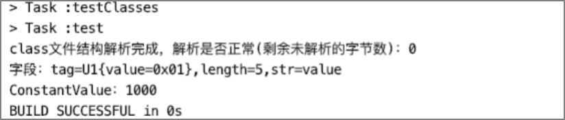
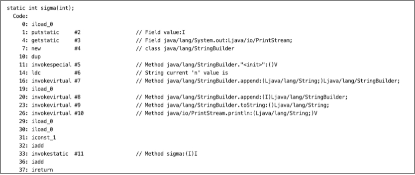
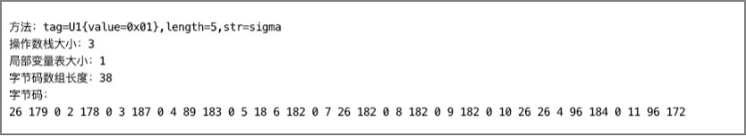
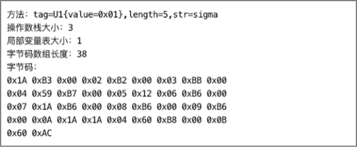

# 属性二次解析

如果想要深入理解某个属性，我们可再对其进行二次解析。如何使用我们编写的项目对class文件结构、字段结构、方法结构的属性表中的属性进行二次解析呢？我们以字段的ConstantValue属性和方法的Code属性为例。

## 解析ConstantValue属性

ConstantValue属性用于通知虚拟机在类或接口初始化阶段为被标志为ACC_STATIC & ACC_FINAL的静态常量字段自动赋值常量。

>  提示：在接口中声明的字段会被编译器加上ACC_STATIC & ACC_FINAL标志。

字段结构的属性表最多只能有一个ConstantValue属性。字段的类型必须是基本数据类型或者String类，因为从常量池中只能引用到基本类型和String类型的字面量。

ConstantValue属性的结构如下：

```java
public class ConstantValue_attribute {  
    private U2 attribute_name_index;  
    private U4 attribute_length;  
    private U2 constantvalue_index;  
} 
```

* attribute_length：由于ConstantValue属性是定长属性，因此attribute_length的值固定为2；
* attribute_name_index：指向常量池中的CONSTANT_Utf8_info常量，该常量表示的字符串为“ConstantValue”；
* constantvalue_index：指向基本数据类型或String类型常量。

与常量池的常量结构不同，常量池的常量都有一个tag字段映射到哪种常量结构，而属性表的属性结构只能通过attribute_name_index判断。

以一个例子来说明ConstantValue属性的使用场景。

在一个接口中定义一个字段并赋值，通过分析其Class文件结构，找到这个字段的属性表，看是否有ConstantValue属性。该测试接口代码如下。

```java
public interface TestConstantValueInterface {  
    int value = 1000;  
}  
```

现在，我们需要编写一个属性解析工具类，添加支持解析ConstantValue属性的静态方法，以完成属性的二次解析工作，代码如下。

```java
public class AttributeProcessingFactory {  
  
  public static ConstantValue_attribute processingConstantValue(AttributeInfo attributeInfo) {  
      ConstantValue_attribute attribute = new ConstantValue_attribute();  
      attribute.setAttribute_name_index(attributeInfo.getAttribute_name_index());  
      attribute.setAttribute_length(attributeInfo.getAttribute_length());  
      attribute.setConstantvalue_index(new U2(attributeInfo.getInfo()[0], attributeInfo.getInfo()[1]));  
      return attribute;  
  }  
  
} 
```

* processingConstantValue：方法要求传入一个经过一次解析后的ConstantValue属性对象（AttributeInfo ），方法返回二次解析后生成的ConstantValue属性对象（ConstantValue_attribute）。

因为当前只实现了ConstantValue属性的解析，所以单元测试中只对名称为“ConstantValue”的属性进行二次解析，单元测试代码如下。

```java
public class ConstantValueAttributeTest {  
  
    @Test  
    public void testConstantValue() throws Exception {  
        ByteBuffer codeBuf = ClassFileAnalysisMain.readFile(".../TestConstantValueInterface.class");  
        ClassFile classFile = ClassFileAnalysiser.analysis(codeBuf);  
        // 获取所有字段  
        FieldInfo[] fieldInfos = classFile.getFields();  
        for (FieldInfo fieldInfo : fieldInfos) {  
            // 获取字段的所有属性  
            AttributeInfo[] attributeInfos = fieldInfo.getAttributes();  
            if (attributeInfos == null || attributeInfos.length == 0) {  
                continue;  
            }  
            System.out.println("字段：" + classFile.getConstant_pool()
                                  [fieldInfo.getName_index().toInt() - 1]);  
      			// 遍历所有属性
            for (AttributeInfo attributeInfo : attributeInfos) {  
                // 获取属性的名称  
               U2 name_index = attributeInfo.getAttribute_name_index();  
               CONSTANT_Utf8_info name_info = (CONSTANT_Utf8_info) 
                     classFile.getConstant_pool()[name_index.toInt() - 1];  
               String name = new String(name_info.getBytes());  
        			// 如果属性名是ConstantValue，则对该属性进行二次解析
               if (name.equalsIgnoreCase("ConstantValue")) {  
                    // 属性二次解析  
                    ConstantValue_attribute constantValue = AttributeProcessingFactory.processingConstantValue(attributeInfo);  
                    // 取得constantvalue_index，从常量池中取值  
                   U2 cv_index = constantValue.getConstantvalue_index();  
                   Object cv = classFile.getConstant_pool() [cv_index.toInt() - 1];  
                   // 需要判断常量的类型  
                   if (cv instanceof CONSTANT_Utf8_info) {  
                        System.out.println("ConstantValue：" + cv.toString());  
                   } else if (cv instanceof CONSTANT_Integer_info) {  
                        System.out.println("ConstantValue：" +  
                                ((CONSTANT_Integer_info) cv).getBytes().toInt());  
                   } else if (cv instanceof CONSTANT_Float_info) {  
                        // todo  
                   } else if (cv instanceof CONSTANT_Long_info) {  
                        // todo  
                   } else if (cv instanceof CONSTANT_Double_info) {  
                        // todo  
                   }  
                }  
            }  
        }  
    }  
  
} 
```

对字段的属性进行二次解析的步骤：

* 1、解析Java类编译后生成的class文件，以便获取该接口的所有字段信息；
* 2、遍历字段表；
* 3、遍历每个字段的属性表；
* 4、根据属性的名称在常量池中的索引到常量池中取到属性名，再根据属性名去调用对应属性结构的二次解析方法对其进行二次解析。

单元测试结果如下图所示。



如图所示，字段名为value的字段其属性表有一个ConstantValue属性，常量值是1000。

## 解析Code属性

一个方法编译后生成的字节码指令存储在方法结构的属性表的Code属性中，但并非每个方法都有Code属性，如声明为native的方法、abstract抽象方法、接口中的非default方法就没有Code属性。实例初始化方法<init>、类或接口的初始化方法<clinit>都会有Code属性。

这一节我们将通过完成对Code属性的二次解析了解Code属性，了解字节码指令是如何存储的在Code属性中的。

方法结构的属性表中最多只能有一个Code属性，Code属性是种可变长的属性，属性中包含了方法的字节码指令及相关辅助信息。

Code属性的结构：

| ***字段名***           | ***类型***       | ***说明***                                                   |
| ---------------------- | ---------------- | ------------------------------------------------------------ |
| attribute_name_index   | u2               | 指向常量池中“Code”常量的索引                                 |
| attribute_length       | u4               | 属性的长度（不包括attribute_name_index和attribute_length占用的长度） |
| max_stack              | u2               | 操作数栈的最大深度                                           |
| max_locals             | u2               | 局部变量表的最大深度                                         |
| code_length            | u4               | code数组的大小                                               |
| code                   | u1[]             | 存储字节码指令                                               |
| exception_table_length | u2               | 异常表的长度                                                 |
| exception_table        | exception[]      | 异常表                                                       |
| attributes_count       | u2               | 属性总数                                                     |
| attributes             | attribute_info[] | 属性表                                                       |

max_stack与max_locals分别对应操作数栈的大小和局部变量表的大小。

code项用一个字节数组存储该方法的所有字节码指令，code_length存储该code数组的大小。

属性也可以有属性表，attributes项便是Code属性的属性表，在Code属性中，属性表可能存在的属性如LineNumerTable属性、LocalVariableTable属性。

LineNumerTable属性：被用来映射源码文件中给定的代码行号对应code[]字节码指令中的哪一部分，在调试时用到，在方法抛出异常打印异常栈信息也会用到。

LocalVariableTable属性：用来描述code[]中的某个范围内，局部变量表中某个位置存储的变量的名称是什么，用于与源码文件中局部变量名做映射。该属性不一定会编译到class文件中，如果没有该属性，那么查看反编译后的java代码将会使用诸如arg0、arg1、arg2之类的名称代替局部变量的名称。

exception_table用于存储方法中的所有try-catch信息，exception_table_length存储该异常表数组的大小。异常表的每一项都是固定的结构体，异常结构如下表格所示。

| ***字段名*** | ***类型*** | ***说明***                                                   |
| ------------ | ---------- | ------------------------------------------------------------ |
| start_pc     | u2         | try的开始位置，在code[]中的索引                              |
| end_pc       | u2         | try的结束位置，在code[]中的索引。                            |
| handler_pc   | u2         | 异常处理的起点，在code[]中的索引。                           |
| catch_type   | u2         | 为0相当finally块。不为0时，指向常量池中某个CONSTANT_Class_info常量的索引，表示需要捕获的异常，只有[start_pc,end_pc)范围内抛出的异常是指定的类或子类的实例，才会跳转到handler_pc指向的字节码指令继续执行。 |

为Code属性结构创建Java类。

```java
public class Code_attribute {  
  
    private U2 attribute_name_index;  
    private U4 attribute_length;  
    private U2 max_stack;  
    private U2 max_locals;  
    private U4 code_length;  
    private byte[] code;  
		private U4 exception_table_length;  
  	private Exception[] exception_table;  
    private U2 attributes_count;  
    private AttributeInfo[] attributes;  
  	// 异常表中每项的结构
    public static class Exception {  
        private U2 start_pc;  
        private U2 end_pc;  
        private U2 handler_pc;  
        private U2 catch_type;  
    }  

}
```

对Code属性进行二次解析主要是想拿到字节码信息，属性表和异常表我们就不解析了，异常表在本书第三章再详细介绍。

对Code属性二次解析代码如下。

```java
public class AttributeProcessingFactory{
		public static Code_attribute processingCode(AttributeInfo attributeInfo) { 
          Code_attribute code = new Code_attribute();  
          ByteBuffer body = ByteBuffer.wrap(attributeInfo.getInfo());  
          // 操作数栈大小  
          code.setMax_stack(new U2(body.get(),body.get()));  
          // 局部变量表大小  
          code.setMax_locals(new U2(body.get(),body.get()));  
          // 字节码数组长度  
          code.setCode_length(new U4(body.get(),body.get(),body.get(),body.get()));  
          // 解析获取字节码  
          byte[] byteCode = new byte[code.getCode_length().toInt()];  
          body.get(byteCode,0,byteCode.length);  
          code.setCode(byteCode);  
          return code;  
     }
}  
```

现在编写单元测试，先将class文件解析为一个ClassFile对象，然后再遍历该ClassFile中的方法表，获取每个方法中的Code属性，再对Code属性进行二次解析。

单元测试代码如下。

```java
public class CodeAttributeTest {  
  
    @Test  
    public void testCodeAttribute() throws Exception {  
        ByteBuffer codeBuf = ClassFileAnalysisMain.readFile("RecursionAlgorithmMain.class");  
        ClassFile classFile = ClassFileAnalysiser.analysis(codeBuf);  
        // 获取方法表  
        MethodInfo[] methodInfos = classFile.getMethods();  
    		// 遍历方法表
        for (MethodInfo methodInfo : methodInfos) {  
            // 获取方法的属性表  
            AttributeInfo[] attributeInfos = methodInfo.getAttributes();  
            if (attributeInfos == null || attributeInfos.length == 0) {  
                continue;  
            }  
            System.out.println("方法：" + classFile.getConstant_pool()
                                [methodInfo.getName_index().toInt() - 1]);  
            // 遍历属性表
						for (AttributeInfo attributeInfo : attributeInfos) {  
                // 获取属性的名称  
                U2 name_index = attributeInfo.getAttribute_name_index();  
                CONSTANT_Utf8_info name_info = (CONSTANT_Utf8_info) 
                        classFile.getConstant_pool()[name_index.toInt() - 1];  
               String name = new String(name_info.getBytes());  
       					// 对Code属性二次解析
                if (name.equalsIgnoreCase("Code")) {  
                    // 属性二次解析  
                    Code_attribute code = AttributeProcessingFactory.processingCode(attributeInfo);  
                    System.out.println("操作数栈大小：" + code.getMax_stack().toInt());  
                    System.out.println("局部变量表大小：" + code.getMax_locals().toInt());  
                    System.out.println("字节码数组长度：" + code.getCode_length().toInt());  
                    System.out.println("字节码：");  
                    for (byte b : code.getCode()) {  
                        System.out.print((b & 0xff) + " ");  
                    }  
                    System.out.println("\n");  
                }  
            }  
        }  
    }  
  
}  
```

例子中使用到的RecursionAlgorithmMain类代码如下。

```java
public class RecursionAlgorithmMain {  
  
    private static volatile int value = 0;  
  
    static int sigma(int n) {  
        value = n;  
         System.out.println("current 'n' value is " + n);  
        return n + sigma(n + 1);  
    }  
  
    public static void main(String[] args) throws IOException {  
        new Thread(() -> sigma(1)).start();  
        System.in.read();  
        System.out.println(value);  
    }  
  
}
```

以RecursionAlgorithmMain的sigma方法为例，首先使用javap查看sigma方法的字节码，目的是对比我们编写的解析工具解析的结果，验证解析结果是否正确。

 

使用编写好的解析工具解析sigma方法的Code属性，结果如下图所示。



这里我们还需要将字节码转为十六进制输出，方便与字节码指令表对照。

byte[]转十六进制字符串工具类的实现代码如下。

```java
public class HexStringUtils {  
  
    public static String toHexString(byte[] codes) {  
        StringBuilder codeStrBuild = new StringBuilder();  
        int i=0;  
        for (byte code : codes) {  
      			// toHexString将字节转十六进制，实现略...
            codeStrBuild.append(toHexString(code)).append(" ");  
            if(++i==9){  
                i=0;  
                codeStrBuild.append("\n");  
            }  
        }  
        return codeStrBuild.toString();  
		}  

}  
```

将字节码转为十六进制字符串后输出的结果如下图所示。



其中，字节码部分的0x1A对应iload_0指令，0xB3对应putstatic指令，由于putstatic指令需要一个操作数，因此0xB3后面的0x00 02就是指令所需的操作数。

---

<font color= #666666>发布于：2021 年 07 月 24 日</font><br><font color= #666666>作者: [吴就业](https://www.wujiuye.com/)</font><br><font color= #666666>GitHub链接:https://github.com/wujiuye/JVMByteCodeGitBook</font><br><font color= #666666>链接: https://www.wujiuye.com/ebook/JVMByteCodeGitBook/chapter/chapter02_12.md</font><br><font color= #666666>来源: Github Pages 开源电子书《深入浅出JVM字节码》（《Java虚拟机字节码从入门到实战》的第二版），未经作者许可，禁止转载!</font><br>