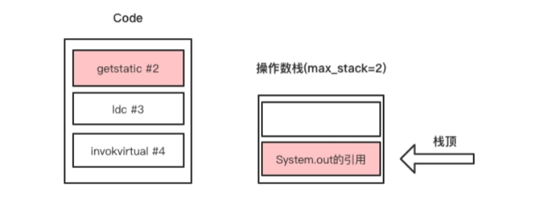
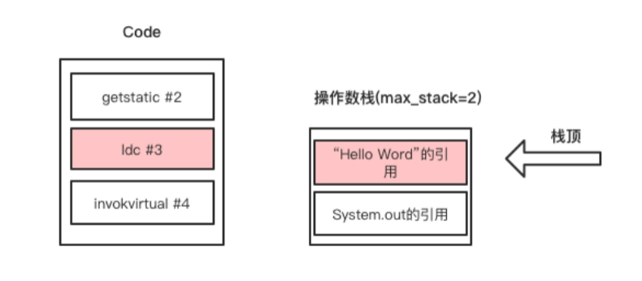
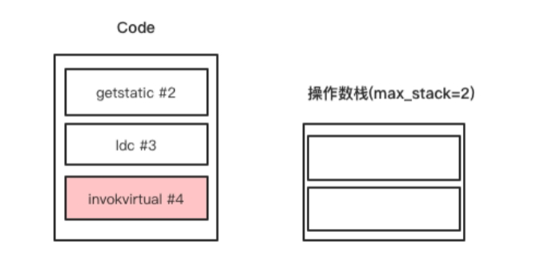

# 从Hello Word出发


与学习一门编程语言一样，我们从使用Java代码编写一个Hello World程序、使用javap[^1]工具查看Hello World程序的字节码并分析每条字节码指令的执行过程开始，入门Java虚拟机字节码指令。 

使用Java代码编写的Hello World程序，代码如下。

```java
public class HelloWord {  
    public static void main(String[] args) {  
        System.out.println("Hello Word");  
    }  
} 
```

使用javap命令输出Hello World程序的字节码如下

```java
public static void main(java.lang.String[]);  
   Code:  
      0: getstatic     #2                  // Field java/lang/System.out:Ljava/io/PrintStream;  
      3: ldc           #3                  // String Hello Word  
      5: invokevirtual #4                  // Method java/io/PrintStream.println:(Ljava/lang/String;)V  
      8: return  
```

第一条指令是getstatic，对应的操作码是0xB2，该指令需要一个操作数，该操作数必须是常量池中某个CONSTANT_Fieldref_info常量的索引。在本例中，该指令表示获取System的out静态字段，该静态字段的类型为java.io.PrintStream。该指令执行完成后，操作数栈顶存放的就是System的out静态字段的引用，如下图所示。



第二条指令是ldc，对应的操作码是0x12，该指令也需要一个操作数，值为常量池中的某个CONSTANT_String_info常量的索引。在本例中，其作用是将常量池中的“Hello Word”字符串的引用放入操作数栈顶。该指令执行完后，操作数栈顶存放的就是字符串“Hello Word”的引用，如下图所示。



第三条指令是invokevirtual，对应的操作码是0xB6，该指令也需要一个操作数，值为常量池中某个CONSTANT_Methodref_info常量的索引。在本例中，它的作用是调用PrintStream对象的println方法。

 invokevirtual指令要求将调用目标方法所需要的参数压入栈顶，除静态方法、类初始化方法<clinit>之外，每个类的成员方法以及类的实例初始化方法<init>的第一个参数都是this引用，在java代码中不需要传递，由编译器编译后生成。

在本例中invokevirtual指令执行之前，操作数栈必须存在一个System.out对象的引用，和println方法所需的参数，并且顺序是严格要求的，正是前面getstatic、ldc两条指令执行的结果。invokevirtual指令执行完成后操作栈的变化如下图所示。



---

[^1]: javap是JDK提供的命令行工具，是专门用于分析class文件字节码的工具

<font color= #666666>发布于：2021 年 08 月 21 日</font><br><font color= #666666>作者: [吴就业](https://www.wujiuye.com/)</font><br><font color= #666666>链接: https://github.com/wujiuye/JVMByteCodeGitBook</font><br><font color= #666666>来源: Github Pages 开源电子书《深入浅出JVM字节码》（《Java虚拟机字节码从入门到实战》的第二版），未经作者许可，禁止转载!</font><br>


