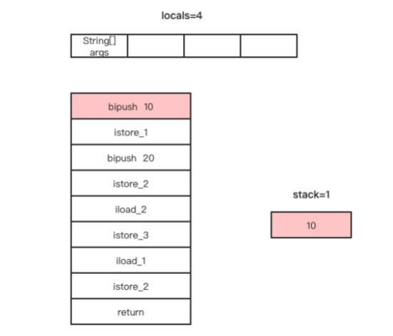
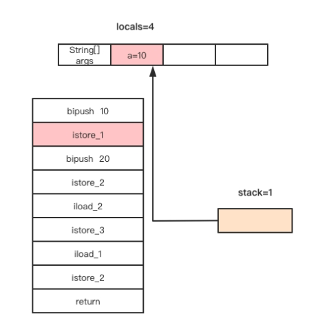
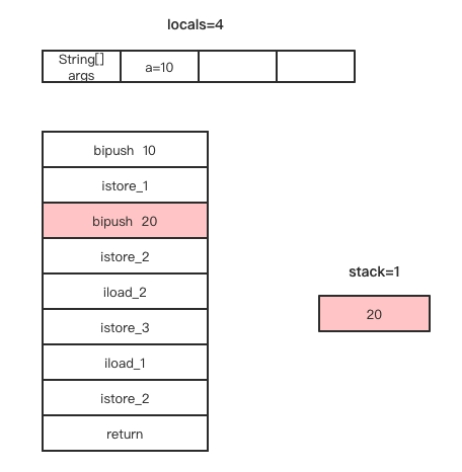
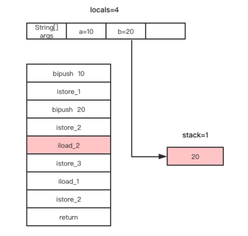
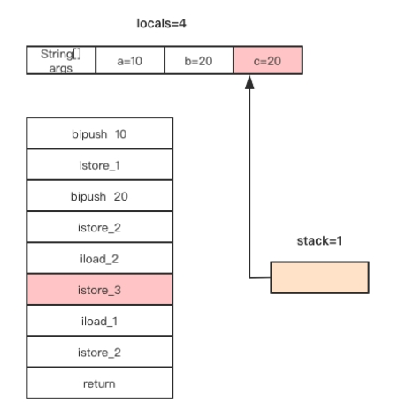
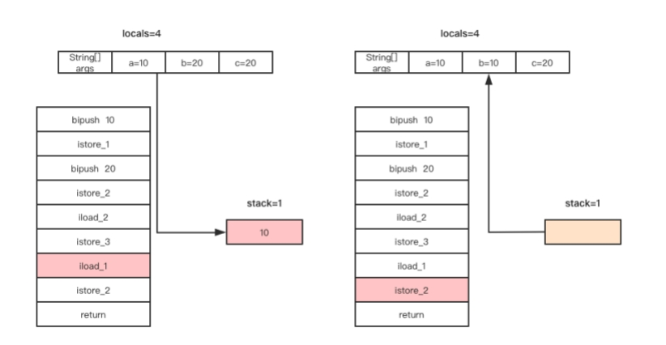

# 读写局部变量表与操作数栈


读写局部变量表与操作数栈就是将局部变量push进操作数栈与将操作数栈的栈顶元素存储到局部变量表的操作。 

将局部变量表中的元素放入操作数栈只能放入栈顶，而将操作数栈的栈顶元素存到局部变量表是可以指定存到局部变量表的位置的，这个过程其实就是给局部变量赋值。

与汇编语言有相似之处就是字节码指令不能直接将局部变量表的某个元素赋值给局部变量表的另一个元素，必须通过操作数栈完成。这也是为什么说字节码指令集是基于栈的指令集。

局部变量表的大小与操作数栈的深度是在Java代码编译成class字节码文件时就已经确定，使用javap -v命令可以查看当前class文件中每个方法的操作数栈深度与局部变量表大小，如下图所示。


以一个给局部变量赋值的例子理解读写操作数栈与局部变量表，代码如下。

```java
public static void main(String[] args) {  
    int a=10,b=20;  
    int c=b;  
    b=a;  
}
```

使用javap命令输出这段代码的字节码如下。

```java
public static void main(java.lang.String[]);  
    Code:  
      stack=1, locals=4, args_size=1  
         0: bipush        10  
         2: istore_1  
         3: bipush        20  
         5: istore_2  
         6: iload_2  
         7: istore_3  
         8: iload_1  
         9: istore_2  
        10: return
```

结果显示，局部变量表的大小为4，操作数栈的大小是1。局部变量表的每个Slot分别用于存储main方法中类型为String数组的参数的引用，以及变量a、b、c的值。

为什么局部变量表的大小为4，操作数栈的大小只是1呢？我们带着这个疑问分析这些字节码指令的执行过程。

通过javap查看字节码我们发现，在字节码指令的前面都会标有数字，这些数字是每条指令在Code属性中code[]数组的索引，也可称为下标或者偏移量。把这些指令的索引连在一起看，发现不是连续的，这是因为有些指令需要操作数，在需要操作数的指令后面会存储该指令执行所需的操作数，所以指令前面的数字不是连续的。

现在我们分析案例中字节码指令的执行过程。

1、偏移量为0的指令为bipush指令，该指令是将一个立即数10放入操作数栈顶。该指令执行完后，操作数栈与局部变量表的变化如下图所示。



2、偏移量为2的指令是istore_1，该指令是将当前操作数栈顶的元素存储到局部变量表索引为1的Slot（第二个Slot）。该指令执行完成后，局部变量表索引为1的Slot存储整数10（即a=10），操作数栈顶的元素已经出栈，此时操作数栈为空，如下图所示。



3、偏移量为3的字节码指令为bipush指令，该指令的作用是将立即数20放入操作数栈顶。该指令执行完成后，局部变量a的值还是10，操作数栈顶存储立即数20，如下图所示。



4、偏移量为5的字节码指令为istore_2，该指令不需要操作数，作用是将当前操作数栈的栈顶元素存储到局部变量表索引为2的Slot。该指令执行完成后，a=10，b=20，操作数栈顶的元素出栈，操作数栈为空，如下图所示。


5、偏移量为6的字节码指令为aload_2，该指令不需要操作数，作用是将局部变量表索引为2的元素放入操作数栈的栈顶。该指令执行完成后，a=10，b=20，操作数栈的栈顶存储整数20，如下图所示。



6、偏移量为7的字节码指令为istore_3，该指令的作用是将当前操作数栈的栈顶元素存储到局部变量表索引为3的Slot。偏移量为6和7的两条指令完成将局部变量b赋值给局部变量c。该指令执行完成后，a=10，b=20，c=20，操作数栈顶元素出栈，操作数栈为空，如下图所示。



7、偏移量为8和9的两条字节码指令分别为iload_1和istore_2，这两条字节码指令的作用是完成局部变量a赋值给局部变量b的操作，这两条指令执行完成后，局部变量与操作数栈的变化如下图所示。



从整个方法的字节码指令执行过程来看，该方法执行所需要占用操作数栈的Slot最多只有一个，因此该方法的操作数栈的大小被编译器设置为1，不浪费任何空间。而方法参数args和方法体内声明的局部变量a、b、c它们的作用域是整个方法，因此需要为args、a、b、c都分配一个局部变量槽位，局部变量表的大小被编译器设置为4。

我们通过这个例子了解了局部变量表和操作数栈的读写，其中iload_xx指令就是将局部变量表的元素放入栈顶，istore_xx指令就是将当前操作数栈的栈顶元素存储到局部变量表。xx是局部变量表的索引，局部变量表是一个数组，需要通过索引访问数组中的元素。iload_xx和istore_xx对应的字节码指令如下表所示。

| ***指令*** | ***指令码*** | ***说明***                               |
| ---------- | ------------ | ---------------------------------------- |
| iload_0    | 0x1A         | 将局部变量0作为int类型值放入操作数栈     |
| iload_1    | 0x1B         | 将局部变量1作为int类型值放入操作数栈     |
| iload_2    | 0X1C         | 将局部变量2作为int类型值放入操作数栈     |
| iload_3    | 0X1D         | 将局部变量3作为int类型值放入操作数栈     |
| istore_0   | 0x3B         | 将栈顶元素作为int类型值保存到局部变量0中 |
| istore_1   | 0x3C         | 将栈顶元素作为int类型值保存到局部变量1中 |
| istore_2   | 0x3D         | 将栈顶元素作为int类型值保存到局部变量2中 |
| istore_3   | 0x3E         | 将栈顶元素作为int类型值保存到局部变量3中 |

iload_xx和istore_xx只能访问局部变量表索引为0到3的元素，那假如局部变量表的长度超过4呢，没有iload_4指令？是的，没有iload_4指令，只能使用iload和istore指令。

其实不管访问局部变量表的哪个位置，都可以通过iload和istore指令访问，那为什么还要iload_xx和istore_xx指令呢。因为iload和istore指令需要操作数，而iload_xx和istore_xx不需要操作数，在编译后能减少Code属性的code[]字节数组的大小，而且大多数方法都不会超过3个参数。因为非静态方法的局部变量表的下标0用于保存this引用，所以是4减1个参数。

例子中的iload_xx指令和istore_xx指令只能操作Java中int类型的变量，与之对应的还有操作float类型的fload_xx和fstore_xx指令，操作long类型的lload_xx和lstore_xx指令，操作double类型的dload_xx和dstore_xx指令，以及操作引用类型的aload_xx和astore_xx指令，还有fload、lload、dload、aload指令。

<center>各类型的加载指令</center>

| ***指令*** | ***指令码*** | ***操作数***            | ***说明***                                                   |
| ---------- | ------------ | ----------------------- | ------------------------------------------------------------ |
| iload      | 0x15         | index，一个字节，0～255 | 将局部变量表index位置的元素作为int类型值放入操作数栈         |
| fload      | 0x17         | index，一个字节，0～255 | 将局部变量表index位置的元素作为fload类型值放入操作数栈       |
| lload      | 0x16         | index，一个字节，0～255 | 将局部变量表index位置的元素作为long类型值放入操作数栈        |
| dload      | 0x18         | index，一个字节，0～255 | 将局部变量表index位置的元素作为double类型值放入操作数栈      |
| aload      | 0x19         | index，一个字节，0～255 | 将局部变量表index位置的元素作为引用类型放入操作数栈          |
| saload     | 0x35         | index，一个字节，0～255 | 将局部变量表index位置的元素作为short类型值放入操作数栈       |
| caload     | 0x34         | index，一个字节，0～255 | 将局部变量表index位置的元素作为char类型值放入操作数栈        |
| baload     | 0x33         | index，一个字节，0～255 | 将局部变量表index位置的元素作为boolean类型值放入操作数栈     |
| aaload     | 0x32         |                         | 将局部变量表index位置的元素作为引用类型的数组引用放入操作数栈 |

<center>各类型的存储指令</center>

| ***指令*** | ***指令码*** | ***操作数***            | ***说明***                                                   |
| ---------- | ------------ | ----------------------- | ------------------------------------------------------------ |
| istore     | 0x36         | index，一个字节，0～255 | 将操作数栈栈顶的元素作为int类型放入局部变量表index位置       |
| fstore     | 0x38         | index，一个字节，0～255 | 将操作数栈栈顶的元素作为float类型放入局部变量表index位置     |
| lstore     | 0x37         | index，一个字节，0～255 | 将操作数栈栈顶的元素作为long类型放入局部变量表index位置      |
| dstore     | 0x39         | index，一个字节，0～255 | 将操作数栈栈顶的元素作为double类型放入局部变量表index位置    |
| astore     | 0x3a         | index，一个字节，0～255 | 将操作数栈栈顶的元素作为引用类型放入局部变量表index位置      |
| sastore    | 0x56         | index，一个字节，0～255 | 将操作数栈栈顶的元素作为short类型放入局部变量表index位置     |
| castore    | 0x55         | index，一个字节，0～255 | 将操作数栈栈顶的元素作为char类型放入局部变量表index位置      |
| bastore    | 0x54         | index，一个字节，0～255 | 将操作数栈栈顶的元素作为boolean类型放入局部变量表index位置   |
| aastore    | 0x53         |                         | 将操作数栈栈顶的元素作为引用类型的数组引用放入局部变量表index位置 |

案例中还用到了bipush指令，bipush用于将一个int型的立即数放入操作数栈的栈顶，该指令属于操作常量与立即数入栈一类的指令。除bipush之外还有将null放入操作数栈栈顶的iconst_null指令、将常量池中的常量值放入操作数栈顶的指令ldc。还有iconst_xx指令，xx可取值为-1到5，作用是将-1～5的立即数放入操作数栈顶。还有fconst_xx、dconst_xx、lconst_xx，xx代表0或1，这些指令分别是将立即数1、2作为浮点数或者双精度浮点数、长整型放入操作数栈顶，不过这几条指令不常用。

在使用将立即数放入操作数栈栈顶的这类指令时，如果立即数大于等于-1且小于等于5，可使用对应的iconst_xx指令，如果立即数超过5，只能使用bipush指令。这也是很多人第一次接触字节码指令时很是不理解的，为什么int a=3与int a=10反编译后字节码指令会不同的原因。

在分析案例过程中，我们发现字节码指令都是给局部变量表这个数组的元素赋值，看不出来是给变量a、b还是c赋值，这是因为Java虚拟机执行字节码指令并不关心局部变量表索引为1的元素在源码中叫什么名字。那我们怎么知道某个位置存储的是局部变量a、b、还是c呢？这就需要通过查看LocalVariableTable属性了。

使用javap命令输出此例子的LocalVariableTable属性如下。

```java
LocalVariableTable:  
        Start  Length  Slot  Name   Signature  
            0      11     0  args   [Ljava/lang/String;  
            3       8     1     a   I  
            6       5     2     b   I  
            8       3     3     c   I  
```

第一行：局部变量的作用范围为[0,11) [^1]，使用局部变量表中的第一个Slot存储，该局部变量的名称为“args”，变量的类型签名为“[Ljava/lang/String”； 

第二行：局部变量的作用范围为[3,11)，使用局部变量表中的第二个Slot存储，该局部变量的名称为“a”，类型签名为“ I”； 

第三行：局部变量的作用范围为[6,11)，使用局部变量表中的第三个Slot存储，该局部变量的名称为“b”，类型签名为“ I”； 

第四行：局部变量的作用范围为[8,11)，使用局部变量表中的第四个Slot存储，该局部变量的名称为“c”，类型签名为“ I”。

---

[^1]: 表示在偏移量为0至偏移量为11的字节码指令范围内，指定的Slot存储的变量的变量名为“args”，也是限定局部变量“args”的作用范围。

<font color= #666666>发布于：2021 年 08 月 21 日</font><br><font color= #666666>作者: [吴就业](https://www.wujiuye.com/)</font><br><font color= #666666>链接: https://github.com/wujiuye/JVMByteCodeGitBook</font><br><font color= #666666>来源: Github Pages 开源电子书《深入浅出JVM字节码》（《Java虚拟机字节码从入门到实战》的第二版），未经作者许可，禁止转载!</font><br>


