# 基于对象的操作

Java语言是一门纯面向对象的编程语言，除访问静态方法和静态变量以及类的初始化方法外，几乎都是基于对象的操作，如调用对象的方法，在方法中访问对象自身的字段。

这节内容我们将学习new一个对象在字节码层面的实现、调用对象的set/get方法在字节码的实现、使用this获取字段或为字段赋值的字节码实现、调用父类方法的字节码的实现。还有解答第一章留下的问题：使用build构造者模式链式调用全过程。

## 创建对象并调用对象的方法

我们来看一个创建对象与调用对象方法的例子，代码如下。

```java
public static void main(String[] args) {  
        UserService service = new UserService();  
        User user = service.getUser();  
        String name = user.getName();  
        System.out.println(name);  
}
```

main方法中创建了一个UserService对象，并调用UserService对象的getUser方法获取一个User对象，最后调用User对象的getName方法获取该对象的name字段的值。

使用javap命令输出这段代码的字节码如下。

```java
public static void main(java.lang.String[]);  
   Code:  
      0: new           #2                  // class com/wujiuye/asmbytecode/book/third/service/UserService  
      3: dup  
      4: invokespecial #3                  // Method com/wujiuye/asmbytecode/book/third/service/UserService."<init>":()V  
      7: astore_1  
      8: aload_1  
      9: invokevirtual #4                  // Method com/wujiuye/asmbytecode/book/third/service/UserService.getUser:()Lcom/wujiuye/asmbytecode/book/third/model/User;  
     12: astore_2  
     13: aload_2  
     14: invokevirtual #5                  // Method com/wujiuye/asmbytecode/book/third/model/User.getName:()Ljava/lang/String;  
     17: astore_3  
     18: getstatic     #6                  // Field java/lang/System.out:Ljava/io/PrintStream;  
     21: aload_3  
     22: invokevirtual #7                  // Method java/io/PrintStream.println:(Ljava/lang/String;)V  
     25: return 
```

我们将整个方法的字节码拆分成几个部分来理解。第一部分是创建UserService对象，即“UserService service = new UserService();”，对应的字节码如下：

```java
0: new           #2                  // class com/wujiuye/asmbytecode/book/third/service/UserService  
3: dup  
4: invokespecial #3              // Method com/wujiuye/asmbytecode/book/third/service/UserService."<init>":()V  
7: astore_1 
```

1、偏移量为0的字节码指令是new指令，操作码为0xBB，该指令需要一个操作数，操作数占两个字节，所以下一条指令的下标为3。该指令的操作数值为常量池中某个CONSTANT_Class_info常量的索引，此例子#2常量表示UserService类。所以该指令执行会创建一个UserService类型的对象，并且指令的返回值为对象的引用，保存在操作数栈的栈顶。此时操作数栈的变化如下图所示。

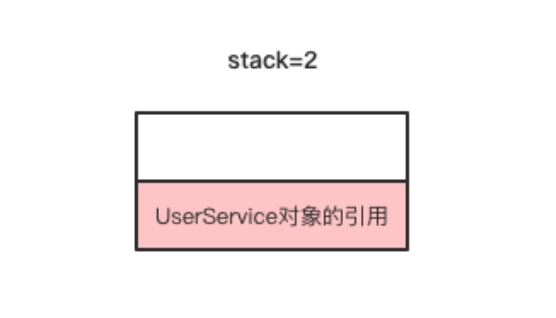

> CONSTANT_Class_info结构的name_index存储的是常量池中某个CONSTANT_Utf8_info常量的索引，该CONSTANT_Utf8_info常量存储的就是UserService类的类名。

2、偏移量为3的字节码指令是dup指令，操作码为0x59，该指令不需要操作数，因此下一条指令的下标为4。该指令的功能是复制当前栈顶一个Slot的数据，复制后的数据存储在操作数栈的栈顶，此时操作数栈的变化如下图所示。

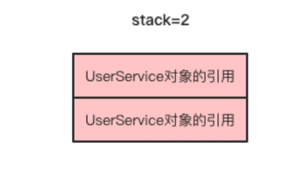

为什么new之后操作数栈顶已经存在一个UserService对象的引用，还要使用dup指令复制一份呢？我们带着问题分析第三步。

3、偏移量为4的字节码指令是invokespecial ，这是一条方法调用指令，操作码为0xB7，该指令需要一个操作数，操作数的值是常量池中某个CONSTANT_Methodref_info常量的索引，此例#3常量表示UserService的<init>方法。

> CONSTANT_Methodref_info常量的class_index项的值是常量池中某个CONSTANT_Class_info常量的索引，表示一个类，在本例中表示UserService类。CONSTANT_Methodref_info常量的name_and_type_index项的值是常量池中某个CONSTANT_NameAndType_info常量的索引，这个常量表示当前方法的名称和方法的描述符，在本例中表示的名称为<init>，方法描述符为”()V”。所以invokespecial 指令是调用UserService类的实例初始化方法<init>。

我们先来了解什么是参数的隐式传递：隐式传递指的是Java代码中方法没有声明此参数，是由编译器加上的，使用局部变量表索引为0的Slot存储。在此例中，调用UserService类的实例初始化方法<init>需要将this引用传递给<init>方法，该this参数会存储在<init>方法的局部变量表索引为0的Slot。

经过上一步，此时操作数栈顶已经存在两个UserService对象的引用。由于UserService的实例初始化方法<init>需要隐式传递一个this引用参数，并且由于<init>方法没有返回值，所以偏移量为4的字节码指令执行完后操作数栈的变化如下图所示。

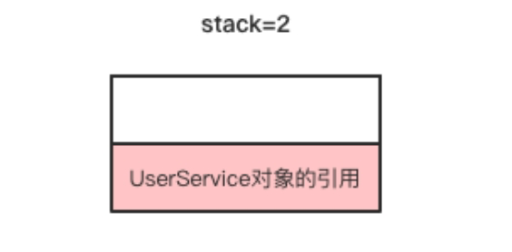

在调用完该UserService对象的<init>方法后该对象就可以正常使用，此时操作数栈顶还有一个UserService对象的引用，可以将其存放到局部变量表、赋值给字段、或是留在操作数栈顶用作后续方法调用的参数，这就是第二步需要执行一条dup指令的原因。

4、偏移量为7的指令是astore_1 ，该指令是将当前栈顶的引用类型的数据存储到局部变量表索引为1的Slot。如果查看LocalVariableTable，局部变量表下标1的位置存储的是局部变量service。该指令执行完成后，操作数栈与局部变量表的变化如下图所示。

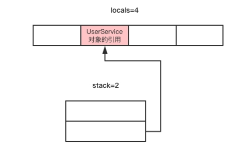

由此可知，new一个对象需要四条字节码指令，先是创建对象存放在栈顶，然后将栈顶存放的对象复制一份，用于调用类的实例初始化方法，最后将new指令创建出来的那份赋值给局部变量或者字段。这也就很好理解并发编程中，为什么单例要使用双重检测，因为new一个对象在字节码层面看并不是一个原子操作。

现在我们来分析第二部分字节码。第二部分对应的Java源代码是“User user = service.getUser()”，即调用刚刚创建的UserService对象的getUser方法获取一个user对象。第二部分对应的字节码如下。

```java
8: aload_1  
9: invokevirtual #4                  // Method com/wujiuye/asmbytecode/book/third/service/UserService.getUser:()Lcom/wujiuye/asmbytecode/book/third/model/User;  
12: astore_2 
```

1、偏移量为8的字节码指令是aload_1，该指令将局部变量表索引为1的元素放到操作数栈顶，即将第一部分字节码创建出来的UserService对象的引用放入操作数栈顶。该指令执行完成后操作数栈的变化如下图所示。

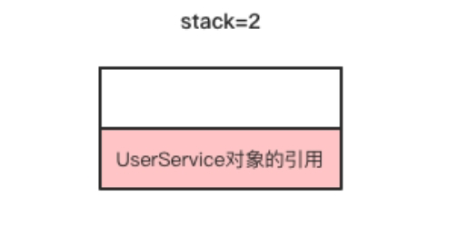

2、偏移量为9的字节码指令是invokevirtual，操作码为0xB6，该指令也是方法调用指令，需要一个操作数，该操作数必须是常量池中某个CONSTANT_Methodref_info常量的索引，在本例中#4指向的常量表示UserService的getUser方法。调用该方法只需要一个隐式参数，因此需要将一个UserService对象的引用放入操作数栈顶。UserService的getUser方法有一个返回值，返回值的类型为引用类型，即返回一个User实例的引用。该指令执行完成后操作数栈的变化如下图所示。

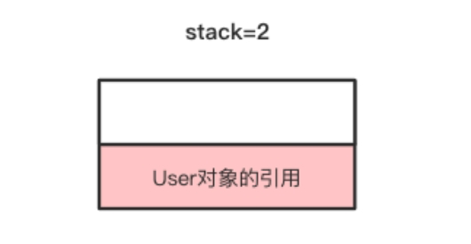

3、偏移量为12的指令是astore_2指令，该指令是将当前操作数栈顶的User对象的引用存储到局部变量表索引为2的Slot。该指令执行完成后，此时的操作数栈又恢复到未使用状态。

第三部分字节码对应的Java源代码是“String name = user.getName()”，即调用User对象的getName方法。这部分的字节码指令如下。

```java
13: aload_2  
14: invokevirtual #5                  // Method com/wujiuye/asmbytecode/book/third/model/User.getName:()Ljava/lang/String;  
17: astore_3  
```

1、偏移量为13的字节码指令是aload_2，在例子中，该指令是将局部变量表索引为2的Slot存储的User对象的引用推送至操作数栈的栈顶。

2、偏移量为14的字节码指令是invokevirtual ，操作数 #5指向常量池中索引为5的CONSTANT_Methodref_info常量，表示User类的getName方法。User的getName方法返回值类型为String，所以该指令执行完成后，操作数栈顶的元素是getName方法返回的String对象的引用。

3、偏移量为17的字节码指令是astore_3，该指令是将上一步调用User对象getName方法的返回值String类型的引用存储到局部变量表索引为3的Slot，也就是给局部变量name赋值。

分析完案例中各字节码指令的执行过程后，我们发现，get、set方法与普通的成员方法调用并没有什么区别。我们也认识了新的指令new、dup、invokespecial 和invokevirtual 。new指令用于创建对象，dup指令用于复制当前栈顶元素，invokespecial 和invokevirtual 指令用于方法的调用。

## 读写this的字段

读写this字段最常见的还是get、set方法，而在web项目中，我们经常会在Service层注入Dao层的对象，调用Service的方法完成业务逻辑，在Service的方法中会调用Dao层的方法，此时获取Dao层对象通过”this.字段名”访问，代码如下。

```java
public class UserService {  
  
    private UserDao userDao = new UserDao();  
  
    public User findUser(String username) {  
        return userDao.getUserByName(username);  
    }  
  
}  
```

使用javap命令输出UserService 类的findUser方法的字节码如下。

```java
public com.wujiuye.asmbytecode.book.third.model.User findUser(java.lang.String);  
    Code:  
       0: aload_0  
       1: getfield      #4             // Field userDao:Lcom/wujiuye/asmbytecode/book/third/dao/UserDao;  
       4: aload_1  
       5: invokevirtual #5        // Method com/wujiuye/asmbytecode/book/third/dao/UserDao.getUserByName:(Ljava/lang/String;)Lcom/wujiuye/asmbytecode/book/third/model/User;  
       8: areturn  
```

偏移量为0和1这两条字节码指令对应的java代码就是this.userDao。首先使用aload_0将局部变量表索引为0的Slot存储的值放入操作数栈顶，对于非静态方法，局部变量表索引为0的Slot存储的变量就是this引用。接着使用getfield指令获取this的userDao字段，getfield指令要求一个操作数，操作数的值为常量池中某个CONSTANT_Fieldref_info常量的索引，本例中索引为4的常量表示userDao字段，字段的类型描述符为“Lcom/wujiuye/asmbytecode/book/third/dao/UserDao; ”。该指令执行完成后返回this.userDao，存储在操作数栈顶。

 我们再来看一个给this.userDao赋值的例子，代码如下。

```java
public class UserService {  
  
    private UserDao userDao = new UserDao();  
  
    public User findUser(String username) {  
        return userDao.getUserByName(username);  
    }  
  
    public void onInit() {  
        this.userDao = new UserDao();  
    }  
}  
```

使用javap命令输出UserService 类的onInit方法的字节码如下。

```java
public void onInit();  
    Code:  
       0: aload_0  
       1: new           #2         // class com/wujiuye/asmbytecode/book/third/dao/UserDao  
       4: dup  
       5: invokespecial #3   // Method com/wujiuye/asmbytecode/book/third/dao/UserDao."<init>":()V  
       8: putfield      #4       // Field userDao:Lcom/wujiuye/asmbytecode/book/third/dao/UserDao;  
      11: return 
```

偏移量为0的aload_0指令是将this引用放入操作数栈栈顶，此时操作数栈的变化如下图所示。

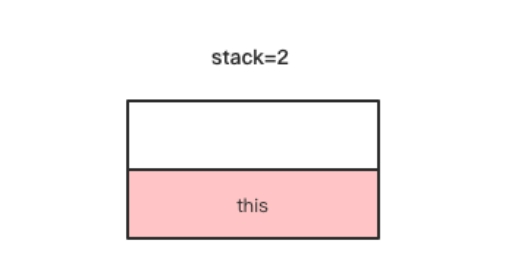

偏移量为1、4、5三条指令是创建一个UserDao对象，这三条指令执行完成后，操作数栈顶的变化如下图所示。

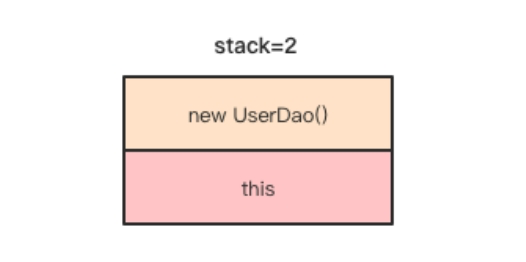

putfield指令与getfield指令需要的操作数都是一样，偏移量为8的putfield指令是将当前栈顶元素赋值给this.userDao字段。

## 实例初始化方法

实例初始化方法是在创建对象之后调用的，Java代码中使用new关键字创建一个对象，编译成字节码后是通过两条指令来完成的，第一条是new指令，第二条是方法调用指令，即调用类的实例初始化方法<init>。

我们还是以UserService为例，代码如下。

```java
public class UserService {  
    private UserDao userDao = new UserDao();  
}  
```

javap会帮我们把<init>方法显示为Java代码的构造方法，所以方法名显示的不是<init>。使用javap查看编译器为UserService类生成的<init>方法的字节码如下。

```java
public com.wujiuye.asmbytecode.book.third.service.UserService();  
   descriptor: ()V  
   Code:  
      0: aload_0  
      1: invokespecial #1       // Method java/lang/Object."<init>":()V  
      4: aload_0  
      5: new           #2            // class com/wujiuye/asmbytecode/book/third/dao/UserDao  
      8: dup  
      9: invokespecial #3      // Method com/wujiuye/asmbytecode/book/third/dao/UserDao."<init>":()V
     12: putfield      #4           // Field userDao:Lcom/wujiuye/asmbytecode/book/third/dao/UserDao;  
     15: return  
```

使用开源工具Classpy显示的方法名是<init>。或者也可以使用本书编写的class文件解析工具。使用Classpy查看<init>方法如下图所示。

 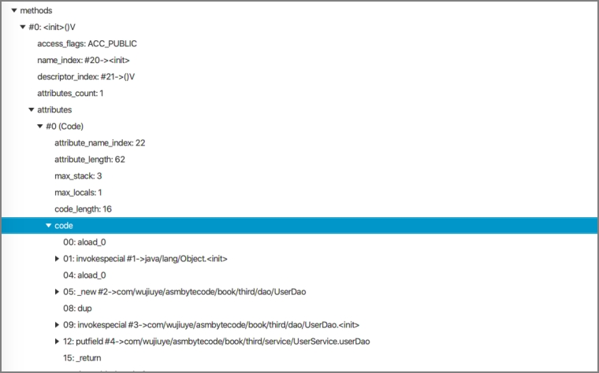

从图中可以看出，我们在编写Java代码给UserService的userDao字段直接赋值，编译器将赋值操作放到<init>方法了。对应图中code部分偏移量为4到12的字节码指令。 

类的实例初始化方法<init>是由编译器生成的，对象的字段初始化赋值也被编译进该方法中完成，构造方法也是编译进该方法。<init>方法中要求必须调用父类的<init>方法，如上图所示，编译器生成的<init> 方法会先调用父类的<init>方法，这是我们使用ASM框架操作字节码生成<init>方法时需要注意的，否则类加载验证字节码阶段会通不过。 

如果同时存在多个构造方法，比如无参构造方法和带参数构造方法，那么编译器是如何生成<init>方法的呢？我们修改下UserService的代码，添加一个带参构造方法，代码如下。

```java
public class UserService {  

    private UserDao userDao = new UserDao();  
  
    public UserService(){  
    }  
  
    public UserService(UserDao userDao){  
        this.userDao = userDao;  
    }  
}
```

使用Classpy工具解析UserService编译后的class文件，可以看到编译器生成了两个<init>方法，但方法描述符不同，一个带参数一个不带参数，不带参数的<init>方法与前面分析的一样，而带参数的构建方法如下图所示。

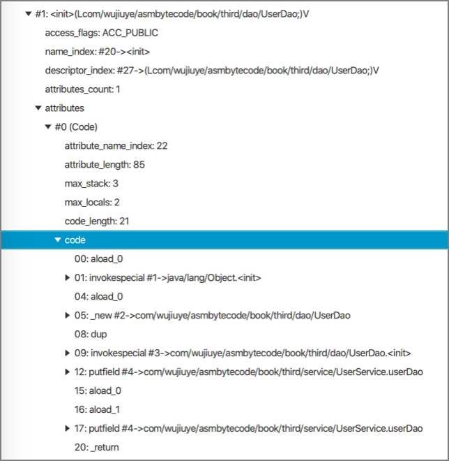

从上图可以看出，带参数的构造方法编译后的方法名为<init>，方法签名为：

```java
(Lcom/wujiuye/asmbytecode/book/third/dao/UserDao;)V
```

编译器生成的构造方法依然会先调用父类的实例初始化方法，也会将字段的初始化赋值编译进该方法，最后才是将方法传入的参数参数赋值给this对象的字段。

那么，如果在带参数的构建方法中调用”this()”呢？

```java
public class UserService {  
  
    private UserDao userDao = new UserDao();  
  
    public UserService(){    
    }  
 
    public UserService(UserDao userDao){  
        this();  
        this.userDao = userDao;  
    }  
} 
```

使用Classpy工具解析UserService编译后的class文件，查看编译器为UserService生成的带参数的实例初始化方法<init>，如下图所示。

 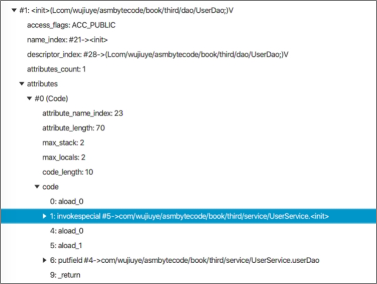

从图中可以看出，编译器生成的带参数的实例初始化方法不再调用父类的实例初始化方法，因为该方法会调用本类的无参数实例初始化方法，在本类的无参实例初始化方法中已经调用了父类的无参实例初始化方法。

## 调用父类的方法

在Java代码中，如果在重写的方法中调用父类的方法需要使用super关键字，未被重写的子类可访问的方法则不需要使用super关键字，这其实是由编译器完成了，使用super关键字调用的方法编译后的字节码指令，其操作数指向父类的方法引用，即调用的方法的CONSTANT_Methodref_info常量的class_index指向的CONSTANT_Class_info常量表示的是父类。

我们来看一个例子：

```java
public abstract class BaseService {  
    public void testInvokeSuperMethod() {  
        System.out.println("BaseService testInvokeSuperMethod....");  
		}  
}  
  
public class UserService extends BaseService {  
    @Override  
    public void testInvokeSuperMethod() {  
        super.testInvokeSuperMethod();  
    }  
}  
```

此案例中，UserService 继承BaseService 并重写了父类的testInvokeSuperMethod方法，在重写的方法中通过super关键字调用父类的方法。

使用javap命令输出testInvokeSuperMethod方法的字节码如下。

```java
public void testInvokeSuperMethod();  
   Code:  
      0: aload_0  
      1: invokespecial #7                  // Method com/wujiuye/asmbytecode/book/third/service/BaseService.testInvokeSuperMethod:()V  
      4: return  
```

从字节码中可以看出，super关键字编译后就不存在了，调用父类的方法依然是使用this引用，aload_0是将局部变量表索引为0的元素放入操作数栈，然后执行invokespecial 指令调用方法。而局部变量表索引为0的Slot存储的正是this引用。

那么虚拟机是怎么区分是调用父类的方法的？答案就在方法描述符，super关键字调用的方法，编译器会将invokespecial 指令所需的操作数指向表示父类方法的CONSTANT_Methodref_info常量。本例中，invokespecial 指令后面跟的操作数是7，正是表示BaseService类的testInvokeSuperMethod方法。

## builder构造者模式的链式调用过程

通过前面的学习，我们大致知道，用于调用非静态方法的字节码指令，需要传递一个this引用，因为非静态方法和类的实例初始化方法都有一个隐式参数。如果调用的方法要求传入参数，还需要按顺序将调用方法所需要的参数依次放入操作数栈。 

在看build构造者模式的链式调用例子之前，我们先看一个Java代码中不声明局部变量存储方法返回值的例子，代码如下。

```java
public static void main(String[] args) {  
    new UserService().getUser().getName();  
} 
```

使用javap命令输出这段代码的字节码如下。

```java
public static void main(java.lang.String[]);  
    descriptor: ([Ljava/lang/String;)V  
    flags: ACC_PUBLIC, ACC_STATIC  
    Code:  
      stack=2, locals=1, args_size=1  
         0: new           #2                  // class com/wujiuye/asmbytecode/book/third/service/UserService  
         3: dup  
        4: invokespecial #3                  // Method com/wujiuye/asmbytecode/book/third/service/UserService."<init>":()V  
        7: invokevirtual #4                  // Method com/wujiuye/asmbytecode/book/third/service/UserService.getUser:()Lcom/wujiuye/asmbytecode/book/third/model/User;  
       10: invokevirtual #5                  // Method com/wujiuye/asmbytecode/book/third/model/User.getName:()Ljava/lang/String;  
       13: pop  
       14: return
```

从编译后的字节码可以看出，整个方法没有一条操作局部变量表的字节码指令。当new指令执行完成后，操作数栈顶存放一个UserService 对象的引用，接着dup指令将操作数栈顶的元素复制一份，此时操作数栈中一共存了两份对同一UserService对象的引用。接着invokespecial 指令调用UserService的<init>方法后，消耗掉操作数栈中栈顶的UserService对象的引用，但此时的操作数栈顶还是一个UserService对象的引用。接着偏移量为7的invokevirtual 指令调用UserService的getUser方法，将操作数栈中最后一个UserService对象的引用消耗掉，但该invokevirtual 调用的getUser方法有返回值，因此该指令执行完成后，操作数栈顶存储的是getUser方法返回的User对象的引用。偏移量为10的invokevirtual 指令则是调用User类的getName方法，同样消耗掉栈顶的User对象的引用。getName方法返回一个字符串对象的引用，存储在操作数栈的栈顶，但是由于我们并未使用，所以最后编译器加了一条pop指令，将栈顶元素弹出扔掉。

现在我们通过分析builder构造者模式的链式调用过程，解答本书第一章中提出的疑问，即使用build构造者模式时，链接调用方法会不会每次调用都将返回的对象引用先存储到局部变量表。

builder构造者模式链式调用案例代码如下。

```java
public static void testBuilder() {  
       Builder builder = new Builder()  
               .setA(10)  
               .setB(20)  
               .setC(30);  
} 
```

使用javap命令输出testBuilder方法的字节码如下。

```java
public static void testBuilder();  
   Code:  
     stack=2, locals=1, args_size=0  
        0: new           #2                  // class com/wujiuye/asmbytecode/book/first/Builder  
        3: dup  
        4: invokespecial #3           // Method com/wujiuye/asmbytecode/book/first/Builder."<init>":()V  
        7: bipush        10  
        9: invokevirtual #4                  // Method com/wujiuye/asmbytecode/book/first/Builder.setA:(I)Lcom/wujiuye/asmbytecode/book/first/Builder;  
       12: bipush        20  
       14: invokevirtual #5                  // Method com/wujiuye/asmbytecode/book/first/Builder.setB:(I)Lcom/wujiuye/asmbytecode/book/first/Builder;  
       17: bipush        30  
       19: invokevirtual #6                  // Method com/wujiuye/asmbytecode/book/first/Builder.setC:(I)Lcom/wujiuye/asmbytecode/book/first/Builder;  
       22: astore_0  
       23: return  
```

从javap输出的字节码可以看出，整个方法只使用了一条astore_0指令，即链式调用Builder对象的setXX方法不会将每次返回的结果存入操作数栈，而只存储最后一次setXX方法返回的Builder对象的引用。因此，使用Builder构造者模式还有一个好处，就是减少字节码指令，提升程序的执行效率。

---

<font color= #666666>发布于：2021 年 08 月 21 日</font><br><font color= #666666>作者: [吴就业](https://www.wujiuye.com/)</font><br><font color= #666666>GitHub链接:https://github.com/wujiuye/JVMByteCodeGitBook</font><br><font color= #666666>链接: https://www.wujiuye.com/ebook/JVMByteCodeGitBook/chapter/chapter03_04.md</font><br><font color= #666666>来源: Github Pages 开源电子书《深入浅出JVM字节码》（《Java虚拟机字节码从入门到实战》的第二版），未经作者许可，禁止转载!</font><br>

