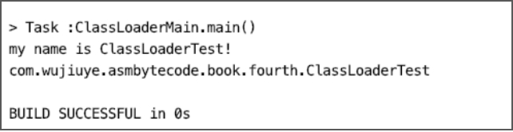

# 动态加载类的两种方式

Java基础类库给我们提供了两种动态加载类的方式，一种是使用Class的静态方法forName，另一种是使用ClassLoader的loadClass方法。

Class的静态方法forName加载类与ClassLoader的loadClass方法有所区别，下面我们分别使用这两种方式加载一个含有静态代码块的类：ClassLoaderTest。

```java
public class ClassLoaderTest {
    static {
        System.out.println("my name is ClassLoaderTest!");
    }
}
```

使用ClassLoader加载类：

```java
public static void loadClass1() throws ClassNotFoundException {
    Class<?> classLoaderTestClass = ClassLoaderMain.class.getClassLoader()
                .loadClass("com.wujiuye.asmbytecode.book.fourth.ClassLoaderTest");
    System.out.println(classLoaderTestClass.getName());
}
```

程序输出如下：


使用Class.forName加载类：

```java
public static void loadClass2() throws ClassNotFoundException {
    Class<?> classLoaderTestClass = 
             Class.forName("com.wujiuye.asmbytecode.book.fourth.ClassLoaderTest");
    System.out.println(classLoaderTestClass.getName());
}
```

程序输出如下：



对比使用两种类加载方式的结果，很明显的区别就是使用Class静态方法forName加载ClassLoaderTest时，ClassLoaderTest的静态代码块被调用了，而静态代码块是被编译器编译后放入类的初始化方法`<clinit>`中的，也就是说，使用Class静态方法forName方法加载类会触发该类初始化，而ClassLoader的loadClass方法则不会。

要了解这两个加载类的方式有什么区别，我们可以从虚拟机的源码中寻找答案，那么如何找到对应的源码呢？

以opendjdk1.8[^1]为例，在源码根目录下，hotspot目录存放的是hotspot虚拟机的源码，jdk目录存放java开发工具包的源码，其中jdk/src/share目录下的classes目录是存放java基础类库的源码，native目录则是java基础类库中的native方法的实现，源码目录结构如下。

```txt
openjdk
-- hotspot
-- jdk
------ src
------ share
---------- classes
---------- native
```

如果我们阅读Java源码就会发现，Class的静态方法forName与ClassLoader的loadClass方法最后都会调用一个native方法，想要查找Java基础类库中某个native方法的c实现，可到jdk/src/share/native的同包名目录下找到相同文件名的c代码文件，在c代码文件中找到对应的方法。

通过查看Java源码我们知道，ClassLoader的loadClass方法最终都会调用到defineClass0、defineClass1、defineClass2这几个native方法其中的一个。在本例中使用只有一个参数的loadClass方法，因此最后调用的是defineClass1方法，对应的c代码如下。

```c
JNIEXPORT jclass JNICALL
Java_java_lang_ClassLoader_defineClass1(JNIEnv *env, jobject loader,jstring name,
                                        jbyteArray data,jint offset,jint length,jobject pd,
                                        jstring source)
{
    jbyte *body;
    char *utfName;
    jclass result = 0;
    char* utfSource;
    ......
    body = (jbyte *)malloc(length);
    ...... 
    result = JVM_DefineClassWithSource(env, utfName, loader, body, length, pd, utfSource);
    .....
    return result;
}
```

这只是截取了其中一部分源代码。无论是defineClass0、defineClass1、defineClass2这几个方法其中的哪一个，最后都会调用虚拟机的对外接口：JVM_DefineClassWithSource。

我们可以到hotspot源码中查看该方法的实现，hotspot/src/share/vm/prims目录存放HotSpot虚拟机的对外接口，包括部分标准库的native部分和JVMTI实现。JVM_DefineClassWithSource等native方法中调用的方法可在hotspot源码的prims包下的jvm.cpp文件中找到。

JVM_DefineClassWithSource源码如下。

```c++
JVM_ENTRY(jclass, JVM_DefineClassWithSource(JNIEnv *env, const char *name, jobject loader, const jbyte *buf, jsize len, jobject pd, const char *source))
  JVMWrapper2("JVM_DefineClassWithSource %s", name);
  return jvm_define_class_common(env, name, loader, buf, len, pd, source, true, THREAD);
JVM_END
```

该方法直接调用了jvm_define_class_common方法完成类的加载，jvm_define_class_common的部分源码如下。

```c++
static jclass jvm_define_class_common(JNIEnv *env, const char *name,
                                      jobject loader, const jbyte *buf,
                                      jsize len, jobject pd, const char *source,
                                      jboolean verify, TRAPS) {
  ......
  // 1
  assert(THREAD->is_Java_thread(), "must be a JavaThread");
  JavaThread* jt = (JavaThread*) THREAD;
  ......
  // 2  
  TempNewSymbol class_name = NULL;
  if (name != NULL) {
    const int str_len = (int)strlen(name);
    if (str_len > Symbol::max_length()) {
      THROW_MSG_0(vmSymbols::java_lang_NoClassDefFoundError(), name);
    }
    class_name = SymbolTable::new_symbol(name, str_len, CHECK_NULL);
  }
  ........
  // 3
  Klass* k = SystemDictionary::resolve_from_stream(class_name, class_loader,
                                                     protection_domain, &st,
                                                     verify != 0,
                                                     CHECK_NULL);
   .......
   return (jclass) JNIHandles::make_local(env, k->java_mirror());
}
```

* 1) 确保加载类的线程是Java线程；
* 2) 验证类名的长度，如果类名不为空，则类名不能超出最大长度，否则不被允许放入常量池，抛出NoClassDefFoundError；
* 3) 调用SystemDictionary类的resolve_from_stream方法解析class文件字节流，该方法返回一个InstanceKlass指针，这便是hotspot虚拟机将class文件字节流解析完成后生成的c++对象，该对象存储在方法区中。

现在我们分析Class的静态方法forName的底层实现。该方法有两个重载方法，在不传入类加载器时，默认使用的类加载我们可以通过调用加载后的Class对象的getClassLoader方法拿到，默认是AppClassLoader。forName方法源码如下。

```c++
public static Class<?> forName(String className) throws ClassNotFoundException {
        Class<?> caller = Reflection.getCallerClass();
        return forName0(className, true, ClassLoader.getClassLoader(caller), caller);
}
private static native Class<?> forName0(String name, boolean initialize,
              ClassLoader loader,Class<?> caller)  throws ClassNotFoundException;
```

该方法会调用Class的forName0这个native方法。forName0方法有一个bool类型的参数initialize，forName方法中调用forName0方法默认传递该参数的值为true，也就是告诉虚拟机，在加载类完成之后需要对类进行初始化。forName0的c代码部分源码如下。

```c++
JNIEXPORT jclass JNICALL
Java_java_lang_Class_forName0(JNIEnv *env, jclass this, jstring classname,
                              jboolean initialize, jobject loader, jclass caller)
{
    char *clname;
    jclass cls = 0;
    char buf[128];
    .....
    cls = JVM_FindClassFromCaller(env, clname, initialize, loader, caller);
    .....
    return cls;
}
```

JVM_FindClassFromCaller的源码可在jvm.cpp文件中找到，我们跳过JVM_FindClassFromCaller，因为该方法是通过调用find_class_from_class_loader方法继续完成类加载的。

```c++
jclass find_class_from_class_loader(JNIEnv* env, Symbol* name, jboolean init,
                                    Handle loader, Handle protection_domain,
                                    jboolean throwError, TRAPS) {
  Klass* klass = SystemDictionary::resolve_or_fail(name, loader, protection_domain, 
throwError != 0, CHECK_NULL);
  KlassHandle klass_handle(THREAD, klass);
  // 检查是否应该初始化类  
if (init && klass_handle->oop_is_instance()) {
    klass_handle->initialize(CHECK_NULL);
  }
  return (jclass) JNIHandles::make_local(env, klass_handle->java_mirror());
}
```

从find_class_from_class_loader方法中就可以看出，使用Class的静态方法forName加载类会触发类的初始化方法被调用是因为在类加载完成后调用了类的初始化方法。而类的加载部分是调用SystemDictionary的resolve_or_fail方法完成的，在类没有被加载过的情况下，最后都是通过调用类加载器的loadClass方法完成类的加载。

---

[^1]: Openjdk1.8下载地址：https://github.com/unofficial-openjdk/openjdk/tree/jdk8u/jdk8u

发布于：2021 年 07 月 03 日<br>作者: [吴就业](https://www.wujiuye.com/)<br>GitHub链接:https://github.com/wujiuye/JVMByteCodeGitBook<br>链接: https://www.wujiuye.com/ebook/JVMByteCodeGitBook/chapter/chapter04_01.md<br>来源: Github Pages 开源电子书《深入浅出JVM字节码》（《Java虚拟机字节码从入门到实战》的第二版），未经作者许可，禁止转载!<br>

