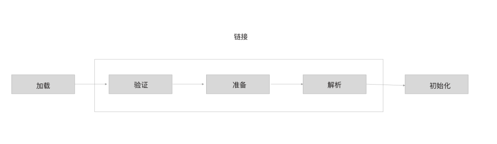
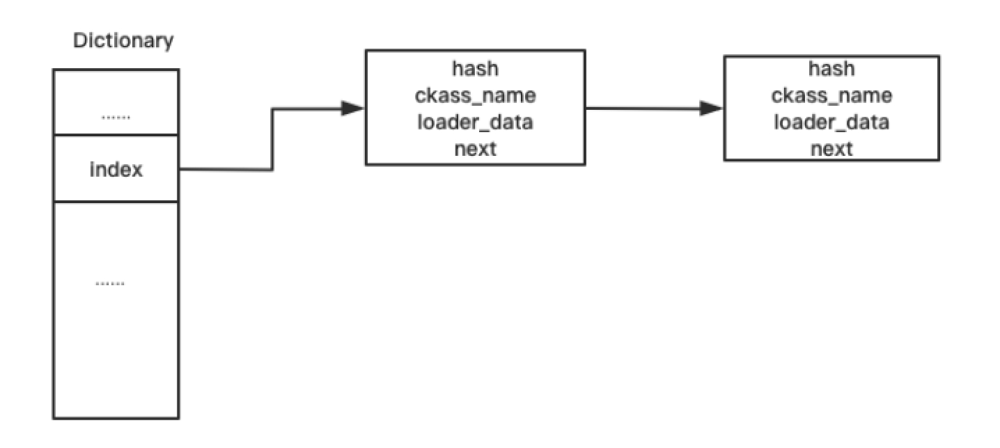
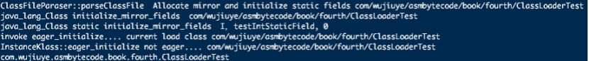
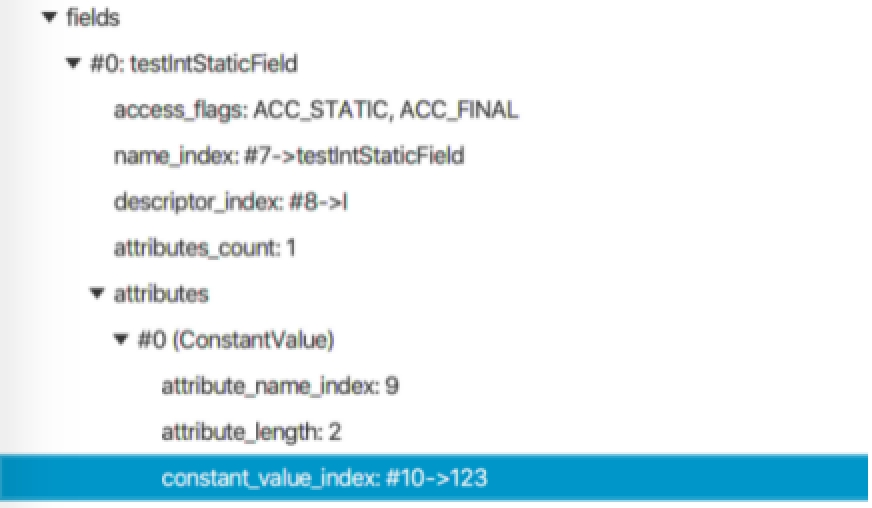
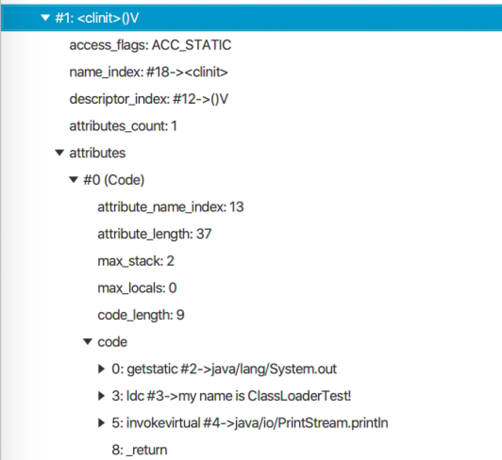
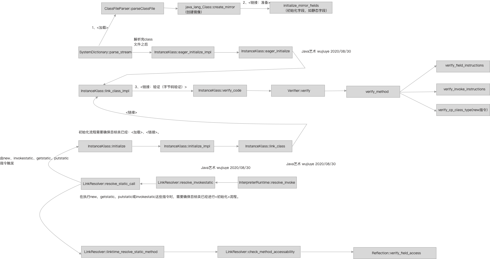

# 类加载过程


类加载过程包括加载、链接和初始化三个阶段，其中链接阶段又可细分为验证、准备、解析三个阶段[^1]。了解类加载过程中的加载以及验证阶段将有助于我们更好的写出被Java虚拟机认可的class字节码，以及当遇到加载类抛出VerifyError错误时知道如何去排查问题、解决问题。



类加载的加载阶段主要是将一个类的字节码加载到内存中，并将其转化为方法区运行时数据结构，同时在堆中生成一个镜像，即Class对象。将字节流转化为方法区运行时数据结构，对于hotspot虚拟机而言，就是生成InstanceKlass实例。

将一个类的字节码加载到内存中，可以是根据文件路径加载，也可以是根据类名和classpath解析成文件路径加载，也可以是从网络上下载。在class文件加密的情况下，加载阶段还包括了解密，这是由用户自定义类加载器完成的，虚拟机加载java基础类库的类不存在加解密行为。

前面我们分析了Class的静态方法forName与类加载器的loadClass方法的底层实现，了解到Class的静态方法forName最终会调用类加载器的loadClass方法完成类的加载。在分析类加载器的loadClass方法底层实现时，只分析到了SystemDictionary的resolve_from_stream方法。从调用类加载器的loadClass方法到底层hotspot虚拟机的SystemDictionary的resolve_from_stream方法执行完成，就已经完成了类加载的加载阶段。

将class文件加载到内存后，需要将加载到内存的字节缓存根据class文件结构解析成InstanceKlass实例。前面第二章我们学习了如何使用Java去解析class字节码文件，对class文件的存储结构有了很深的了解，如果读者对这块内容感兴趣，也可看下hotspot是如何解析的。源码在classFileParser.cpp文件中，ClassFileParser类的parseClassFile方法[^2]。

ClassFileParser的parseClassFile方法解析文件的顺序依然是魔数、主次版本号、常量池、类的访问标志、this与super类的符号引用、实现的接口、字段表、方法表、属性表。因为class文件的存储结构就是按顺序存储的，除魔数和版本号我们可以直接使用偏移量获取外，都只能按顺序解析获取class文件结构的各项。

在解析完class文件结构成之后，加载阶段就已经结束了，接着是验证阶段。但验证并不只是在解析完成之后才去验证，从hotspot源码中我们能看到，验证阶段有一部分动作是与加载阶段交叉进行的，如文件格式验证，以及确保父类不是接口、final方法不能被重写等，如下代码所示。

```c++
instanceKlassHandle ClassFileParser::parseClassFile(Symbol* name,
                  ClassLoaderData* loader_data,Handle protection_domain,
                  KlassHandle host_klass,GrowableArray<Handle>* cp_patches,
                  TempNewSymbol& parsed_name,bool verify,TRAPS) {
  ......
  if (super_klass.not_null()) {
      if (super_klass->has_default_methods()) {
         has_default_methods = true;
      }
      if (super_klass->is_interface()) {
        ResourceMark rm(THREAD);
        Exceptions::fthrow(
          THREAD_AND_LOCATION,
          vmSymbols::java_lang_IncompatibleClassChangeError(),
          "class %s has interface %s as super class",
          class_name->as_klass_external_name(),
          super_klass->external_name()
        );
        return nullHandle;
      }
      // Make sure super class is not final
      if (super_klass->is_final()) {
        THROW_MSG_(vmSymbols::java_lang_VerifyError(), "Cannot inherit from final class", nullHandle);
      }
    }
    ......
    // check if this class can access its super class
    check_super_class_access(this_klass, CHECK_(nullHandle));
    // check if this class can access its superinterfaces
    check_super_interface_access(this_klass, CHECK_(nullHandle));
    // check if this class overrides any final method
    check_final_method_override(this_klass, CHECK_(nullHandle));
    // check that if this class is an interface then it doesn't have static methods
    if (this_klass->is_interface()) {
      /* An interface in a JAVA 8 classfile can be static */
      // java8开始才允许接口有静态方法
      if (_major_version < JAVA_8_VERSION) {
        check_illegal_static_method(this_klass, CHECK_(nullHandle));
      }
    }
    ......
}
```

验证阶段除对文件格式验证外，在class字节码解析生成InstanceKlass实例之后，会对InstanceKlass再进行验证，如元数据验证、字节码验证、符号引用验证等。

在SystemDictionary的resolve_from_stream方法中，我们可以看到，在调用ClassFileParser的parseClassFile方法完成之后，还调用了define_instance_class方法或者find_or_define_instance_class渴望继续完成链接阶段。SystemDictionary的resolve_from_stream方法部分源码如下。

```c++
  if (!HAS_PENDING_EXCEPTION) {
    ......
    // Add class just loaded
    // If a class loader supports parallel classloading handle parallel define requests
    // find_or_define_instance_class may return a different InstanceKlass
    if (is_parallelCapable(class_loader)) {
      k = find_or_define_instance_class(class_name, class_loader, k, THREAD);
    } else {
      define_instance_class(k, THREAD);
    }
  }
```

find_or_define_instance_class方法中也会调用define_instance_class方法，只不过多了异步加锁的逻辑。define_instance_class方法的源码如下。

```c++
void SystemDictionary::define_instance_class(instanceKlassHandle k, TRAPS) {
  ......
  // 1
  Symbol*  name_h = k->name();
  unsigned int d_hash = dictionary()->compute_hash(name_h, loader_data);
  int d_index = dictionary()->hash_to_index(d_hash);
  ......
  // 2
if (k->class_loader() != NULL) {
    methodHandle m(THREAD, Universe::loader_addClass_method());
    JavaValue result(T_VOID);
    JavaCallArguments args(class_loader_h);
    args.push_oop(Handle(THREAD, k->java_mirror()));
    JavaCalls::call(&result, m, &args, CHECK);
  }
  ......
  update_dictionary(d_index, d_hash, p_index, p_hash,k, class_loader_h, THREAD);
  .......
  // 3
  k->eager_initialize(THREAD);
  ......
}
```

其中，第一部分是根据类名和类加载器计算出一个索引，该索引用于存放class文件加载后生成的InstanceKlass实例，存储结构如下图所示。

 

第二部分判断类加载器是否为空，不为空情况下调用类加载器的addClass方法，以使用此加载器记录每个加载的类的Class实例，该方法在ClassLoader中的定义如下。

```java
void addClass(Class<?> c) { 
  classes.addElement(c);
}
```

提示：子类并不需要重写该方法，也重写不了该方法，因为该方法是包私有的，外部访问不了。因此，我们自己实现类加载器不需要自己去实现缓存加载的类的Class实例。前面说的Class的静态方法forName最终也是调用类加载器的loadClass方法完成类的加载的，这个结论也可通过在ClassLoader的addClass方法中下断点验证。

第三部分虽然调用instanceKlassHandle实例的eager_initialize方法想要完成链接阶段，包括验证阶段的字节码验证行为，但此时并不会执行，实际执行是在类初始化之前。

引起类初始化的4条指令如new、getstatic、putstatic、invokestatic，虚拟机在执行这四条指令时，先判断类是否已经初始化，未初始化则完成类的初始化，这也是链接与字节码验证的时机。部分的java.lang.VerifyError的发生并不是在ClassLoader的loadClass方法，而是在加载完成之后想要使用时。

在instanceKlassHandle实例的eager_initialize方法中会调用eager_initialize_impl方法，eager_initialize_impl方法中调用了InstanceKlass的link_class_impl方法。link_class_impl方法的源码如下。

```c++
bool InstanceKlass::link_class_impl(
    instanceKlassHandle this_oop, bool throw_verifyerror, TRAPS) {
  ......
  // 在链接此类之前链接父类
  instanceKlassHandle super(THREAD, this_oop->super());
  if (super.not_null()) {
    // 父类是接口抛出异常
    if (super->is_interface()) {  // check if super class is an interface
      ResourceMark rm(THREAD);
      Exceptions::fthrow(
        THREAD_AND_LOCATION,
        vmSymbols::java_lang_IncompatibleClassChangeError(),
        "class %s has interface %s as super class",
        this_oop->external_name(),
        super->external_name()
      );
      return false;
    }
    // 递归调用链接父类
    link_class_impl(super, throw_verifyerror, CHECK_false);
  }
  // 在链接该类之前链接该类实现的所有接口
  Array<Klass*>* interfaces = this_oop->local_interfaces();
  int num_interfaces = interfaces->length();
  for (int index = 0; index < num_interfaces; index++) {
    HandleMark hm(THREAD);
    instanceKlassHandle ih(THREAD, interfaces->at(index));
    link_class_impl(ih, throw_verifyerror, CHECK_false);
  }
  // 如果类在链接其超类的过程中被链接则结束
  if (this_oop->is_linked()) {
    return true;
  }
  ...... 
  {
    ......
    if (!this_oop->is_linked()) {
      if (!this_oop->is_rewritten()) {
         {
          // 验证字节码
          bool verify_ok = verify_code(this_oop, throw_verifyerror, THREAD);
          if (!verify_ok) {
            return false;
          }
        }
        if (this_oop->is_linked()) {
          return true;
        }
        this_oop->rewrite_class(CHECK_false);
      } else if (this_oop()->is_shared()) {
         ......
      }
      this_oop->link_methods(CHECK_false);
      ......
      this_oop->set_init_state(linked);
      ......
   }
   return true;
}
```

验证字节码部分的逻辑比较复杂，整个调用链路是：InstanceKlass::verify_code->Verifier::verify->Verifier::verify_class->ClassVerifier::verify_class->ClassVerifier::verify_method。

verify_method方法中包括验证方法签名、异常处理表、局部变量表、栈映射桢、字节码指令。在后面我们使用ASM操作字节码时可能会遇到各种验证错误，在遇到VerifyError时，从hotspot源码中查找验证失败的原因是最高效的解决方案。

现在我们编写一个验证链接阶段在类初始化之前的测试程序，使用ClassLoader加载一个类，在加载完成后打印类名，并在打印类名完成后通过反射创建一个该类的实例，代码如下。

```java
public static void main(String[] args) throws Exception {
        Class<?> clz = LinkAndVerifyTest.class.getClassLoader()
                .loadClass("com.wujiuye.asmbytecode.book.fourth.VerifyTest2");
        System.out.println(clz);
        try {
            Object obj= clz.newInstance();
        } catch (Exception e) {
            e.printStackTrace();
        }
}
```

接着我们还要修改hotspot源码，在源码中添加日记打印。分别在instanceKlassHandle的eager_initialize方法、InstanceKlass的eager_initialize方法、InstanceKlass的link_class_impl方法、InstanceKlass的verify_code方法添加日记打印。

以在InstanceKlass的verify_code方法添加日记打印为例，代码如下。

```c++
bool InstanceKlass::verify_code(
    instanceKlassHandle this_oop, bool throw_verifyerror, TRAPS) {
  // 1) Verify the bytecodes
  Verifier::Mode mode =
    throw_verifyerror ? Verifier::ThrowException : Verifier::NoException;
  // 日记打印
  const char* plog = "com/wujiuye/";
  if(!strncmp((const char*)this_oop->name()->bytes(), plog, strlen(plog))){
     printf("InstanceKlass::verify_code %s \n",this_oop->name()->as_utf8());
  }
  // end 日记打印
  return Verifier::verify(this_oop, mode, this_oop->should_verify_class(), CHECK_false);
}
```

修改完成后重新编译虚拟机[^3]，使用编译后的jdk的java命令执行测试程序，程序输出如下图所示。


从结果可以看出，打印类加载器加载的Class对象的类名在链接阶段之前，说明链接阶段是在类初始化阶段触发的。链接阶段包括验证、准备和解析，所以验证阶段的字节码验证在类初始化之前才开始验证。

那么准备阶段又是在什么时候完成的呢？是在验证阶段全部完成之后吗，如果是这样，那准备阶段将在字节码验证完成之后才能开始。

准备阶段是为类中定义的静态变量分配内存并设置初始化值的阶段，这里的初始值通常情况下指的是对应类型的零值，比如int类型的零值为0。而给静态字段赋值通常是在编译器生成的类初始化方法`<clinit>`方法中完成的，也就是类初始化阶段。

举例：

```java
public class ClassLoaderTest {
    static int testIntStaticField = 123;
    static {
        System.out.println("my name is ClassLoaderTest!");
    }
}
```

ClassLoaderTest 的静态字段testIntStaticField是int类型，编译后可以在`<clinit>`方法中找到赋值语句。编译后的`<clinit>`方法代码如下图所示。


从图中可以看出，静态字段testIntStaticField的赋值是在初始化阶段调用类的`<clinit>`方法才开始赋值的，而在准备阶段只是赋予零值。那么在HotSpot源码中，准备阶段是什么时候开始的呢？

我们回到前面分析的ClassFileParser的parseClassFile方法，在字节码流解析生成存储到方法区的InstanceKlass实例并完成一些如验证类是否重写final方法等验证之后，会调用java_lang_Class::create_mirror方法，代码如下。

```c++
// Allocate mirror and initialize static fields
java_lang_Class::create_mirror(this_klass, class_loader, protection_domain,
                                   CHECK_(nullHandle));
```

create_mirror方法用于创建一个java.lang.Class对象，这个对象存储在堆中，也称为InstanceKlass的镜像。从注释中可以看出，调用该方法还会初始化静态字段。create_mirror方法中会调用initialize_mirror_fields方法初始化镜像的静态字段，initialize_mirror_fields方法的部分代码如下。

```c++
/ 初始化镜像java.lang.Class的字段
void java_lang_Class::initialize_mirror_fields(KlassHandle k,Handle mirror,
                            Handle protection_domain,TRAPS) {
  ......
  // Initialize static fields
  //  初始化静态字段
  InstanceKlass::cast(k())->do_local_static_fields(&initialize_static_field, mirror, CHECK);
}
```

在调用InstanceKlass的do_local_static_fields方法时，传递了一个方法指针initialize_static_field，该方法会被回调执行，因此我们直接看initialize_static_field方法的实现，代码如下。

```c++
// 初始化静态字段
static void initialize_static_field(fieldDescriptor* fd, Handle mirror, TRAPS) {
  assert(mirror.not_null() && fd->is_static(), "just checking");
  // 是否有初始值
  if (fd->has_initial_value()) {
    BasicType t = fd->field_type();
    // 根据类型设置零值
    switch (t) {
      case T_BYTE:
        mirror()->byte_field_put(fd->offset(), fd->int_initial_value());
              break;
      case T_BOOLEAN:
        mirror()->bool_field_put(fd->offset(), fd->int_initial_value());
              break;
      case T_CHAR:
        mirror()->char_field_put(fd->offset(), fd->int_initial_value());
              break;
      case T_SHORT:
        mirror()->short_field_put(fd->offset(), fd->int_initial_value());
              break;
      case T_INT:
        mirror()->int_field_put(fd->offset(), fd->int_initial_value());
        break;
      case T_FLOAT:
        mirror()->float_field_put(fd->offset(), fd->float_initial_value());
        break;
      case T_DOUBLE:
        mirror()->double_field_put(fd->offset(), fd->double_initial_value());
        break;
      case T_LONG:
        mirror()->long_field_put(fd->offset(), fd->long_initial_value());
        break;
      case T_OBJECT:
        {
          // 如果字段是引用类型，ConstantValue 只支持字符串类型
          #ifdef ASSERT
          TempNewSymbol sym = SymbolTable::new_symbol("Ljava/lang/String;", CHECK);
          assert(fd->signature() == sym, "just checking");
          #endif
            // 初始化值为：" "
          oop string = fd->string_initial_value(CHECK);
          mirror()->obj_field_put(fd->offset(), string);
        }
        break;
      default:
            // 抛出类文件格式错误，无效常量属性
        THROW_MSG(vmSymbols::java_lang_ClassFormatError(),
                  "Illegal ConstantValue attribute in class file");
    }
  }
}
```

initialize_static_field方法首先会判断这个字段是否有初始值，有初始值才会给该静态字段赋值为初始值。怎么判断是否有初始化值？就是判断该字段是否有一个ConstantValue_attribute属性。但是在本例中ClassLoaderTest的testIntStaticField并没有这个属性，因此不会为testIntStaticField字段赋值为初始值。

我们可以在vm/classfile/javaClasses.cpp文件中，在initialize_static_field方法添加如下日记打印。

```c++
static void initialize_static_field(fieldDescriptor* fd, Handle mirror, TRAPS) {
  assert(mirror.not_null() && fd->is_static(), "just checking");
  // 日记打印
  const char* plog = "testIntStaticField";
  if(!strncmp((const char*)fd->name()->bytes(), plog, strlen(plog))){
      printf("java_lang_Class static initialize_mirror_fields  %s，%s, %d \n",fd->signature()->as_utf8(), fd->name()->as_utf8(),fd->has_initial_value());
  }
  // end 日记打印
  if (fd->has_initial_value()) {
    ......
  }
}
```

编写测试代码加载ClassLoaderTest，测试代码如下。

```java
Class<?> classLoaderTestClass = Class.forName(
"com.wujiuye.asmbytecode.book.fourth.ClassLoaderTest");
```

重新编译openjdk后，使用编译后的jdk的java命令运行测试代码。程序输出如下图所示。



现在我们将ClassLoaderTest的testIntStaticField字段改为静态常量，代码如下。

```java
public class ClassLoaderTest {
    final static int testIntStaticField = 123;
    static {
        System.out.println("my name is ClassLoaderTest!");
    }
}
```

将静态字段testIntStaticField改为常量后，日记打印输出如图4.7所示。

 

从图中可以看出，initialize_static_field方法日记打印输出的has_initial_value为1，说明该字段已经存在一个ConstantValue_attribute属性，我们可以使用classpy工具查看，如下图所示。

 

 编译器生成的`<clinit>`方法如下图所示。

 

从上图可以看出，`<clinit>`方法已经没有为变量赋值的字节码指令了。而此时该字段已经存在一个ConstantValue_attribute属性，所以在准备阶段就为该字段赋值为初始值123。因此我们可以得出结论，如果字段存在ConstantValue_attribute属性，那么字段将会在类加载的准备阶段被赋值为初始化值，即ConstantValue_attribute属性保存的初始值。

同属链接阶段的解析阶段是Java虚拟机将常量池内的符号引用替换为直接引用的过程，根据《Java虚拟机规范》规定，在ane-warray、checkcast、getfield、getstatic、instanceof、invokedynamic、invokeinterface、invokespecial、invokestatic、invokevirtual、ldc、mulianewarray、new、putfield、putstatic这些要求操作数指向常量池中的符号引用常量（如：CONSTANT_Class_info、CONSTANT_Field_info、CONSTANT_Methodref_info）的指令执行之前，必须先对使用的符号引用进行解析。

符号引用以一组符号描述引用的目标，如CONSTANT_Class_info表示引用的类、CONSTANT_Field_info表示引用哪个类的哪个字段、CONSTANT_Methodref_info表示引用哪个类的哪个方法。

在HotSpot虚拟机的实现中，对于解释执行与动态调用（invokedynamic），解析阶段是在符号引用将要被使用前才去解析。而验证阶段的符号引用验证实际发生在解析阶段，符号引用验证包括：通过字符串描述的全限定名是否能找到对应的类、在指定的类中是否存在简单名称所描述的方法和字段、符号引用中的类、字段、方法的可访问性（`<private>`、`<protected>`、`public`、`<package>`）。

检查类、方法、字段可访问性对应源码在`linkResolver.cpp`类中：

```
// 检查类
LinkResolver::check_klass_accessability
// 检查方法
LinkResolver::check_method_accessability
// 检查字段
LinkResolver::check_field_accessability
```

到此，我们已经大概了解了整个类的加载过程，如下图所示。



* 加载阶段：先是加载.class文件到内存中，然后根据class文件结构解析生成InstanceKlass，在此过程中也会完成部分验证阶段的工作内容，如文件格式验证，以及确保父类不是接口、final方法不能被重写等；
* 准备阶段：准备阶段是完成静态字段的初始化赋值，如果是常量字段则被赋值为常量值，否则赋值为对应类型的零值。在HotSport虚拟机中，准备阶段实际是在加载阶段完成后执行的，在解析生成InstanceKlass并完成一些如验证类是否重写final方法等验证之后，会调用java_lang_Class::create_mirror方法创建InstanceKlass镜像，即Class对象，create_mirror方法中会调用initialize_mirror_fields方法初始化镜像的静态字段。
* 验证阶段：在HotSport虚拟机中，验证阶段并非全部在加载阶段之后才进行的，一部分如文件格式验证，以及确保父类不是接口、final方法不能被重写等是在加载阶段完成的，这一阶段也会对访问控制修饰符进行验证，如验证是否能够继承父类；一部分则是字节码验证（方法字节码指令验证、异常表验证、栈映射帧验证、局部变量表验证等）是在初始化之前才触发执行的；还有一部分是符号引用验证，符号引用验证发生在解析阶段，符号引用验证包括：通过字符串描述的全限定名是否能找到对应的类、在指定的类中是否存在简单名称所描述的方法和字段、以及符号引用中的类、字段、方法的可访问性（`<private>`、`<protected>`、`public`、`<package>`）。
* 解析阶段：将常量池内的符号引用替换为直接引用的过程，在HotSpot虚拟机的实现中，对于解释执行与动态调用（invokedynamic），解析阶段是在符号引用将要被使用前才去解析。
* 初始化阶段：初始化阶段是调用类的`<clinit>`方法，引起类初始化的指令有new、getstatic、putstatic、invokestatic，虚拟机在执行这些指令时，先判断类是否已经初始化，未初始化则完成类的初始化，如果父类以及实现的接口还未初始化则会先初始化父类以及实现的接口。

---

[^1]: 周志明. 《深入理解Java虚拟机》第三部分第七章：虚拟机类加载机制
[^2]: classFileParser.cpp源码文件的路径：/hotspot/src/share/vm/classfile/classFileParser.cpp文件中
[^3]: 由于编译HotSpot虚拟机是在Linux操作系统上完成的，所以使用java命令执行测试程序也是在Linux操作系统上完成

<font color= #666666>发布于：2021 年 07 月 03 日</font><br><font color= #666666>作者: 吴就业</font><br><font color= #666666>链接: https://wujiuye.gitbook.io/jvmbytecode</font><br><font color= #666666>来源: GitBook开源电子书《深入浅出JVM字节码》（《Java虚拟机字节码从入门到实战》的第二版），未经作者许可，禁止转载!</font><br>

