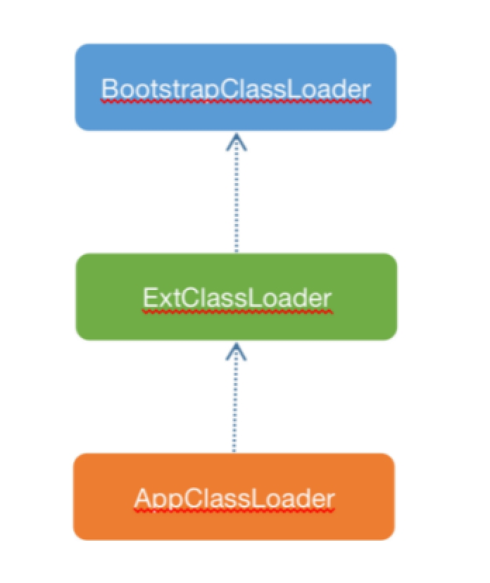

# 双亲委派模型

Java基础类库给我们提供了几种类加载器，这几种类加载器的关系如图4.5所示。

 

BootstrapClassLoader：负责加载JDK提供的基础类库，基础类库编译后的rt.jar包位于 $JAVA_HOME/lib目录下。该类加载器由C代码实现，也叫启动类加载器。

ExtClassLoader：负责加载 JVM 扩展类，比如内置的 js 引擎、xml 解析器等等，这些库名通常以javax开头，它们的jar包位于 $JAVA_HOME/lib/ext目录。

 AppClassLoader：应用程序加载器，负责加载classpath 路径中的jar包和目录，我们编写的代码以及使用的第三方jar包通常都是由它来加载。

这几种类加载器的关系并非继承关系，而是通过持有一个父加载器的引用，在外部调用loadClass方法时，先委托父加载器去加载，在父加载器抛出ClassNotFoundException异常时，再由自己去加载，如果还是加载不到类，再往上抛出ClassNotFoundException异常，这就是双亲委派模型。双亲委派的实现如下源码所示。

```java
protected Class<?> loadClass(String name, boolean resolve) throws ClassNotFoundException{
        synchronized (getClassLoadingLock(name)) {
            ......
                try {
                    if (parent != null) {
                        c = parent.loadClass(name, false);
                    } else {
                        c = findBootstrapClassOrNull(name);
                    }
                } catch (ClassNotFoundException e) {
                    // ClassNotFoundException thrown if class not found
                    // from the non-null parent class loader
                }
                if (c == null) {
                    // If still not found, then invoke findClass in order
                    // to find the class.
                    long t1 = System.nanoTime();
                    c = findClass(name);
                    ......
                }
           ......
            return c;
        }
}
```

如果想要打破双亲委派模型，只需要在自实现的类型加载器中重写该方法，去掉try-catch部分的逻辑即可。

---

发布于：2021 年 07 月 03 日<br>作者: [吴就业](https://www.wujiuye.com/)<br>GitHub链接:https://github.com/wujiuye/JVMByteCodeGitBook<br>链接: https://www.wujiuye.com/ebook/JVMByteCodeGitBook/chapter/chapter04_03.md<br>来源: Github Pages 开源电子书《深入浅出JVM字节码》（《Java虚拟机字节码从入门到实战》的第二版），未经作者许可，禁止转载!<br>