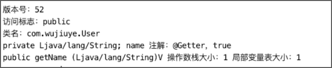

# 访问者模式在ASM框架中的应用

访问者模式是23种设计模式中的一种，使用频率不高，通常用于操作一些拥有固定结构的数据，避免操作数据的过程中由于不注意而导致数据结构发生改变。如改写SQL的JsqlParser框架，以及本书介绍的ASM框架。

访问者模式的定义是：封装一些作用于某种数据结构中的各元素的操作，它可以在不改变数据结构的前提下定义作用于这些元素的新的操作。

ASM框架使用访问者模式封装了class文件结构的各项元素的操作。我们将通过实现一个简单版的ASM框架学习访问者模式在ASM框架中的应用，也以此来理解访问者模式。

首先定义类访问者接口ClassVisitor，代码如下。

```java
public interface ClassVisitor {
    // 设置class文件结构的版本号、类的访问标志、类名
    void visit(int version, String access, String className);
    // 为类添加一个字段
    FieldVisitor visitField(String access, String name, String descriptor);
    // 为类添加一个方法
    MethodVisitor visitMethod(String access, String name, String descriptor);
}
```

ClassVisitor接口定义了三个方法：visit方法可设置class文件结构的版本号、类的访问标志以及类名，visitField方法可给类添加一个字段，visitMethod方法可给类添加一个方法。

由于字段元素也是一个数据结构，需要使用访问者模式封装字段结构中各项元素的操作。如通过调用字段访问者的visitAnnotation方法为字段添加一个注解。

字段访问者，FieldVisitor接口的定义代码如下。

```java
public interface FieldVisitor {
    // 为字段添加一个注解
    void visitAnnotation(String annotation, boolean runtime);
}
```

编写FieldVisitor接口的实现类，FieldWriter类代码如下。

```java
@Getter
public class FieldWriter implements FieldVisitor {

    private String access;
    private String name;
    private String descriptor;
    private List<String> annotations;

    public FieldWriter(String access, String name, String descriptor) {
        this.access = access;
        this.name = name;
        this.descriptor = descriptor;
        this.annotations = new ArrayList<>();
    }

    @Override
    public void visitAnnotation(String annotation, boolean runtime) {
        this.annotations.add("注解：" + annotation + "，" + runtime);
    }

}
```

与字段结构一样，方法结构也需要使用访问者模式封装各项元素的操作。如通过调用方法访问者的visitMaxs方法设置操作数栈和局部变量表的大小。

方法访问者，MethodVisitor接口的定义如下。

```java
public interface MethodVisitor {
    // 设置局部变量表和操作数栈的大小
    void visitMaxs(int maxStackSize, int maxLocalSize);
}
```

编写MethodVisitor接口的实现类，MethodWriter类代码如下。

```java
@Getter
public class MethodWriter implements MethodVisitor {

    private String access;
    private String name;
    private String descriptor;
    private int maxStackSize;
    private int maxLocalSize;

    public MethodWriter(String access, String name, String descriptor) {
        this.access = access;
        this.name = name;
        this.descriptor = descriptor;
    }

    @Override
    public void visitMaxs(int maxStackSize, int maxLocalSize) {
        this.maxLocalSize = maxLocalSize;
        this.maxStackSize = maxStackSize;
    }

}
```

在class文件结构中，字段表可以有零个或多个字段，方法表可以有一个或多个方法，因此我们需要使用数组存储字段表和方法表。而由于方法表和字段表中的每个方法或每个字段也都是一个数据结构，因此字段表和方法表我们存储的是字段的访问者和方法的访问者。

编写ClassVisitor接口的实现类，ClassWriter类代码如下。

```java
@Getter
public class ClassWriter implements ClassVisitor {

    private int version;
    private String className;
		private String access;
		// 存储的是字段访问者
		private List<FieldWriter> fieldWriters = new ArrayList<>();
		// 存储的是方法访问者
    private List<MethodWriter> methodWriters = new ArrayList<>();

    @Override
    public void visit(int version, String access, String className) {
        this.version = version;
        this.className = className;
        this.access = access;
    }

    @Override
    public FieldVisitor visitField(String access, String name, String descriptor) {
        FieldWriter fieldWriter = new FieldWriter(access, name, descriptor);
        fieldWriters.add(fieldWriter);
        return fieldWriter;
    }

    @Override
    public MethodVisitor visitMethod(String access, String name, String descriptor) {
        MethodWriter methodWriter = new MethodWriter(access, name, descriptor);
        methodWriters.add(methodWriter);
        return methodWriter;
    }
    
}
```

visitField方法先为类添加一个字段元素，创建字段的访问者（FieldVisitor），并将字段访问者添加到字段表，最后返回该字段访问者。visitMethod方法先为类添加一个方法元素，创建方法的访问者（MethodVisitor），并将访问者添加到方法表，最后返回该方法访问者。

在ASM框架中，可调用ClassWriter实例的toByteArray方法获取生成的类的class字节数组。我们可以模拟实现toByteArray方法，在ClassWriter类添加showClass方法，用于输出类的class文件结构的各项信息，代码如下。

```java
public void showClass() {
        System.out.println("版本号：" + getVersion());
        System.out.println("访问标志：" + getAccess());
        System.out.println("类名：" + getClassName());
        // 遍历字段
        for (FieldWriter fieldWriter : fieldWriters) {
            System.out.print(fieldWriter.getAccess()
                    + " " + fieldWriter.getDescriptor()
                    + " " + fieldWriter.getName()+ " ");
            for (String annotation : fieldWriter.getAnnotations()) {
                System.out.println(annotation + " ");
            }
        }
        // 遍历方法
        for (MethodWriter methodWriter : methodWriters) {
            System.out.println(methodWriter.getAccess()
                    + " " + methodWriter.getName()
                    + " " + methodWriter.getDescriptor()
                    + " 操作数栈大小：" + methodWriter.getMaxStackSize()
                    + " 局部变量表大小：" + methodWriter.getMaxLocalSize());
        }
}
```

现在，我们使用自己编写的简单版ASM框架生成一个类，为该类添加一个字段并为该字段添加一个注解，然后为该类添加一个方法，并设置该方法的局部变量表和操作数栈的大小，代码如下。

```java
public static void main(String[] args) {
    ClassWriter classWriter = new ClassWriter();
		classWriter.visit(52, "public", "com.wujiuye.User");
		// 添加字段
    FieldVisitor fieldVisitor = classWriter
            .visitField("private", "name", "Ljava/lang/String;");
    // 为字段添加注解
		fieldVisitor.visitAnnotation("@Getter", true);
		// 添加方法
    MethodVisitor methodVisitor = classWriter
            .visitMethod("public", "getName", "(Ljava/lang/String)V");
    // 设置局部变量表和操作数栈的大小
    methodVisitor.visitMaxs(1, 1);
    classWriter.showClass();
}
```

程序输出结果如下图所示。



---

发布于：2021 年 10 月 10 日<br>作者: [吴就业](https://www.wujiuye.com/)<br>GitHub链接:https://github.com/wujiuye/JVMByteCodeGitBook<br>链接: https://www.wujiuye.com/ebook/JVMByteCodeGitBook/chapter/chapter05_02.md<br>来源: Github Pages 开源电子书《深入浅出JVM字节码》（《Java虚拟机字节码从入门到实战》的第二版），未经作者许可，禁止转载!<br>

