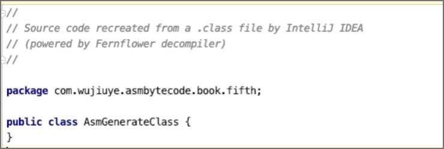
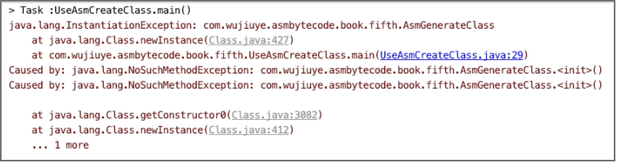

# 创建类并创建方法


ASM使用访问者模式提供非常丰富的API简化我们的开发，如访问类的ClassVisitor、访问字段的FieldVisitor、访问方法的MethodVisitor。

在使用ASM创建一个类之前，我们先认识ASM提供的ClassWriter类，ClassWriter继承ClassVisitor，是以字节码格式生成类的类访问者。使用这个访问者可生成一个符合class文件格式的字节数组。

我们可以使用ClassWriter从头开始生成一个Class，也可以与ClassReader一起使用，以修改现有的Class生成新的Class。

 ClassWriter的构造方法要求传递一个参数，必须是COMPUTE_FRAMES、COMPUTE_MAXS中的0个或多个。

 ```java
// 0个
ClassWriter classWriter = new ClassWriter(0);
// 一个：COMPUTE_MAXS
ClassWriter classWriter = new ClassWriter(ClassWriter.COMPUTE_MAXS);
// 一个：COMPUTE_FRAMES
ClassWriter classWriter = new ClassWriter(ClassWriter.COMPUTE_FRAMES);
// 多个：COMPUTE_MAXS和COMPUTE_FRAMES
ClassWriter classWriter = new ClassWriter(ClassWriter.COMPUTE_MAXS | ClassWriter.COMPUTE_FRAMES);
 ```

* COMPUTE_MAXS：自动计算局部变量表和操作数栈的大小。但仍然需要调用visitMax方法，只是你可以传递任意参数，ASM会忽略这些参数，并重新计算大小。
* COMPUTE_FRAMES：自动计算方法的栈映射桢。与自动计算局部变量表和操作数栈的大小一样，我们仍然需要调用visitFrame方法，但参数可以随意填。

创建一个ClassWriter对象其实就是创建一个符合class文件结构的空字节数组，但此时这个对象是没有任何意义的，我们需要调用ClassWriter对象的API为该对象填充class文件结构的各项元素。

ClassWriter类的visit方法用于设置类的class文件结构版本号、类的访问标志、类的名称、类的签名、父类的名称、实现的接口。visit方法的定义如下。

```java
public final void visit(final int version,final int access,final String name,
      final String signature,final String superName,final String[] interfaces)
```

visit方法的参数说明：

* version：指定类文件结构的版本号；
* access：指定类的访问标志，如public、final等；
* name：指定类的名称（内部类名），如“java/lang/String”；
* signature：类的类型签名，如“Ljava/lang/String;”；
* superName：继承的父类名称。除Object类外，所有的类都必须有父类；
* interfaces：该类需要实现的接口。

在ASM框架中，每个访问者都有一个visitEnd方法，如ClassVisitor。ClassVisitor的visitEnd方法在结束时调用，用于通知访问者，类访问结束。

现在，我们就使用ClassWriter来创建一个类，一个继承至Object的类，代码如下。

```java
public class UseAsmCreateClass {

    public static void main(String[] args) throws IOException, ClassNotFoundException {
        String className = "com.wujiuye.asmbytecode.book.fifth.AsmGenerateClass";
        String signature = "L" + className.replace(".", "/") + ";";
        // 字节计算局部变量表和操作数栈大小、栈映射桢
        ClassWriter classWriter = new ClassWriter(0);
				// 类名和父类名需要使用 “/”替换“.”。这个可以在常量池中找到答案
        classWriter.visit(Opcodes.V1_8, ACC_PUBLIC,
                className.replace(".", "/"),
                signature,
                Object.class.getName().replace(".", "/"),
                null);
        classWriter.visitEnd();
        // 获取生成的class的字节数组
        byte[] byteCode = classWriter.toByteArray();
        ByteCodeUtils.savaToFile(className, byteCode);
    }

}
```

由于ClassWriter对象生成的是类的字节数组，因此，为验证我们所写的代码生成的class字节码是正确的，我们还需要将ClassWriter对象生成的字节数组输出到一个class文件。在案例代码中，我们使用ByteCodeUtils的savaToFile方法将class字节数组输出到文件，savaToFile方法的实现代码如下。

```java
public static void savaToFile(String className, byte[] byteCode) throws IOException {
        File file = new File("/tmp/" + className + ".class");
        if ((!file.exists() || file.delete()) && file.createNewFile()) {
            try (FileOutputStream fos = new FileOutputStream(file)) {
                fos.write(byteCode);
            }
        }
}
```

使用IDEA打开这个class文件，查看class文件反编译后的java代码，如下图所示。



IDEA能够将其反编译为java代码，说明该class文件的结构没有任何问题，但并不能说明这个类能使用。因为我们并没有生成类的实例初始化方法`<init>`，ASM不是编译器，不会自动帮我们生成`<init>`方法。如果现在使用ClassLoader来加载这个类并通过反射创建一个实例，那么将会得到如下图所示的错误。



因此，在创建类之后，我们必须要为类添加实例初始化方法，也就是Java类的构造方法。并且需要在实例初始化方法中调用父类的实例初始化方法。

 为类生成方法，我们需要用到ClassWriter类的visitMethod方法，visitMethod方法的定义如下。

```java
public final MethodVisitor visitMethod(final int access,final String name,
                  final String descriptor,final String signature,final String[] exceptions)
```

visitMethod方法的各参数说明：

* access：方法的访问标志，如public、static等；
* name：方法的名称（内部类名）；
* descriptor：方法的描述符，如“()V”；
* signature：方法签名，可以为空；
* exceptions：该方法可能抛出的受检异常的类型内部名称，可以为空。

调用ClassWriter的visitMethod方法会创建一个MethodWriter，MethodWriter的构造方法中会将方法名、方法描述符、方法签名生成CONSTANT_Utf8_info常量，并添加到常量池中。如果exceptions参数不为空，会为异常表的每个异常类型生成一个CONSTANT_Class_info常量，并添加到常量池中。

使用visitMethod方法为类生成一个`<init>`方法，代码如下。

```java
MethodVisitor methodVisitor = classWriter.visitMethod(ACC_PUBLIC,"<init>","()V",null,null);
methodVisitor.visitEnd();
```

visitMethod方法会返回该方法的访问者：MethodVisitor实例。我们在使用完MethodVisitor 之后，与ClassVisitor一样，需要调用实例的visitEnd方法。可以说，使用ASM提供的每个访问者，都需要调用一次实例的visitEnd方法，一般的使用场景下，不调用visitEnd方法也不会有任何问题，因为这些visitEnd方法都是空实现，什么事情也不做。

调用visitMethod方法仅仅只是为类生成一个方法，如果方法的访问标志没有ACC_NATIVE或ACC_ABSTRACT，也就是说方法不是native方法或者抽象方法，那么我们还需要继续为方法添加Code属性。

我们先来了解MethodVisitor接口定义的几个常用API：

* visitCode：访问方法的Code属性，实际上也是一个空方法，什么事情也不做；
* visitMaxs：用于设置方法的局部变量表与操作数栈的大小；

MethodVisitor接口提供的编写字节码指令相关的API：

* visitInsn：往Code属性的code数组中添加一条无操作数的字节码指令，如dup指令、aload_0指令等；
* visitVarInsn：往Code属性的code数组中添加一条需要一个操作数的字节码指令，如aload指令；
* visitFieldInsn：往Code属性的code数组中添加一条访问字段的字节码指令，用于添加putfield、getfield、putstatic、getstatic指令；
* visitTypeInsn：往Code属性的code数组中添加一条操作数为常量池中某个CONSTANT_Class_info常量的索引的字节码指令，如new指令；
* visitMethodInsn：往Code属性的code数组中添加一条调用方法的字节码指令，如invokevirtual指令。

这些API简化了我们操作字节码的难度，如使用visitTypeInsn生成一条new指令，我们不需要知道new指令需要的操作数是多少，用到的常量也不需要去创建，只需要传递类的内部类型名称，即使用‘/’符号替代‘.’符号的类名。

visitMethodInsn方法会为我们生成对应的方法符号引用常量：CONSTANT_Methodref_info。visitMethodInsn方法的定义如下。

```java 
public void visitMethodInsn(final int opcode,final String owner,final String name,   final String descriptor,final boolean isInterface)
```

visitMethodInsn方法的各参数解析：

* opcode：字节码指令的操作码，如invokesepcial指令的操作码十进制的值为183；
* owner：类的内部类型名称，如“java/lang/Object”；
* name：方法名称，如“<init>”；
* descriptor：方法描述符，如“()V”;
* isInterface：是否是接口，使用invokeinterface指令才传true，其它都传false。

现在，我们使用MethodVisitor为新增的`<init>`方法生成方法体，即为`<init>`方法生成调用父类`<init>`方法的字节码指令，并设置该方法的局部变量表以及操作数栈的大小。实现代码如下。

 ```java
static void generateMethod(ClassWriter classWriter){
        MethodVisitor methodVisitor = classWriter.visitMethod(ACC_PUBLIC, "<init>", "()V", null, null);
        methodVisitor.visitCode();
        // 调用父类构造器
        methodVisitor.visitVarInsn(ALOAD, 0);
        methodVisitor.visitMethodInsn(INVOKESPECIAL,"java/lang/Object","<init>", "()V", false);
        // 添加一条返回指令
        methodVisitor.visitInsn(RETURN);
        // 设置操作数栈和局部变量表大小
        methodVisitor.visitMaxs(1,1);
        methodVisitor.visitEnd();
}
 ```

此时再修改代码main方法，在调用ClassWriter实例的visitEnd方法之前，先调用generateMethod方法，为类生成一个`<init>`方法。最终生成的Java类如下。

```java
public class AsmGenerateClass {
    public AsmGenerateClass() {
    }
}
```

---

<font color= #666666>发布于：2021 年 10 月 10 日</font><br><font color= #666666>作者: [吴就业](https://www.wujiuye.com/)</font><br><font color= #666666>链接: https://github.com/wujiuye/JVMByteCodeGitBook</font><br><font color= #666666>来源: Github Pages 开源电子书《深入浅出JVM字节码》（《Java虚拟机字节码从入门到实战》的第二版），未经作者许可，禁止转载!</font><br>


