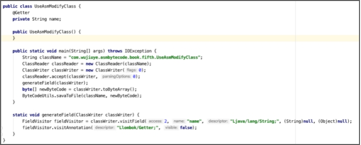
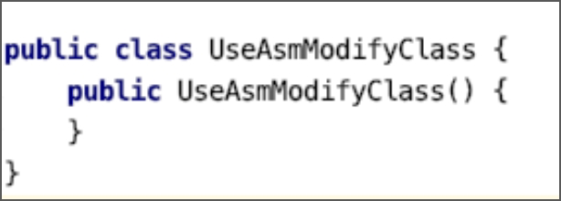
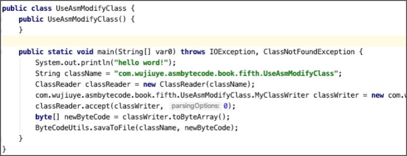

# 改写类并改写方法

改写类，就是基于被改写的类的class字节数组修改，生成新的类，一般改写类不会修改类的名称，因为修改类的名称或使用不同类加载器加载，那对虚拟机而言就是一个新的类。Java Agent允许我们在类加载之前修改类，也可结合Attach API使用，在类加载之后，程序运行期间可随时修改类，通过重新加载类替换旧的类。关于Java Agent和Attach API见本书第七章。 

改写一个类首先需要获取到一个类的字节数组。ASM框架提供的ClassReader用于解析符合class文件格式的字节数组，我们可通过使用ClassReader读取并解析获取到一个类的字节数组，再将解析后的字节数组交给ClassWriter去改写。 

ClassReader的构造方法有五个，如下。

```java
public ClassReader(final String className) throws IOException
public ClassReader(final byte[] classFile)
public ClassReader(final InputStream inputStream) throws IOException
public ClassReader(final byte[] classFileBuffer, final int classFileOffset, final int classFileLength)
ClassReader(final byte[] classFileBuffer, final int classFileOffset, final boolean checkClassVersion) 
```

前四个构造方法是我们可以使用的，且最后都会调用到最后一个构造方法。第一个构造方法可直接传递类名，ASM根据类名从当前classpath去读取该类的class文件；第二个构造方法可直接传递一个符合class文件结构的字节数组；第三个构造方法是传递一个输入流，ASM从输入流读取字节数据。 

以使用ClassReader类的传递一个类名的构造方法创建一个ClassReader实例为例，代码如下。

```java
String className = "com.wujiuye.asmbytecode.book.fifth.UseAsmModifyClass";
ClassReader classReader = new ClassReader(className);
```

ClassReader并不是访问者，但ClassReader类提供了accept方法用于接收一个ClassVisitor实例，由该ClassVisitor实例访问ClassReader实例解析后的class字节数组。accept方法的定义如下。

```java
public void accept(final ClassVisitor classVisitor, final int parsingOptions)
```

accept方法各参数解析：

* classVisitor：类访问者，如ClassWriter；
* parsingOptions：解析选项，可以是SKIP_CODE、SKIP_DEBUG、SKIP_FRAMES、EXPAND_FRAMES中的零个或多个。零个传0，多个使用“或”运算符组合。

我们来看一个ClassReader与ClassWriter结合使用的例子：从classpath中读取一个现有类，并给该类添加一个字段，然后将改写后的类的字节数组输出到文件。代码如下。

```java
public class UseAsmModifyClass {

    public static void main(String[] args) throws IOException {
        String className = "com.wujiuye.asmbytecode.book.fifth.UseAsmModifyClass";
        ClassReader classReader = new ClassReader(className);
        ClassWriter classWriter = new ClassWriter(0);
        classReader.accept(classWriter, 0);
        generateField(classWriter);
        byte[] newByteCode = classWriter.toByteArray();
        ByteCodeUtils.savaToFile(className, newByteCode);
    }

		static void generateField(ClassWriter classWriter) {
        FieldVisitor fieldVisitor = classWriter.visitField(ACC_PRIVATE,
                "name", "Ljava/lang/String;", null, null);
        fieldVisitor.visitAnnotation("Llombok/Getter;", false);
    }

}
```

在UseAsmModifyClass 类的main方法中，我们先创建一个ClassReader 实例，用来读取UseAsmModifyClass类的class文件并解析，然后创建一个ClassWriter实例，调用ClassReader实例 的accept方法传入该ClassWriter实例，之后调用generateField方法为该类生成一个私有的String类型的字段，字段名为name，并为该字段添加一个@Getter注解。最后调用ByteCodeUtils工具类的savaToFile方法将改写后的class字节数组输出到文件。改写后的类如下图所示。



为该类添加方法与从头开始创建一个新的类并为类添加方法一样，可通过调用ClassWriter实例的visitMethod方法为类添加方法。但改写方法就不能简单的通过调用ClassWriter实例的visitMethod方法完成了。

以移除UseAsmModifyClass类的main方法为例。我们需要自己实现一个ClassVisitor，但我们不做ClassWriter能做的事情，只做ClassWriter不能做的事情，因此我们可以使用代理模式实现自定义的ClassVisitor。自定义的ClassVisitor实现代码如下。

```java
public class MyClassWriter extends ClassVisitor {

        private ClassWriter classWriter;

        public MyClassWriter(ClassWriter classWriter) {
            super(Opcodes.ASM6, classWriter);
            this.classWriter = classWriter;
        }

        @Override
        public MethodVisitor visitMethod(int access, String name, String descriptor, String signature, String[] exceptions) {
            if ("main".equals(name)) {
                return null;
            }
            return super.visitMethod(access, name, descriptor, signature, exceptions);
        }

        public byte[] toByteArray() {
            return classWriter.toByteArray();
        }

    }
```

自定义的MyClassWriter重写了ClassVisitor类的visitMethod方法，当方法名称为“main”时，返回null，否则调用父类的visitMethod方法，由父类调用构造MyClassWriter时，参数传入的ClassWriter实例的visitMethod方法，创建main方法与创建main方法访问者。

能够移除main方法的原理是，当visitMethod方法返回null时，main方法不会创建，也不会创建main方法的访问者，因此不会创建“main”方法。

我们在调用ClassReader实例的accept方法时，accept方法会遍历ClassReader实例读取到的类的class文件结构的各项，遍历的目的是调用ClassWriter实例的相应visit方法，将ClassReader实例读取到的类的文件结构各项填充到ClassWriter实例的class文件结构。 

现在我们可以使用自定义的MyClassWriter改写UseAsmModifyClass类，去掉UseAsmModifyClass的main方法，实现代码如下。

```java
public class UseAsmModifyClass {
	public static void main(String[] args) throws IOException {
        String className = "com.wujiuye.asmbytecode.book.fifth.UseAsmModifyClass";
        ClassReader classReader = new ClassReader(className);
        // 创建MyClassWriter实例
        MyClassWriter classWriter = new MyClassWriter(new ClassWriter(0));
        classReader.accept(classWriter, 0);

        byte[] newByteCode = classWriter.toByteArray();
        ByteCodeUtils.savaToFile(className, newByteCode);
	}
}
```

改写后的UseAsmModifyClass类如下图所示。



如果我们不想去掉main方法，只是想改变main方法中的代码，怎么实现呢？

与实现自定义的ClassVisitor类一样，我们也可以通过实现自定义的MethodVisitor类实现。如在UseAsmModifyClass的main方法插入一行输出“hello word!”的代码，实现代码如下。

```java
public class MainMethodWriter extends MethodVisitor {

        private MethodVisitor methodVisitor;

        public MainMethodWriter(MethodVisitor methodVisitor) {
            super(Opcodes.ASM6, methodVisitor);
            this.methodVisitor = methodVisitor;
        }

        @Override
        public void visitCode() {
            super.visitCode();
            methodVisitor.visitFieldInsn(GETSTATIC,
                    Type.getInternalName(System.class),
                    "out",
                    Type.getDescriptor(System.out.getClass()));
            methodVisitor.visitLdcInsn("hello word!");
            methodVisitor.visitMethodInsn(INVOKEVIRTUAL,
                    Type.getInternalName(System.out.getClass()),
                    "println",
                    "(Ljava/lang/String;)V", false);
        }

}
```

MainMethodWriter类重写了visitCode方法，目的是在main方法的第一条字节码指令的前面插入输出“hello word!”的字节码指令。当然，也可以重写visitInsn方法，在main方法的return指令之前插入字节码指令，代码如下。

```java
@Override
public void visitInsn(int opcode) {
    if (opcode == RETURN) {
        // 如果操作码等于return指令的操作码
				// 则在return指令之前插入一些字节码指令
    }
    super.visitInsn(opcode);
}
```

现在，我们改写自定义的MyClassWriter类，修改visitMethod方法，判断如果是main方法，则创建一个MainMethodWriter，代码如下。

```java
public class MyClassWriter extends ClassVisitor {

        private ClassWriter classWriter;

        public MyClassWriter(ClassWriter classWriter) {
            super(Opcodes.ASM6, classWriter);
            this.classWriter = classWriter;
        }

        @Override
        public MethodVisitor visitMethod(int access, String name, String descriptor, String signature, String[] exceptions) {
            if ("main".equals(name)) {
                MethodVisitor methodVisitor = super.visitMethod(access, name, descriptor, signature, exceptions);
                return new MainMethodWriter(methodVisitor);
            }
            return super.visitMethod(access, name, descriptor, signature, exceptions);
        }

        public byte[] toByteArray() {
            return classWriter.toByteArray();
        }

}
```

改写后的UseAsmModifyClass类如下图所示。



---

发布于：2021 年 10 月 10 日<br>作者: [吴就业](https://www.wujiuye.com/)<br>GitHub链接:https://github.com/wujiuye/JVMByteCodeGitBook<br>链接: https://www.wujiuye.com/ebook/JVMByteCodeGitBook/chapter/chapter05_06.md<br>来源: Github Pages 开源电子书《深入浅出JVM字节码》（《Java虚拟机字节码从入门到实战》的第二版），未经作者许可，禁止转载!<br>

