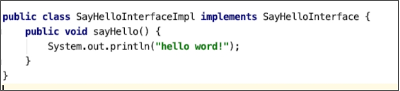

# 创建类并实现接口


前面我们已经学习了如何使用ASM创建一个类并为类添加方法。实现接口也非常简单，只需要在调用类访问器的visit方法时，指定该类需要实现的接口，而实现接口定义的方法就是使用visitMethod方法为该类添加一个访问标志与接口中定义的方法相同、方法名称与方法描述符都相同的方法。

以实现SayHelloInterface接口为例，SayHelloInterface接口的定义如下。

```java
public interface SayHelloInterface {
    void sayHello();
}
```

现在，我们使用ClassWriter创建一个新的类，类名为SayHelloInterfaceImpl，并为该类实现SayHelloInterface接口，实现SayHelloInterface接口的sayHello方法，为sayHello插入输出“hello word”的字节码指令。代码如下。

```java
public class UseAsmImpInterface {

    public static void main(String[] args) throws IOException {
        // 创建的类的类名
        String implClassName = SayHelloInterface.class.getName() + "Impl";
        ClassWriter cw = new ClassWriter(0);
        // 设置class文件结构的版本号、类名、类签名、父类、实现的接口
        cw.visit(Opcodes.V1_8, ACC_PUBLIC,
                implClassName.replace(".", "/"),
                null,
                Type.getInternalName(Object.class),
                new String[]{Type.getInternalName(SayHelloInterface.class)});
        // 创建asyHello方法
        MethodVisitor mv = cw.visitMethod(ACC_PUBLIC, "sayHello",
                "()V", null, null);
        // 插入输出"hello word!"的字节码指令
        mv.visitFieldInsn(GETSTATIC,
                Type.getInternalName(System.class),
                "out",
                Type.getDescriptor(System.out.getClass()));
        mv.visitLdcInsn("hello word!");
        mv.visitMethodInsn(INVOKEVIRTUAL,
                Type.getInternalName(System.out.getClass()),
                "println",
                "(Ljava/lang/String;)V", false);
        // void方法也需要有return指令 
				mv.visitInsn(RETURN);
				// 设置局部变量表和操作数栈的大小
        mv.visitMaxs(2,1);
        // 获取生成的类的字节数组
        byte[] byteCode = cw.toByteArray();
        // 保存到文件
        ByteCodeUtils.savaToFile(implClassName, byteCode);
    }

}
```

在创建ClassWriter 时，我们给构造方法传递的参数值为0，意味着我们需要自己计算方法的局部变量表和操作数栈的大小，所以在创建sayHello方法时，需要调用方法访问者的visitMaxs方法设置局部变量表和操作数栈的大小。

那为什么操作数栈的大小是2，局部变量表的大小是1呢？

我们一共为sayHello方法添加了三条指令，第一条指令是获取一个静态字段，指令返回字段的引用存储在操作数栈顶，接着将字符串“hello word!”的引用放入栈顶，最后才调用PrintStream实例的println方法，因此操作数栈的深度至少为2才能完成println方法的调用。而局部变量表只存储this引用，所以设置为1。

此案例代码中，还用到了ASM提供的工具类（Type类）的一些方法：

* getInternalName：获取一个类的内部类型名称，比如我们调用String.class.getName方法获取到的名称是“java.lang.String”，调用Type的getInternalName方法获取到的就是“java/lang/String”；
* getDescriptor：获取类的描述符，如String类的描述符为“Ljava/lang/String;”。

运行案例代码的main方法，我们能够得到一个SayHelloInterfaceImpl类，但是这个类并不能加载使用，因为没有生成`<init>`方法。生成的SayHelloInterfaceImpl类如下图所示。

 

---

<font color= #666666>发布于：2021 年 10 月 10 日</font><br><font color= #666666>作者: [吴就业](https://www.wujiuye.com/)</font><br><font color= #666666>链接: https://github.com/wujiuye/JVMByteCodeGitBook</font><br><font color= #666666>来源: Github Pages 开源电子书《深入浅出JVM字节码》（《Java虚拟机字节码从入门到实战》的第二版），未经作者许可，禁止转载!</font><br>


