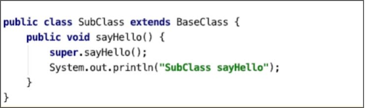

# 继承类并重写父类方法


与创建类并实现接口相似，继承类并重写父类的方法，只需要在调用类访问器的visit方法时，指定该类所继承的父类，重写父类的方法，就是使用visitMethod方法为该类添加一个，访问标志与父类中的方法相同、方法名称与方法描述符都相同的方法。与实现接口不同的是，我们可以在重写的方法中调用父类的方法。

以继承BaseClass为例，BaseClass类如下。

```java
public class BaseClass {
    public void sayHello() {
        System.out.println("BaseClass sayHello");
    }
}
```

现在，我们使用ClassWriter创建一个新的类，类名为SubClass，并指定该类继承BaseClass类。然后重写父类的sayHello方法，在子类的sayHello方法中，先调用父类的sayHello方法，再输出“SubClass sayHello”字符串。实现代码如下。

```java
public class UseAsmOverrideMethod {

    public static void main(String[] args) throws IOException {
        // 创建的类的类名
        String subClassName = BaseClass.class.getName()
                .replace("Base", "Sub");
        ClassWriter cw = new ClassWriter(0);

        // 设置class文件结构的版本号、类名、类签名、父类、实现的接口
        cw.visit(Opcodes.V1_8, ACC_PUBLIC,
                subClassName.replace(".", "/"),
                null,
                Type.getInternalName(BaseClass.class),
                null);

        // 生成初始化方法
        // generateInitMethod(cw);

        // 创建sayHello方法
        MethodVisitor mv = cw.visitMethod(ACC_PUBLIC, "sayHello",
                "()V", null, null);

        // 调用父类的方法
        mv.visitVarInsn(ALOAD, 0);
        mv.visitMethodInsn(INVOKESPECIAL,
                Type.getInternalName(BaseClass.class),
                "sayHello",
                "()V", false);

        // 插入输出"SubClass sayHello"的字节码指令
        mv.visitFieldInsn(GETSTATIC,
                Type.getInternalName(System.class),
                "out",
                Type.getDescriptor(System.out.getClass()));
        mv.visitLdcInsn("SubClass sayHello");
        mv.visitMethodInsn(INVOKEVIRTUAL,
                Type.getInternalName(System.out.getClass()),
                "println",
                "(Ljava/lang/String;)V", false);

        mv.visitInsn(RETURN);
        // 设置局部变量表和操作数栈的大小
        mv.visitMaxs(2, 1);

        // 获取生成的类的字节数组
        byte[] byteCode = cw.toByteArray();
        // 保存到文件
        ByteCodeUtils.savaToFile(subClassName, byteCode);
    }
}
```

注意：为了简化代码，省去了为类生成`<init>`方法的代码，所以生成的这个SubClass 类是不能被加载使用的。

运行此案例代码，我们将得到一个SubClass类，如下图所示。

 

---

<font color= #666666>发布于：2021 年 10 月 10 日</font><br><font color= #666666>作者: [吴就业](https://www.wujiuye.com/)</font><br><font color= #666666>链接: https://github.com/wujiuye/JVMByteCodeGitBook</font><br><font color= #666666>来源: Github Pages 开源电子书《深入浅出JVM字节码》（《Java虚拟机字节码从入门到实战》的第二版），未经作者许可，禁止转载!</font><br>


